## 概念

Apache Flink 是流式计算处理领域的领跑者。它凭借易用、高吞吐、低延迟、丰富的算子和原生状态支持等优势，多方位领先同领域的开源竞品。

同样地，ClickHouse 是 OLAP 在线分析领域的一颗冉冉新星，它拥有极其出众的查询性能，以及丰富的分析函数，可以助力分析师灵活而迅速地挖掘海量数据的价值。

然而金无足赤，人无完人，每个组件都有自己擅长和不擅长的方面。**为了实现构造高性能实时数仓的目标，接下来的文章会介绍如何将它们巧妙地结合起来，取长补短**，最终实现 “效率翻倍，快乐加倍” 的梦想。

## 影响海量数据查询效率的因素

面对海量的业务数据，**有很多因素会显著降低我们的端对端查询效率**（即数据从产生到最终消费的全流程效率）。

1. 第一个因素是业务需求多样，分析的链路繁杂。

例如我们有一个电商相关的数据库，做增长分析的同学需要用它的数据来进行用户画像，以便实施精准营销，例如对新用户、流失用户制定不同的营销策略；而做风控的同学则需要把数据接入机器学习模型，打击 “羊毛党” 和黑产用户。

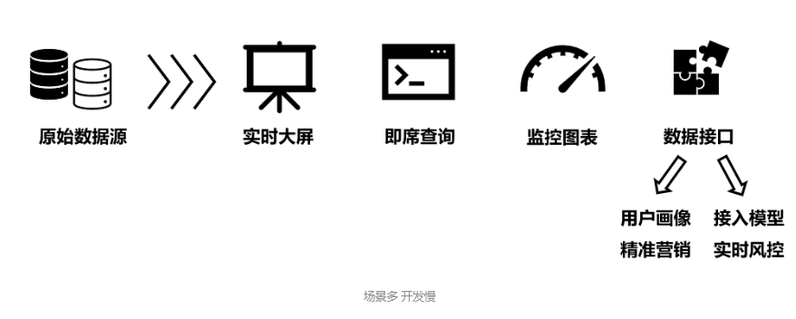

**如果不加约束，大家都从原始数据源来读取数据并分析，一方面对原始数据源的压力非常大（同时承担着各类业务的写请求、读请求）**，另一方面分析链路难以复用，最终会形成重复开发、各自为政的 “烟囱模式”，开发慢，运维难。

2. 第二个因素是数据量庞大且多样化，传统的分析工具难以应对：
      
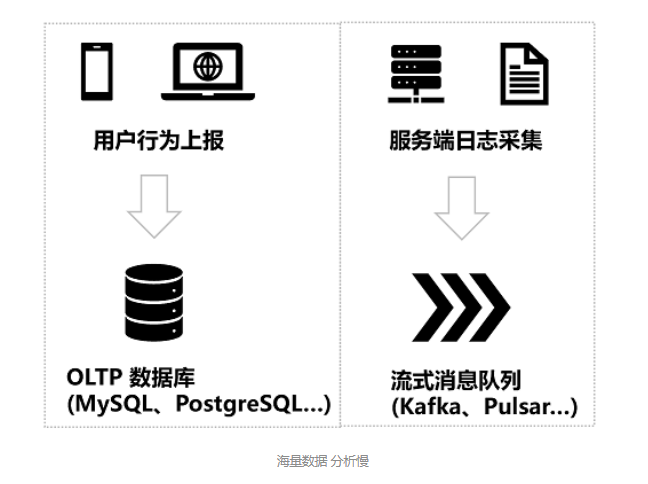

例如我们通常用 MySQL、PostgreSQL、Oracle 等 OLTP（Online Transation Processing）数据库来存放各类的交易流水等数据，它们的优点是支持高并发、低延迟读写，且对事务提供了完整的支持。但是缺点是复杂查询（聚合、窗口、分组等）性能差，且缺少数据分析常用的各类函数，用作数据分析场景既低效，又不方便，还可能影响线上业务的稳定性。

因此，我们需要 OLAP（Online Analytical Processing）引擎构造的数据仓库（例如我们的 ClickHouse 就可以被用作 OLAP 引擎），来满足海量数据的复杂查询能力。但它们通常并发读写的能力差，且事务支持不完备，因此也不建议直接用作线上的唯一数据存取系统。

通常我们会使用 CDC（Change Data Capture，变更数据捕获）工具，例如 Debezium、Canal 等，**将 OLTP 数据库的流水实时同步到 OLAP 系统以供分析，这样可以充分发挥两套系统各自的优势**。有些系统宣称自己同时满足 OLAP 和 OLTP 的特性，通常被称为 HTAP（Hybrid Transactional/Analytical Processing）。**但实际上对于很多 HTAP 系统而言，往往只是在内部将两套系统的 CDC 数据同步的过程对用户隐藏了，本质上还是异构的**。

此外，我们还会有一些流式数据，例如日志采集流、用户点击流等，它们以流的形式源源不断输入，且有很强的时效性，且顺序在传输过程中很容易错乱，导致分析起来异常困难。

3. 第三个因素是数据源繁杂，组件和格式众多，接入起来耗时长：

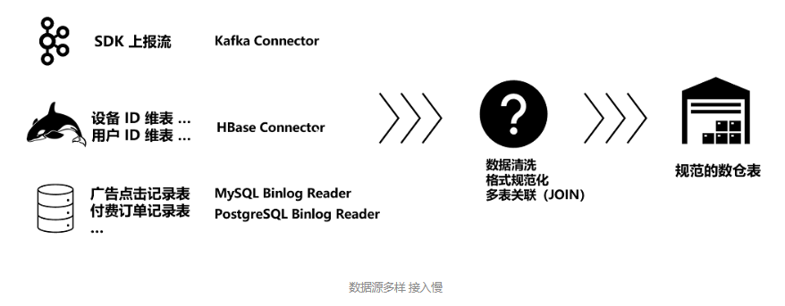

**例如一个业务可能用 Kafka 来承接从 SDK 中上报的各类点击流数据，又使用 HBase 等 KV 系统来存储维表信息，还使用传统的 MySQL、PostgreSQL 数据库来保存精确的广告点击记录和付费订单记录等等。这些数据来自不同数据源，如何将它们规范化，并合理地关联在一起，最终写入到数仓中，也是一个难点和重点**。

上述痛点和难点如果不加解决，会严重拖慢分析师的效率：**轻则影响拓客和营销的效果，巨额的投入得不到转化**；重则会因为风控系统失灵，对业务造成毁灭性打击。因此我们必须通过系统化的体系构建，选择合适的工具组件，逐一解决上述提到的效率困境。

## 实时数仓如何解决困境 提升效率

我们知道，数据仓库（Data Warehouse）是面向主题的、集成的一套系统。它遵循一系列的建模规范，每层致力于解决不同的问题。

下图是一个典型的实时数仓架构，它分为外部应用、应用层（ADS 或 APP）、汇总层（DWS）、明细层（DWD）和维度层（DIM），以及原始数据层（ODS）。我们以电商行业的互联网精准营销为例子，讲解一下典型的实时数仓结构。

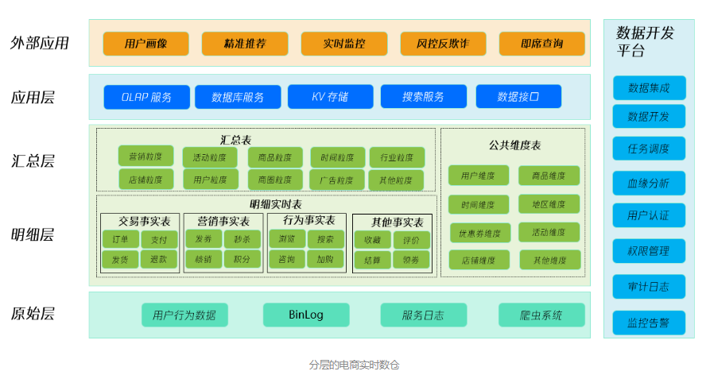

实时数仓可以对接很多外部应用，**例如用户画像、精准推荐系统可以针对性地推送营销活动，做到 “千人千面”**，如下图；BI 实时大屏可以将双 11 大促的总体交易数据图表化；实时监控则能让运维及时感知服务和主机运行的风险；风控反欺诈则可以对业务运行数据做展示，配合告警阈值系统，可以实时监控用户行为和订单量异常等风险因子等；即席查询可以应对分析师灵光一现的突发查询需求。

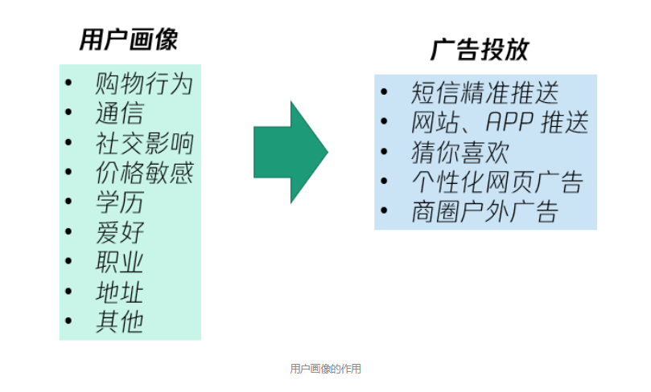

应用层承担了各类数据应用的基础设施，例如 KV 存储（HBase 等）、数据库服务（PostgreSQL 等）、OLAP 服务（ClickHouse 等）、搜索服务（Elasticsearch 等），为上层的外部应用提供支持。**实时数仓的应用层的数据来源于汇总层的各类多维主题宽表和汇总表，例如营销汇总表、活动汇总表、商品汇总表等等。**这样，业务方只需要从不同的主题汇总表中读取数据，无需再单独对各类数据源做一整套分析链路。如果宽表字段设计合理，内容足够丰富的话，可以大大缓解开发慢的问题。此外，还可以导出数据接口，以供其他业务部门对接。

汇总层的数据是从明细层和维度层关联而来的。**由于 ClickHouse 等 OLAP 工具对关联（JOIN）的性能较弱，因此我们可以采用 Flink 来实现流式数据的高效动态 JOIN，并将实时的关联数据定义为宽表并写入 ClickHouse 以供应用层后续分析查询**。由于 ClickHouse 等 OLAP 引擎的强劲性能，海量数据的分析慢等问题也可以得到一定程度的解决。

**明细层通常是经过清洗过滤等规范化操作后的各类主题的事实表，例如订单交易数据、浏览数据等，而 维度表 则保存了数据中 ID 与实际字段的映射关系**，以及其他变化缓慢但可以用来补充宽表的数据。

原始层是对各类数据源的接入映射，**例如业务方写入 Kafka 的各类 Topics，以及 MySQL 等数据库的 Binlog 等原始数据等等**。主要侧重于数据摄取和简单存储，是上面各层的数据来源。由于 Flink 等流计算平台具有丰富的 Connector 以对接各种外部系统，且提供了丰富的自定义接口，我们接入各类异构的数据源也不成问题了。

## Flink 是 ClickHouse 的最佳搭档

ClickHouse 是一个用于联机分析 (OLAP) 的列式数据库管理系统（DBMS），它采用了列式存储、数据压缩、多核并行、向量引擎、分布式处理等技术，性能遥遥领先竞品。

例如我们给定一条数据分析时常见的分组和排序查询语句：

```
SELECT Phone, Model, uniq(UID) AS u
FROM hits
WHERE Model != ''
GROUP BY Phone, Model
ORDER BY u DESC
LIMIT 10;
```

下图是 1 亿条数据量级下，ClickHouse 与多种常见数据处理系统的查询速度对比图（数字越小代表耗时越短，性能越好），可以看到 ClickHouse 的性能数据遥遥领先：

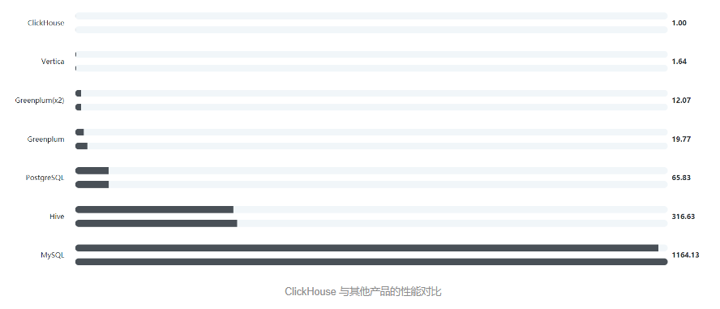

### 尽管 ClickHouse 的数据分析能力如此高效，它还是有自己不擅长的地方：

- **不适合大量单条数据的写请求，因为写入过快时后台合并不过来**，会报 Too many parts 等错误
- 不适合频繁的数据更新和删除操作，因为变更数据的聚合处理需要时间，短期内可能出现数据不准的现象
- **不擅长做多张表的关联**（尤其是不同数据库引擎的源表之间 JOIN）
- 生态支持弱，不适合多种不同数据源（特别是流式数据源）的接入

### 而这些 ClickHouse 不擅长做的事情，刚好是 Flink 最适合的领域：

- Flink 流处理模型，**天然适合处理大量单条的流数据，吞吐量高，延迟低**。
- Flink 的流动态表映射模型（如下图，来自 Flink 官网文档），**可以很好地应对频繁更新和删除等记录**。还可以通过 Mini-Batch、Window 等优化手段，极大地降低下游 ClickHouse 的处理压力。
- Flink **支持多种流和流的 JOIN，还支持流和维度表的 JOIN 操作**。借助强大的状态管理能力，可以做到精确的关联语义。
- Flink 的生态支持很丰富，常见的各类系统基本都有 Connector；而且通过标准化 Source 和 Sink API，也可以轻松实现自己的 Connector。

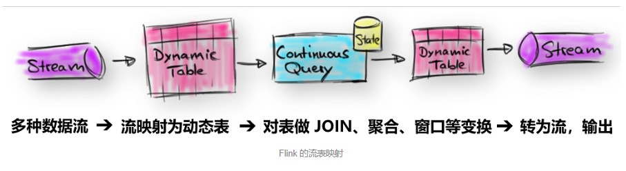

## 打造稳定可靠的实时数仓 v1.0

### Lambda 架构

对于实时数仓的构造方法，业界和学界有很多的探索和实践。Lambda 架构是一个成熟且广为采用的方案。它分为离线批处理和实时流处理两个子系统。

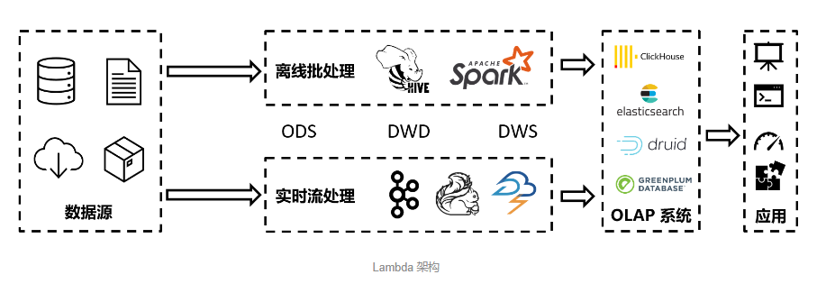

**Lambda 架构的优点是离线和在线的数据源统一的前提下，准确性和容错性相对较好**。例如**实时流处理遇到了故障导致输出的结果不够精确时，离线批处理系统可以把数据重跑一次，用更精确的数据来覆盖它。**

但 Lambda 的缺点也很明显：**离线和实时采用独立的平台，每个分析语句都需要重复写两套，而且运维人员也需要维护两套以上的系统，成本高昂**。而且如果两套系统的数据口径不一致，那么离线重算的结果，很可能和实时部分产生较大偏差，造成数据的 “跳变” 等异常，反而失去了准确性的优势。

### 问题解决

当我们推动这套实时数仓系统落地时，会遇到一些实践的问题：

1.  如何将大量的流数据，从 Flink 高效地写入到 ClickHouse

我们知道，**写入 ClickHouse 时，既可以写分布式表，也可以直接写本地表**。写分布式表的优点在于不需要关注太多底层节点的细节，但是缺点也很明显：由于数据需要被集中缓存和转发，会增加一定的延时，且会加重短期的数据不一致现象；此外，**网络方面压力也较大，连接数和网络流量都会有较大的上升。因此，如果我们要写入的数据量很大的话，可以事先获取各节点的连接地址，通过写本地表的方式直接写入各个节点**。

写入本地表的方式可以有很多，**例如为了防止节点之间出现较为严重的数据倾斜，可在每次写入式随机选择一个节点；也可以采用轮询的方式，每次写入下一个不同节点。**如果数据后续要按 Key 进行聚合，那么还可以使用散列的方式，将相同 Key 的数据写到同一个节点，如下图所示：

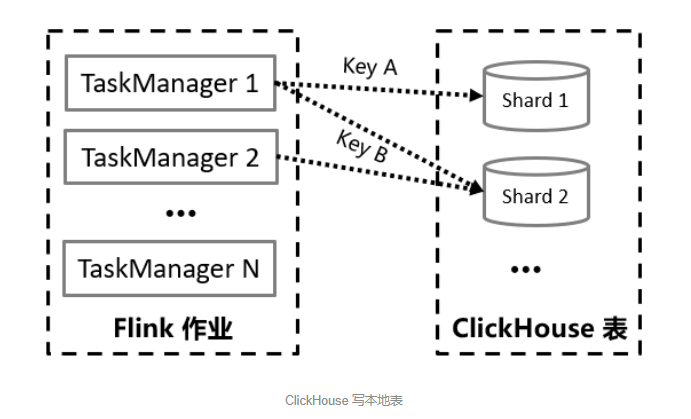

另外我们注意到，**流式数据通常会包含大量的更新和删除操作**。为了支持频繁变更的数据，**可以将 Flink 的 Retract Stream（回撤流）、Upsert Stream（更新-插入流）等含有状态标记的数据流，写入到 ClickHouse 的 CollapsingMergeTree 引擎表中**。例如下图（来自 Flink 官方文档）中的 GROUP BY 查询会随着新数据的写入，对 user 这个 Key 的统计值 cnt 进行持续的更新。当 Mary 第二次出现时，cnt 统计值由 1 变成了 2，那么可以对旧记录发一条 sign 为 -1 的消息，和之前那条 sign 为 1 的记录相互抵消。然后再写入新的 cnt 为 2 的记录。后续 Mary 第三次出现时，执行同样的操作，即可保证写入 ClickHouse 的最终统计数据是准确的。

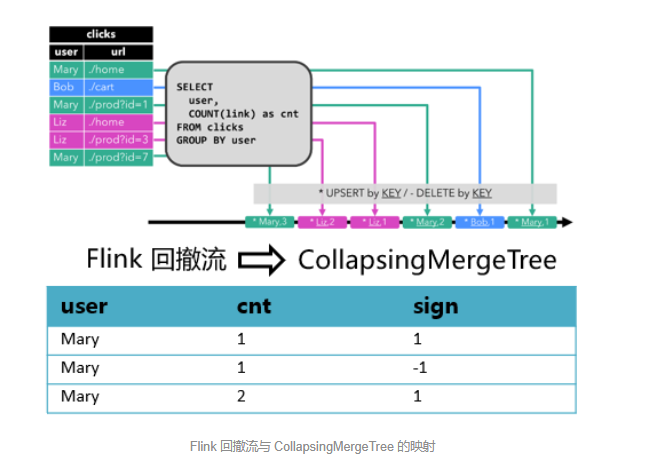

考虑到 ClickHouse 擅长大批量写入的特点，还需要对 Flink ClickHouse Sink 增加攒批写入的支持，**避免频繁写入造成的性能下降问题**；此外还有故障重试策略、Flink 与 ClickHouse 之间的 SQL 类型映射等需要关注的点。

做好了这些，我们才可以得到一个性能、稳定性俱佳的 Flink ClickHouse Connector。


### 如何评价数仓的质量

当我们完成了对数仓的初步建模和构建后，数据质量验证是决定数仓是否真正可用的关键环节，需要关注的有：一致性、准确性、容错能力、链路延迟等。对于业务方和平台方而言，各自需要关注和保证不同的方面，如下图所示：

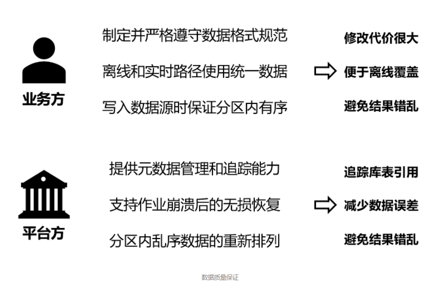

**业务方需要尽早制定并严格遵守数据格式（Schema）的规范**，因为 Flink SQL 和很多 Connector 是不支持运行时动态修改表结构的。如果需要修改，则作业的状态准确度可能受到影响，甚至需要重新跑一遍所有数据，代价很大。**此外，对于离线和实时链路，一定要保证数据源的口径是一致的，不然会出现数据 “跳变” 的问题**。对于多分区的数据源（例如 Kafka 等），**还要保证应当将数据有序写入单个分区，否则乱序的数据会影响流处理的精度，造成结果错乱**。

对于平台提供方，例如我们腾讯云流计算 Oceanus 而言，需要提供元数据管理等基本能力，避免实际需要修改表结构时，难以追踪多个不同作业之间的依赖关系，造成错漏。同时平台方需要集成 Flink 自带的状态快照功能，精确保存作业的运行时状态，并在作业发生异常时使用最近的状态来恢复作业，以最大程度地保证计算精度，减少误差的存在。Flink 提供的 Watermark 机制也可以做到一定程度的乱序数据重整，对避免结果错乱也很有帮助。

如果从离线数仓或其他版本的数仓系统迁移到实时数仓时，**一定要做双写验证，确保新系统的计算结果与原系统保持一致**。另外可以使用例如 ```Apache Griffin``` 等数据质量监控工具，实现数据异常的发现和告警。对于重点任务，还可以通过热备等方式，避免单个任务由于外部不可控原因而发生崩溃时，引发输出中断等事故。

实时数仓相比离线数仓平台，对质量的评价标准还多了一项：链路延迟。**如果不能及时得到数据输出的话，这个数仓也是不合格的。而影响链路时延有很多不同因素**，例如：

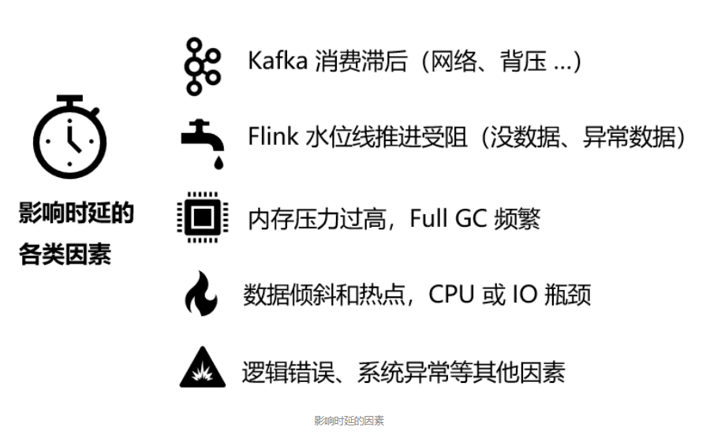

流计算 Oceanus 平台为了确保及时发现上述问题，也做了很多优化工作。例如，我们支持 70+ 项 Flink 核心指标的订阅，**用户可在界面上查看数据源（Source）的实时数据摄入量、链路处理时延、JobManager 和 TaskManager 内存各分区的用量、GC 次数等指标；也可以通过自定义 Reporter，将 Flink 监控数据导出到自己的 Prometheus 等外部系统来自助分析**。

**在异常感知方面，流计算 Oceanus 平台还可以自动诊断作业运行期间的常见异常事件，例如 TaskManager CPU 占用率过高、Full GC 事件过久、严重背压、Pod 异常退出等**，事件可以秒级送达，帮助用户及时获知并处理作业的异常情况。

## 持续演进批流融合数仓 v2.0

在实时数仓领域，除了上述介绍的 Lambda 架构外，还有一个比较流行的 Kappa 架构，如图所示：

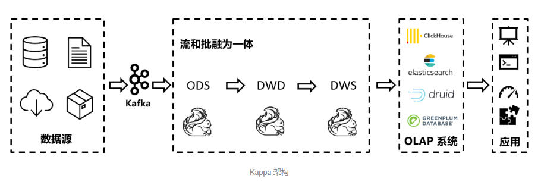

相比 Lambda 架构而言，**Kappa 架构将流和批融为一体，不再分为两条数据处理链路，数据统一经过流式数据管道传递，清晰简明，可以大幅降低开发和运维成本**。但是它的缺点也很明显：由于数据传输都需要经过消息队列等数据管道，**为了保证作业崩溃或逻辑修改后可以随时追溯历史数据，消息需要有很长的保存期**。此外，**由于各层之间没有可落盘的文件存储，难以直接分析中间层的数据**，通常需要**启动一个单独的作业来导出数据才能分析，灵活度欠佳**。

为了解决 Kappa 架构的缺点，我们引入新一代的表结构：Apache Iceberg，它的优点如下：

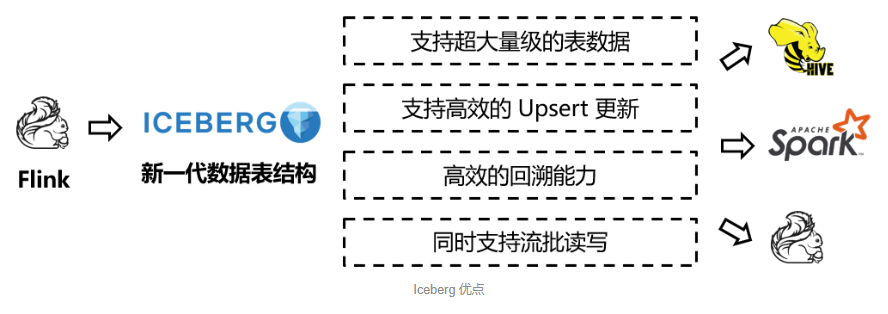

Iceberg 同时支持流式读写和批量读写。**对于实时链路而言，它可以在一定程度上代替 Kafka 等传统流式数据管道**；对于需要读取中间层的数据等特殊需求，**又可以使用常见的批处理分析工具来直接分析 Iceberg 数据文件，非常便捷**。如果流作业发生了崩溃等情形，**还可以借助它高效的历史数据回溯能力，快速从特定的时间点开始重新消费数据**，如下图：

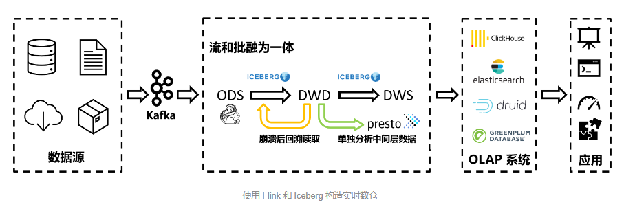

**此外，它还支持超长的数据保存期，不必担心数据保存期过短**，历史数据被清理而难以回溯等传统数据管道会遇到的难题，因此 Iceberg 的引入，弥补了传统 Kappa 架构的各类缺点。虽然 Iceberg 等组件的成熟度相对而言没有那么高，但是已经有不少大客户在使用了。相信在不久的未来，我们可以看到更多的类似的组件在生产环境的持续落地。

## 总结与展望

**当数据量总体较小时，传统的 OLTP 数据库已经可以初步满足分析需求。但是随着数据量的剧增，以及分析逻辑的复杂化，OLTP 数据库已经无法满足需求时，业界逐步发展出了离线 OLAP 引擎和离线数仓等应用技术**。

后来随着大家对实时性的关注，在离线数仓的基础上又演进出了 Lambda 实时数仓。为了解决 Lambda 数仓重复开发和运维的繁杂等缺陷，**Kappa 数仓也渐渐得到了采纳。为了弥补 Kappa 数仓的缺点，很多公司又设计了批流融合的数据格式**，打造了融合的一体化数仓结构。**例如 Iceberg、Hudi 为批处理的文件格式增加了流式读写支持；而 Pulsar、Pravega 则为数据流增加了批处理所需的长期持久化存储特性**。


