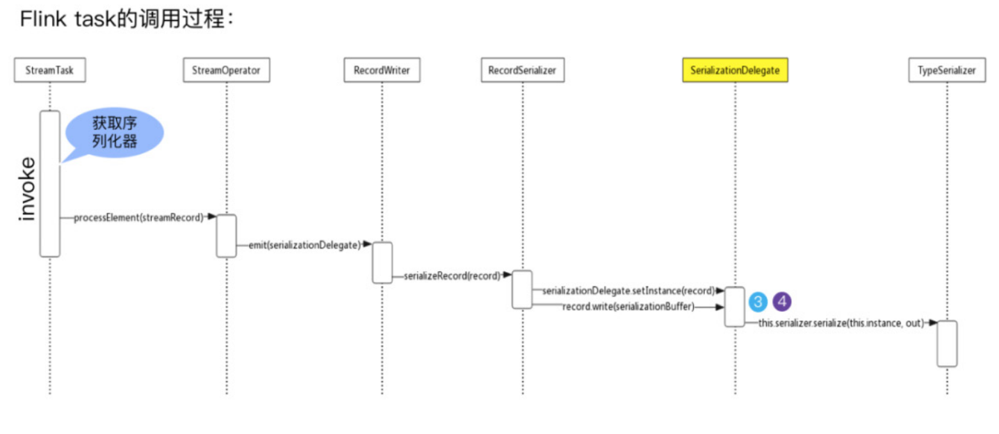

## Flink 量身定制的序列化框架

### 为什么要为 Flink 量身定制序列化框架？

大家都知道现在大数据生态非常火，大多数技术组件都是运行在 JVM 上的，Flink 也是运行在 JVM 上，基于 JVM 的数据分析引擎都需要将大量的数据存储在内存中，这就不得不面临 JVM 的一些问题，比如 Java 对象存储密度较低等。针对这些问题，**最常用的方法就是实现一个显式的内存管理，也就是说用自定义的内存池来进行内存的分配回收，接着将序列化后的对象存储到内存块中**。

现在 Java 生态圈中已经有许多序列化框架，比如说 Java serialization, Kryo, Apache Avro 等等。但是 Flink 依然是选择了自己定制的序列化框架，那么到底有什么意义呢？若 Flink 选择自己定制的序列化框架，对类型信息了解越多，可以在早期完成类型检查，更好的选取序列化方式，**进行数据布局，节省数据的存储空间，直接操作二进制数据**。


Flink 在其内部构建了一套自己的类型系统，Flink 现阶段支持的类型分类如图所示，从图中可以看到 Flink 类型可以分为基础类型（Basic）、数组（Arrays）、复合类型（Composite）、辅助类型（Auxiliary）、泛型和其它类型（Generic）。Flink 支持任意的 Java 或是 Scala 类型。不需要像 Hadoop 一样去实现一个特定的接口（org.apache.hadoop.io.Writable），**Flink 能够自动识别数据类型**。


那这么多的数据类型，在 Flink 内部又是如何表示的呢？图示中的 Person 类，**复合类型的一个 Pojo 在 Flink 中是用 PojoTypeInfo 来表示，它继承至 TypeInformation**，也即在 **Flink 中用 TypeInformation 作为类型描述符来表示每一种要表示的数据类型**。


TypeInformation 的思维导图如图所示，从图中可以看出，在 Flink 中每一个具体的类型都对应了一个具体的TypeInformation 实现类，例如 BasicTypeInformation 中的 IntegerTypeInformation 和 FractionalTypeInformation都具体的对应了一个TypeInformation。然后还有BasicArrayTypeInformation、CompositeType 以及一些其它类型，也都具体对应了一个TypeInformation。

TypeInformation 是 Flink 类型系统的核心类。对于用户自定义的 Function 来说，**Flink 需要一个类型信息来作为该函数的输入输出类型，即 TypeInfomation**。该类型信息类作为一个工具来生成对应类型的序列化器 TypeSerializer，并用于执行语义检查，比如当一些字段在作为 joing 或 grouping 的键时，检查这些字段是否在该类型中存在。

如何使用 TypeInformation ？下面的实践中会为大家介绍。


在 Flink 序列化过程中，进行序列化操作必须要有序列化器，那么序列化器从何而来？

每一个具体的数据类型都对应一个 TypeInformation 的具体实现，每一个 TypeInformation 都会为对应的具体数据类型提供一个专属的序列化器。通过 Flink 的序列化过程图可以看到 **TypeInformation 会提供一个 createSerialize() 方法，通过这个方法就可以得到该类型进行数据序列化操作与反序化操作的对象 TypeSerializer**。

对于大多数数据类型 Flink 可以自动生成对应的序列化器，能非常高效地对数据集进行序列化和反序列化，**比如，BasicTypeInfo、WritableTypeIno 等，但针对GenericTypeInfo 类型，Flink 会使用 Kyro 进行序列化和反序列化**。**其中，Tuple、Pojo 和 CaseClass 类型是复合类型，它们可能嵌套一个或者多个数据类型。在这种情况下，它们的序列化器同样是复合的**。它们会将内嵌类型的序列化委托给对应类型的序列化器。

简单的介绍下 Pojo 的类型规则，即在满足一些条件的情况下，才会选用 Pojo 的序列化进行相应的序列化与反序列化的一个操作。**即类必须是 Public 的，且类有一个 public 的无参数构造函数，该类（以及所有超类）中的所有非静态 no-static、非瞬态 no-transient 字段都是 public 的（和非最终的 final）或者具有公共 getter 和 setter 方法，该方法遵循 getter 和 setter 的 Java bean 命名约定**。当用户定义的数据类型无法识别为 POJO 类型时，必须将其作为 GenericType 处理并使用 Kryo 进行序列化。

Flink 自带了很多 TypeSerializer 子类，大多数情况下各种自定义类型都是常用类型的排列组合，因而可以直接复用，如果内建的数据类型和序列化方式不能满足你的需求，Flink 的类型信息系统也支持用户拓展。若用户有一些特殊的需求，只需要实现 TypeInformation、TypeSerializer 和 TypeComparator 即可定制自己类型的序列化和比较大小方式，来提升数据类型在序列化和比较时的性能。


序列化就是将数据结构或者对象转换成一个二进制串的过程，在 Java 里面可以简单地理解成一个 byte 数组。而反序列化恰恰相反，就是将序列化过程中所生成的二进制串转换成数据结构或者对象的过程。下面就以内嵌型的 Tuple 3 这个对象为例，简述一下它的序列化过程。

Tuple 3 包 含 三 个 层 面，**一 是 int 类 型， 一 是 double 类 型， 还 有 一 个 是 Person**。Person 包含两个字段，一是 int 型的 ID，另一个是 String 类型的 name，它在序列化操作时，会委托相应具体序列化的序列化器进行相应的序列化操作。从图中可以看到 Tuple 3 会把 int 类型通过 IntSerializer 进行序列化操作，此时 int 只需要占用四个字节就可以了。根据 int 占用四个字节，这个能够体现出 Flink 可序列化过程中的一个优势，即在知道数据类型的前提下，**可以更好的进行相应的序列化与反序列化操作。相反，如果采用 Java 的序列化，虽然能够存储更多的属性信息，但一次占据的存储空间会受到一定的损耗。**

Person 类会被当成一个 Pojo 对象来进行处理，PojoSerializer 序列化器会把一些属性信息使用一个字节存储起来。同样，其字段则采取相对应的序列化器进行相应序列化，在序列化完的结果中，**可以看到所有的数据都是由 MemorySegment 去支持**。MemorySegment 具有什么作用呢？

**MemorySegment 在 Flink 中会将对象序列化到预分配的内存块上，它代表 1 个固定长度的内存，默认大小为 32 kb**。MemorySegment 代表 Flink 中的一个最小的内存分配单元，相当于是 Java 的一个 byte 数组。 每条记录都会以序列化的形式存储在一个或多个 MemorySegment 中。

## Flink 序列化的最佳实践

### 最常见的场景

Flink 常见的应用场景有四种，即注册子类型、注册自定义序列化器、添加类型提示、手动创建 TypeInformation，具体介绍如下：

- **注册子类型**：如果函数签名只描述了超类型，但是它们实际上在执行期间使用了超类型的子类型，**那么让 Flink 了解这些子类型会大大提高性能**。可以 在 StreamExecutionEnvironment 或 ExecutionEnvironment 中 调 用 .registertype (clazz) 注册子类型信息。

- **注册自定义序列化**：对于不适用于自己的序列化框架的数据类型，Flink 会使用 Kryo 来进行序列化，并不是所有的类型都与 Kryo 无缝连接，具体注册方法在下文介绍。

- **添加类型提示**：有时，当 Flink 用尽各种手段都无法推测出泛型信息时，**用户需要传入一个类型提示 TypeHint，这个通常只在 Java API 中需要**。

- **手动创建一个 TypeInformation**：在某些 API 调用中，这可能是必需的，因为 Java 的泛型类型擦除导致 Flink 无法推断数据类型。

其实在大多数情况下，用户不必担心序列化框架和注册类型，因为 Flink 已经提供了大量的序列化操作，不需要去定义自己的一些序列化器，但是在一些特殊场景下，需要去做一些相应的处理。

### 实践 - 类型声明

类型声明去创建一个类型信息的对象是通过哪种方式？通常是用 TypeInformation.of() 方法来创建一个类型信息的对象，具体说明如下：

- 对于非泛型类，直接传入 class 对象即可。

```java
PojoTypeInfo<Person> typeInfo = (PojoTypeInfo<Person>) TypeInformation.of(Person.class);
```

- 对于泛型类，需要通过 TypeHint 来保存泛型类型信息。

```java
final TypeInfomation<Tuple2<Integer,Integer>> resultType = TypeInformation.of(new TypeHint<Tuple2<Integer,Integer>>(){});
```

- 预定义常量。

如 BasicTypeInfo，这个类定义了一系列常用类型的快捷方式，对于 String、Boolean、Byte、Short、Integer、Long、Float、Double、Char 等 基 本 类 型 的类型声明，可以直接使用。而且 Flink 还提供了完全等价的 Types 类（org.apache.flink.api.common.typeinfo.Types）。特别需要注意的是，flink-table 模块也有一个 Types 类（org.apache.flink.table.api.Types），用于 table 模块内部的类型定义信息，用法稍有不同。使用 IDE 的自动 import 时一定要小心。

- 自定义 TypeInfo 和 TypeInfoFactory。


通过自定义 TypeInfo 为任意类提供 Flink 原生内存管理（而非 Kryo），可令存储更紧凑，运行时也更高效。需要注意在自定义类上使用 @TypeInfo 注解，随后创建相应的 TypeInfoFactory 并覆盖 createTypeInfo() 方法。

### 实践 - 注册子类型

Flink 认识父类，但不一定认识子类的一些独特特性，因此需要单独注册子类型。StreamExecutionEnvironment 和 ExecutionEnvironment 提 供 registerType() 方法用来向 Flink 注册子类信息。

```java
final ExecutionEnvironment env = ExecutionEnvironment.getExecutionEnvironment();Env.registerType(typeClass);
```
在 registerType() 方法内部，会使用 TypeExtractor 来提取类型信息，如上图所示，获取到的类型信息属于 PojoTypeInfo 及其子类，那么需要将其注册到一起，否则统一交给 Kryo 去处理，Flink 并不过问 ( 这种情况下性能会变差 )

### 实践 -Kryo 序列化

对于 Flink 无法序列化的类型（例如用户自定义类型，没有 registerType，也没有自定义 TypeInfo 和 TypeInfoFactory），**默认会交给 Kryo 处理，如果 Kryo 仍然无法处理（例如 Guava、Thrift、Protobuf 等第三方库的一些类），有两种解决方案**：

- 强制使用 Avro 来代替 Kryo。

```java
env.getConfig().enableForceAvro();
```

- 为 Kryo 增加自定义的 Serializer 以增强 Kryo 的功能。

```java
env.getConfig().addDefaultKryoSerializer(clazz, serializer);
```

注：**如果希望完全禁用 Kryo（100% 使用 Flink 的序列化机制），可以通过 Kryoenv.getConfig().disableGenericTypes() 的方式完成**，但注意一切无法处理的类都
将导致异常，这种对于调试非常有效。

## Flink 通信层的序列化

Flink 的 Task 之间如果需要跨网络传输数据记录， 那么就需要将数据序列化之后写入 NetworkBufferPool，然后下层的 Task 读出之后再进行反序列化操作，最后进行逻辑处理。

为了使得记录以及事件能够被写入 Buffer，随后在消费时再从 Buffer 中读出，**Flink 提供了数据记录序列化器（RecordSerializer）与反序列化器（RecordDeserializer）以及事件序列化器（EventSerializer）**。

Function 发送的数据被封装成 SerializationDelegate，它将任意元素公开为 IOReadableWritable 以进行序列化，通过 setInstance() 来传入要序列化的数据。在 Flink 通信层的序列化中，有几个问题值得关注，具体如下：

- 何时确定 Function 的输入输出类型？


在构建 StreamTransformation 的时候通过 **TypeExtractor 工具确定 Function 的输入输出类型**。**TypeExtractor 类可以根据方法签名、子类信息等蛛丝马迹自动提取或恢复类型信息**。

- 何时确定 Function 的序列化 / 反序列化器？

**构 造 StreamGraph 时， 通过TypeInfomation 的 createSerializer() 方 法获取对应类型的序列化器 TypeSerializer**，并在 addOperator() 的过程中执行 setSerializers() 操作，设置 StreamConfig 的 TYPESERIALIZERIN1 、 TYPESERIALIZERIN2、 TYPESERIALIZEROUT_1 属性。

- 何时进行真正的序列化 / 反序列化操作？这个过程与 TypeSerializer 又是怎么联系在一起的呢？



大家都应该清楚 Task 和 StreamTask 两个概念，**Task 是直接受 TaskManager 管理和调度的，而 Task 又会调用 StreamTask，而 StreamTask 中真正封装了算子的处理逻辑**。在 run() 方法中，首先将反序列化后的数据封装成 StreamRecord 交给算子处理；然后将处理结果通过 Collector 发动给下游 ( 在构建 Collector 时已经确定了 SerializtionDelegate)，并通过 RecordWriter 写入器将序列化后的结果写入 DataOutput；最后序列化的操作交给 SerializerDelegate 处理，实际还是通过TypeSerializer 的 serialize() 方法完成。

