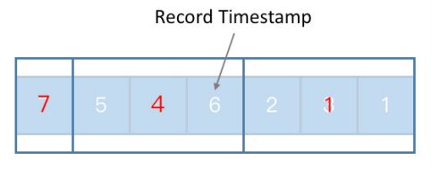

## 前言

Flink 的 API 大体上可以划分为三个层次：处于最底层的 ProcessFunction、中间一层的 DataStream API 和最上层的 SQL/Table API，这三层中的每一层都非常依赖于时间属性。时间属性是流处理中最重要的一个方面，是流处理系统的基石之一，贯穿这三层 API。在 DataStream API 这一层中因为封装方面的原因，我们能够接触到时间的地方不是很多，所以我们将重点放在底层的 ProcessFunction 和最上层的 SQL/Table API。

## Flink 时间语义

在不同的应用场景中时间语义是各不相同的，Flink 作为一个先进的分布式流处理引擎，它本身支持不同的时间语义。**其核心是 Processing Time 和 Event Time（Row Time）**，这两类时间主要的不同点如下表所示：

Processing Time 是来模拟我们真实世界的时间，其实就算是处理数据的节点本地时间也不一定是完完全全的真实世界的时间，所以说它是用来模拟真实世界的时间。而 Event Time 是数据世界的时间，即我们要处理的数据流世界里的时间。关于他们的获取方式，Process Time 是通过直接去调用本地机器的时间，而 Event Time 则是根据每一条处理记录所携带的时间戳来判定。

这两种时间在 Flink 内部的处理以及用户的实际使用方面，难易程度都是不同的。相对而言的 Processing Time 处理起来更加的简单，而 Event Time 要更麻烦一些。而在使用 Processing Time 的时候，我们得到的处理结果（或者说流处理应用的内部状态）是不确定的。而因为在 Flink 内部对 Event Time 做了各种保障，使用 Event Time 的情况下，无论重放数据多少次，都能得到一个相对确定可重现的结果。

因此在判断应该使用 Processing Time 还是 Event Time 的时候，可以遵循一个原则：**当你的应用遇到某些问题要从上一个 checkpoint 或者 savepoint 进行重放，是不是希望结果完全相同。如果希望结果完全相同，就只能用 Event Time；**如果接受结果不同，则可以用 Processing Time。Processing Time 的一个常见的用途是，根据现实时间来统计整个系统的吞吐，比如要计算现实时间一个小时处理了多少条数据，这种情况只能使用 Processing Time。

## 时间的特性

时间的一个重要特性是：时间只能递增，不会来回穿越。 在使用时间的时候我们要充分利用这个特性。假设我们有这么一些记录，然后我们来分别看一下 Processing Time 还有 Event Time 对于时间的处理。

- 对于 Processing Time，因为我们是使用的是本地节点的时间（假设这个节点的时钟同步没有问题），我们每一次取到的 Processing Time 肯定都是递增的，递增就代表着有序，所以说我们相当于拿到的是一个有序的数据流。

- 而在用 Event Time 的时候因为时间是绑定在每一条的记录上的，由于网络延迟、程序内部逻辑、或者其他一些分布式系统的原因，数据的时间可能会存在一定程度的乱序，比如上图的例子。在 Event Time 场景下，我们把每一个记录所包含的时间称作 Record Timestamp。**如果 Record Timestamp 所得到的时间序列存在乱序,我们就需要去处理这种情况。**

    

如果单条数据之间是乱序，我们就考虑对于整个序列进行更大程度的离散化。简单地讲，**就是把数据按照一定的条数组成一些小批次**，但这里的小批次并不是攒够多少条就要去处理，**而是为了对他们进行时间上的划分**。经过这种更高层次的离散化之后，**我们会发现最右边方框里的时间就是一定会小于中间方框里的时间，中间框里的时间也一定会小于最左边方框里的时间**。

这个时候我们在**整个时间序列里插入一些类似于标志位的特殊的处理数据，这些特殊的处理数据叫做 watermark**。一个 watermark 本质上就代表了这个 watermark 所包含的 timestamp 数值，**表示以后到来的数据已经再也没有小于或等于这个时间的了**。

## Timestamp 和 Watermark 行为概览

接下来我们重点看一下 Event Time 里的 Record Timestamp（简写成 timestamp）和 watermark 的一些基本信息。**绝大多数的分布式流计算引擎对于数据都是进行了 DAG 图的抽象，它有自己的数据源，有处理算子，还有一些数据汇。数据在不同的逻辑算子之间进行流动**。watermark 和 timestamp 有自己的生命周期，接下来我会从 watermark 和 timestamp 的产生、他们在不同的节点之间的传播、以及在每一个节点上的处理，这三个方面来展开介绍。

### Timestamp 分配和 Watermark 生成

Flink 支持两种 watermark 生成方式。第一种是在 SourceFunction 中产生，相当于把整个的 timestamp 分配和 watermark 生成的逻辑放在流处理应用的源头。我们可以在 SourceFunction 里面通过这两个方法产生 watermark：

- 通过 collectWithTimestamp 方法发送一条数据，其中第一个参数就是我们要发送的数据，**第二个参数就是这个数据所对应的时间戳**；也可以调用 emitWatermark 去产生一条 watermark，**表示接下来不会再有时间戳小于等于这个数值记录**。

- 另 外,有 时 候 我 们 不 想 在 SourceFunction 里 生 成 timestamp 或 者watermark， 或 者 说 使 用 的 SourceFunction 本 身 不 支 持， 我 们 还 可 以在 使 用 DataStream API 的 时 候 指 定， **调用的DataStream.assign TimestampsAndWatermarks 这个方法，能够接收不同的timestamp和 watermark 的生成器**。

总体上而言生成器可以分为两类：

- 第一类是定期生成器。

- 第二类是根据一些在**流处理数据流中遇到的一些特殊记录生成的**。

两者的区别主要有三个方面，首先定期生成是现实时间驱动的，这里的“定期生成”主要是指 watermark（因为 timestamp 是每一条数据都需要有的），**即定期会调用生成逻辑去产生一个 watermark**。而**根据特殊记录生成是数据驱动的**，即是否生成 watermark 不是由现实时间来决定，而是当看到一些特殊的记录就表示接下来可能不会有符合条件的数据再发过来了，**这个时候相当于每一次分配Timestamp 之后都会调用用户实现的 watermark 生成方法，用户需要在生成方法中去实现watermark 的生成逻辑**（简单点理解就是一个是自动一个是手动）。

大家要注意的是就是我们在分配 timestamp 和生成 watermark 的过程，虽然在 SourceFunction 和 DataStream 中都可以指定，**但是还是建议生成的工作越靠近 DataSource 越好**。这样**会方便让程序逻辑里面更多的 operator 去判断某些数据是否乱序**。Flink 内部提供了很好的机制去**保证这些 timestamp 和 watermark 被正确地传递到下游的节点**。

### Watermark 传播

具体的传播策略基本上遵循这三点。

- 首先，watermark 会以广播的形式在算子之间进行传播。比如说上游的算子连接了三个下游的任务，它会把自己当前的收到的 watermark 以广播的形式传到下游。

- 第二，如果在程序里面**收到了一个 Long.MAX_VALUE 这个数值的 watermark，就表示对应的那一条流的一个部分不会再有数据发过来了，它相当于就是一个终止的标志**。

- 第三，对于单流而言，这个策略比较好理解，而对于有多个输入的算子，watermark 的计算就有讲究了，**一个原则是：单输入取其大，多输入取小**。

> https://nightlies.apache.org/flink/flink-docs-release-1.17/zh/docs/dev/datastream/event-time/generating_watermarks/

举个例子，假设这边蓝色的块代表一个算子的一个任务，然后它有三个输入，分别是 W1、W2、W3，这三个输入可以理解成任何输入，这三个输入可能是属于同一个流，也可能是属于不同的流。然后在计算 watermark 的时候，对于单个输入而言是取他们的最大值，因为我们都知道 watermark 应该遵循一个单调递增的一个原则。对于多输入，它要统计整个算子任务的 watermark 时，就会取这三个计算出来的 watermark 的最小值。即一个多个输入的任务，它的 watermark 受制于最慢的那条输入流。这一点类似于木桶效应，整个木桶中装的水会受制于最矮的那块板。

同时我们可以注意到这种设计其实有一个局限，**具体体现在它没有区分你这个输入是一条流多个 partition 还是来自于不同的逻辑上的流的 JOIN**。对于同一个流的不同 partition，我们对他做这种强制的时钟同步是没有问题的，因为一开始就把一条流拆散成不同的部分，**但每一个部分之间共享相同的时钟**。

**但是如果算子的任务是在做类似于 JOIN 操作，那么要求两个输入的时钟强制同步其实没有什么道理的**，因为完全有可能是把一条离现在时间很近的数据流和一个离当前时间很远的数据流进行 JOIN，这个时候对于快的那条流，因为它要等慢的那条流，所以说它可能就要在状态中去缓存非常多的数据，这对于整个集群来说是一个很大的性能开销。

### ProcessFunction

在正式介绍 watermark 的处理之前，先简单介绍 ProcessFunction，因为 watermark 在任务里的处理逻辑分为内部逻辑和外部逻辑。外部逻辑其实就是通过 ProcessFunction 来体现的，如果你需要使用 Flink 提供的时间相关的 API 的话就只能写在 ProcessFunction 里。

ProcessFunction 和时间相关的功能主要有三点：

- 第一点，根据你当前系统使用的时间语义不同，你可以去获取当前你正在处理这条记录的 Record Timestamp，或者当前的 Processing Time。

- 第二点，它可以获取当前算子的时间，可以把它理解成当前的 watermark。

- 第三点，为了在 ProcessFunction 中去实现一些相对复杂的功能，允许注册一些 timer（定时器）。比如说在 watermark 达到某一个时间点的时候就触发定时器，所有的这些回调逻辑也都是由用户来提供，涉及到如下三个方法，registerEventTimeTimer、registerProcessingTimeTimer 和 onTimer。**在 onTimer 方法中就需要去实现自己的回调逻辑，当条件满足时回调逻辑就会被触发**。

一个简单的应用是，我们在做一些时间相关的处理的时候，可能需要缓存一部分数据，但这些数据不能一直去缓存下去，所以需要有一些过期的机制，我们可以通过 timer 去设定这么一个时间，指定某一些数据可能在将来的某一个时间点过期，从而把它从状态里删除掉。所有的这些和时间相关的逻辑在 Flink 内部都是由自己的 Time Service（时间服务）完成的。

### Watermark 处理

一个算子的实例在收到 watermark 的时候，**首先要更新当前的算子时间**，这样的话在 ProcessFunction 里方法查询这个算子时间的时候，就能获取到最新的时间。第二步它会遍历计时器队列，这个计时器队列就是我们刚刚说到的 timer，**你可以同时注册很多 timer，Flink 会把这些 Timer 按照触发时间放到一个优先队列中**。第三步 **Flink 得到一个时间之后就会遍历计时器的队列，然后逐一触发用户的回调逻辑**。 通过这种方式，Flink 的某一个任务就会将当前的watermark 发送到下游的其他任务实例上，从而完成整个 watermark 的传播，从而形成一个闭环。

## Table API 中的时间

下面我们来看一看 Table/SQL API 中的时间。为了让时间参与到 Table/SQL 这一层的运算中，**我们需要提前把时间属性放到表的 schema 中，这样的话我们才能够在 SQL 语句或者 Table 的逻辑表达式里面使用时间去完成需求**。

### Table 中指定时间列

其实之前社区就怎么在 Table/SQL 中去使用时间这个问题做过一定的讨论，是把获取当前 Processing Time 的方法是作为一个特殊的 UDF，**还是把这一个列物化到整个的 schema 里面，最终采用了后者**。我们这里就分开来讲一讲 Processing Time 和 Event Time 在使用的时候怎么在 Table 中指定。

对 于 Processing Time， 我 们 知 道 要 得 到 一 个 Table 对 象（或 者 注 册 一 个 Table）有两种手段：

- 可以从一个 DataStream 转化成一个 Table。

- 直接通过 TableSource 去生成这么一个 Table。

对于第一种方法而言，**我们只需要在你已有的这些列中（例子中 f1 和 f2 就是两个已有的列），在最后用“列名 .proctime”这种写法就可以把最后的这一列注册为一个 Processing Time**，以后在写查询的时候就可以去直接使用这一列。如果 Table 是通过 TableSource 生成的，就可以通过实现这一DefinedRowtimeAttributes接口，然后就会自动根据你提供的逻辑去生成对应的 Processing Time。

> https://nightlies.apache.org/flink/flink-docs-release-1.17/zh/docs/dev/table/concepts/time_attributes/

相 对 而 言， 在 使 用 Event Time 时 则 有 一 个 限 制， **因 为 Event Time 不 像 Processing Time 那样是随拿随用**。如果要从 DataStream 去转化得到一个 Table，**必 须 要 提 前 保 证 原 始 的 DataStream 里 面 已 经 存 在 了 Record Timestamp 和 watermark。如果想通过 TableSource 生成的，也一定要保证要接入的数据里面存在一个类型为 long 或者 timestamp 的时间字段**。

具体来说，如果要从 DataStream 去注册一个表，和 proctime 类似，**只需要加上“列名 .rowtime”就可以。需要注意的是，如果要用 Processing Time，必须保证要新加的字段是整个 schema 中的最后一个字段，而 Event Time 的时候其实可以去替换某一个已有的列**，然后 Flink 会自动的把这一列转化成需要的 rowtime 这个类型。

如果是通过 TableSource 生成的，只需要实现 DefinedRowtimeAttributes 接口就可以了。需要说明的一点是，在 DataStream API 这一侧其实不支持同时存在多个 Event Time（rowtime），但是在 Table 这一层理论上可以同时存在多个 rowtime。因为 DefinedRowtimeAttributes 接口的返回值是一个对于 rowtime 描述的 List，即其实可以同时存在多个 rowtime 列，在将来可能会进行一些其他的改进，或者基于去做一些相应的优化。

### 时间列和 Table 操作

指定完了时间列之后，当我们要真正去查询时就会涉及到一些具体的操作。这里我列举的这些操作都是和时间列紧密相关，**或者说必须在这个时间列上才能进行的。比如说“Over 窗口聚合”和“Group by 窗口聚合”这两种窗口聚合，在写 SQL 提供参数的时候只能允许你在这个时间列上进行这种聚合**。第三个就是时间窗口聚合，你在写条件的时候只支持对应的时间列。最后就是排序，我们知道在一个无尽的数据流上对数据做排序几乎是不可能的事情，但因为这个数据本身到来的顺序已经是按照时间属性来进行排序，所以说如果要对一个 DataStream 转化成 Table 进行排序的话，只能是按照时间列进行排序，当然同时也可以指定一些其他的列，但是时间列这个是必须的，并且必须放在第一位。

**为什么说这些操作只能在时间列上进行？**

因为我们有的时候可以把到来的数据流就看成是一张按照时间排列好的一张表，**而我们任何对于表的操作，其实都是必须在对它进行一次顺序扫描的前提下完成的**。**大家都知道数据流的特性之一就是一过性，某一条数据处理过去之后，将来其实不太好去访问它**。当然因为 Flink 中内部提供了一些状态机制，我们可以在一定程度上去弱化这个特性，但是最终还是不能超越的，限制状态不能太大。所有这些操作为什么只能在时间列上进行，**因为这个时间列能够保证我们内部产生的状态不会无限的增长下去，这是一个最终的前提**。

## 相关实战

> http://wuchong.me/blog/2020/02/25/demo-building-real-time-application-with-flink-sql/

