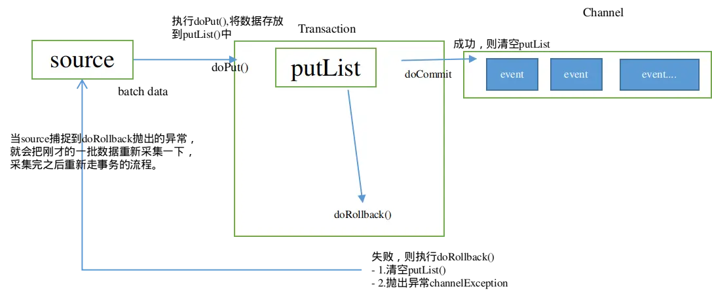
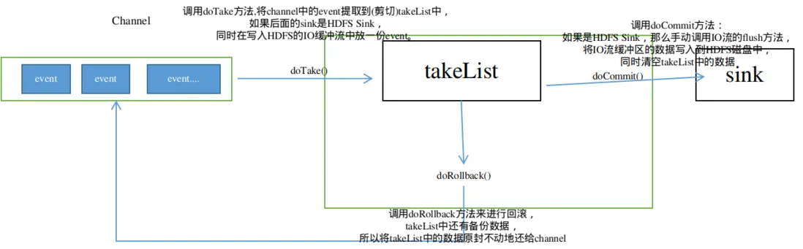
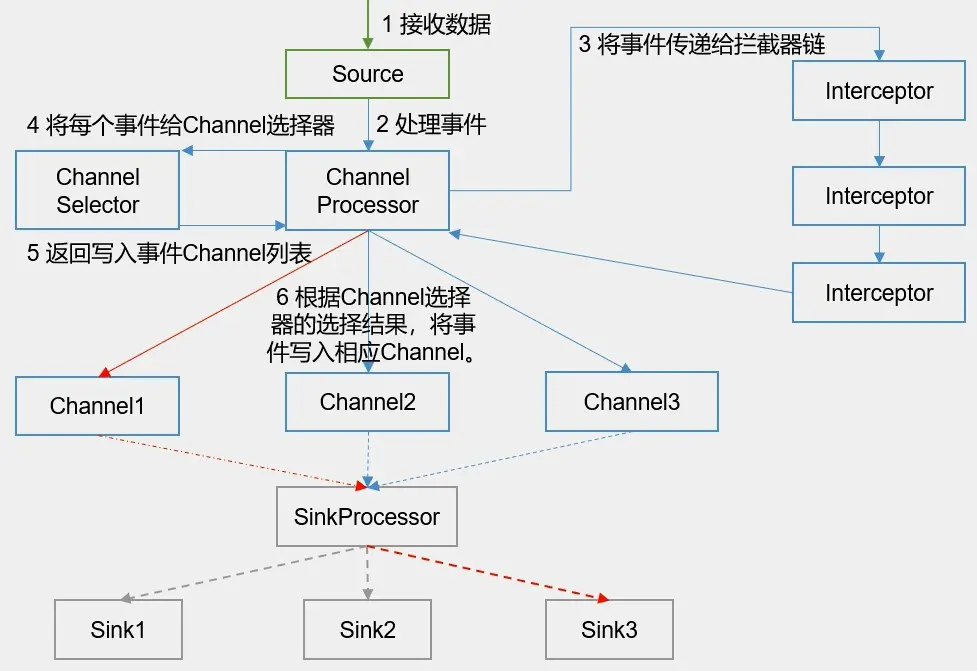

Flume使用两个独立的事务分别负责从soucrce到channel，以及从channel到sink的事件传递。**在Source到Channel之间的叫put事务**，**在Channel到Sink之间的叫Take事务**。
事务两个特性就是：成功了提交，失败了回滚。

## Put事务

从source到channel过程中，数据在flume中会被封装成Event对象，**多个event被放到一个事务中**，然后把这个包含events的事务放到channel中。



- 事务开始的时候会调用一个doPut方法，**doPut方法的会将这批数据batch data，也就是一批event放到putList中**。

    1. doPut传递的数据的大小可以通过参数bathchSize配置。
    2. putList的大小则通过channel的参数transactionCapacity进行配置。

- 当数据成功存放到putList之后，调用doCommit()方法,putList中所有的event进入channel()中。

    1. 成功则清空putList。
    2. 不成功的情况：
        
        1. 从putList传输到channel过程出问题，**在doCommit提交之后，事务在向channel放的过程中，遇到问题**。
        2. Sink那边取数据速度要比Source这边放数据速度慢，**导致channel中的数据积压，这个时候就会造成putList中的数据放不进去**。

    3. 这时会进行事务的回滚操作，调用doRollback方法，doRollback方法会做两个事情：

        1. 清空putList中的数据。
        2. **抛出channelException异常**。

        **当source捕捉到doRollback抛出的异常，就会把刚才的一批数据重新采集一下，采集完之后重新走事务的流程**。

## Take事务



1. 事务开始时，调用doTake方法,将channel中的event提取到(剪切)takeList中。
2. 如果后面的sink是HDFS Sink，同时在**写入HDFS的IO缓冲流中放一份event**。
3. 当takeList中存放的Event达到**约定数量(batchSize) ，就会调用doCommit方法**：

    1. 成功执行情况下:
        - **如果是HDFS Sink，那么手动调用IO流的flush方法，将IO流缓冲区的数据写入到HDFS磁盘中**，同时清空takeList中的数据。

    2. 失败情况下:

        - 网络延迟等原因导致传输数据失败，调用doRollback方法来进行回滚，**takeList中还有备份数据，所以将takeList中的数据原封不动地还给channel**，这时候就完成了事务的回滚。

        - 如果takeList数据有一部分传输成功了，剩下的因为网络延迟传输失败了，同样会调用doRollback方法来进行回滚，它会把整个takeList中的数据返回给channel，**会将当前的takeList清空，并将takeList的信息回滚到channel中，如果此时channel也是满的**，直接报错，然后继续进行数据的读写。

        **如此一来，再次进行事务时候，就会存在数据重复的可能**。

## Flume内部原理



### Source采集数据

- **EventBuilder.withBody(body)将数据封装成Event对象**，getChannelProcessor().processEvent(event)将数据交给Channel Processor
通过源码可以看到，以avro source为例:

    ```java
     public Void append(AvroFlumeOGEvent evt) throws AvroRemoteException
      {
        .....
    
        Event event = EventBuilder.withBody(evt.getBody().array(), headers); // 将数据封装成Event对象，
        try {
          getChannelProcessor().processEvent(event); // 将数据交给Channel Processor
          this.counterGroup.incrementAndGet("rpc.events");
        } catch (ChannelException ex) {
          return null;
        }
    
        this.counterGroup.incrementAndGet("rpc.successful");
        return null;
      }
    
    ```
- **Channel Processor将Event事件传递给拦截器链interceptorChain.intercept(event)**，然后将数据返回给Channel Processor。

- Channel Processor将拦截过滤之后的Event事件传递给Channel选择器(Channel Selector))，Channel Selector返回给Channel Processor写入event事件的Channel列表,其中Channel Selectors有两种类型：
    - Replicating Channel Selector : 将source过来的events发往所有的channel（相当于复制多份，默认使用的channel selector）。
    - Multiplexing Channel Selector：可以指定source发过来的events发往的channel。

- Channel Processor根据Channel选择器的选择结果，将Event事件写入相应的Channel。

- 看下channel Processor源码，首先构造器中**直接定义了selector和拦截器interceptorChain**。

    ```java
      public ChannelProcessor(ChannelSelector selector)
      {
        this.selector = selector;
        this.interceptorChain = new InterceptorChain();
      }
     
    ```
- 然后在processEvent和```processEventBatch(List<Event> events)```。

    ```java
     public void processEvent(Event event)
      {
        event = this.interceptorChain.intercept(event); // 提交到拦截器链
        if (event == null) {
          return;
        }
    
        List requiredChannels = this.selector.getRequiredChannels(event); // 提交到channel 选择器
        for (Iterator localIterator = requiredChannels.iterator(); localIterator.hasNext(); ) { reqChannel = (Channel)localIterator.next();
          Transaction tx = reqChannel.getTransaction();
          Preconditions.checkNotNull(tx, "Transaction object must not be null");
          try {
            tx.begin();
            reqChannel.put(event);
            tx.commit();
          } catch (Throwable t) {
            tx.rollback();
            if ((t instanceof Error)) {
              LOG.error("Error while writing to required channel: " + reqChannel, t);
              throw ((Error)t);
            }if ((t instanceof ChannelException)) {
              throw ((ChannelException)t);
            }
            throw new ChannelException("Unable to put event on required channel: " + reqChannel, t);
          }
          finally
          {
            if (tx != null)
              tx.close();
          }
        }
        Channel reqChannel;
        List optionalChannels = this.selector.getOptionalChannels(event); 
        for (Channel optChannel : optionalChannels) {
          Transaction tx = null;
          try {
            tx = optChannel.getTransaction();
            tx.begin();
    
            optChannel.put(event); // 将event事件写入channel
    
            tx.commit();
          } catch (Throwable t) {
            tx.rollback();
            LOG.error("Unable to put event on optional channel: " + optChannel, t);
            if ((t instanceof Error))
              throw ((Error)t);
          }
          finally {
            if (tx != null)
              tx.close();
          }
        }
      }
    }
    ```
- SinkProcessor启动sink，sink在channel中去轮询，取出channel中的event事件。SinkProcessor有三种:

    - DefaultSinkProcessor(默认的，内部无任何逻辑，只是单纯的调用sink)。
    - LoadBalancingSinkProcessor(负载均衡)。

        - 负载均衡Sink 选择器提供了在多个sink上进行负载均衡流量的功能。 **它维护一个活动sink列表的索引来实现负载的分配。 默认支持了轮询（round_robin）和随机（random）两种选择机制分配负载。 默认是轮询，可以通过配置来更改**。也可以从 AbstractSinkSelector 继承写一个自定义的选择器。

        工作时，此选择器使用其配置的选择机制选择下一个sink并调用它。 如果所选sink无法正常工作，则处理器通过其配置的选择机制选择下一个可用sink。 此实现不会将失败的Sink列入黑名单，而是继续乐观地尝试每个可用的Sink。
        如果所有sink调用都失败了，选择器会将故障抛给sink的运行器。

        如果backoff设置为true则启用了退避机制，失败的sink会被放入黑名单，达到一定的超时时间后会自动从黑名单移除。 如从黑名单出来后sink仍然失败，则再次进入黑名单而且超时时间会翻倍，以避免在无响应的sink上浪费过长时间。 如果没有启用退避机制，在禁用此功能的情况下，发生sink传输失败后，会将本次负载传给下一个sink继续尝试，因此这种情况下是不均衡的。

    - FaioverSinkProcessor(故障转移)。

        - 故障转移组逻辑处理器维护了一个发送Event失败的sink的列表，保证有一个sink是可用的来发送Event。
        故障转移机制的工作原理是将故障sink降级到一个池中，在池中为它们分配冷却期（超时时间），在重试之前随顺序故障而增加。**Sink成功发送事件后，它将恢复到实时池。sink具有与之相关的优先级，数值越大，优先级越高。 如果在发送Event时Sink发生故障，会继续尝试下一个具有最高优先级的sink**。 例如，在优先级为80的sink之前激活优先级为100的sink。如果未指定优先级，则根据配置中的顺序来选取。

        要使用故障转移选择器，不仅要设置sink组的选择器为failover，还有为每一个sink设置一个唯一的优先级数值。 可以使用 maxpenalty 属性设置故障转移时间的上限（毫秒）。