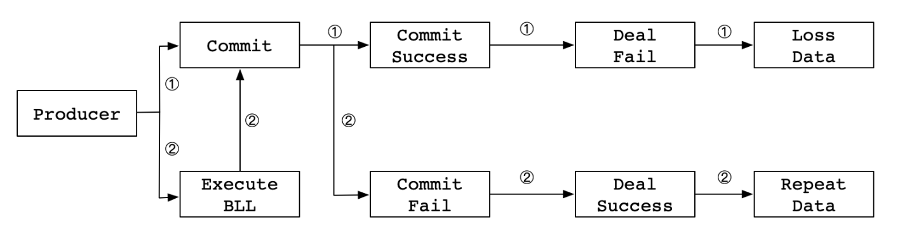
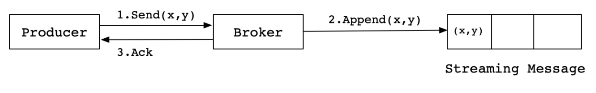
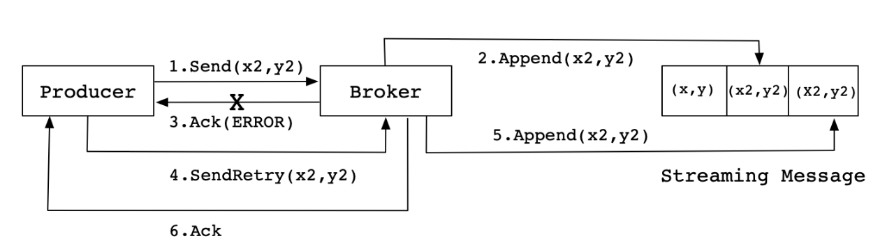
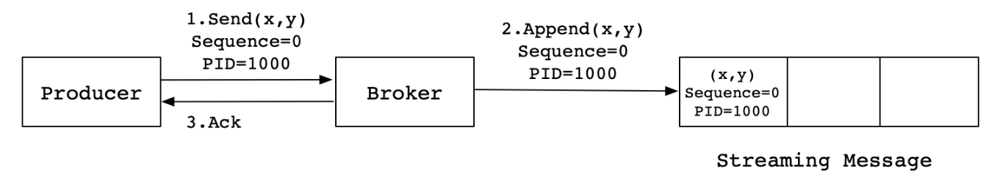
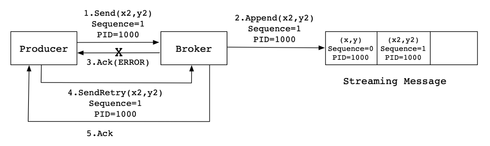

## 位置概念

Kafka的ISR（In-Sync Replicas）、OSR（Out-of-Sync Replicas）、AR（Assigned Replicas）、HW（High Watermark）和LEO（Log End Offset）之间的关系可以通过以下文字图形来表示：

- ISR：同步副本集合，包含了与leader保持同步的follower副本。当一个follower副本与leader之间的滞后时间小于某个阈值时，它会被加入到ISR中。

- OSR：落后副本集合，包含了与leader之间滞后时间较大的follower副本。当一个follower副本与leader之间的滞后时间超过阈值时，它会被从ISR中移除，并加入到OSR中。

- AR：分配副本集合，包含了被分配到分区的所有副本，包括leader副本和follower副本。

- HW：高水位线，表示消费者已经消费到的最大偏移量。当生产者向Kafka发送消息时，其能够消费到的offset+1就是HW，也就是水桶原理，对应的follower，也就是每个分区的LEO的最小值就是HW，也就是HW-1的offset就是的消息对于消费者是可见的（简单的理解就是水桶原理，最低的木板就是HW）。

- LEO：日志结束偏移量，表示当前日志文件中最大的offset值。当消费者成功消费一条消息后，其offset会增加，但不会超过LEO。

关系图如下：

```
+------------+     +------------+     +------------+     +------------+
|            |     |            |     |            |     |            |
| Leader     |---->| Follower   |---->| Follower   |---->| Follower   |
|            |     | (ISR)      |     | (OSR)      |     | (AR)       |
+------------+     +------------+     +------------+     +------------+
                            每个分区最小的LEO
                                 ^
                                 |
                                 v
                                 HW
                                   每个分区的offset+1,即是下一次写入数据的位置
                                    ^
                                    |
                                    v
                                    LEO
```

在这个关系图中，Leader、Follower、ISR、OSR、AR、HW和LEO之间的关系如下：

- Leader是分区的领导者，负责处理客户端请求和协调副本之间的数据同步。
- Follower是分区的跟随者，负责复制Leader的数据并保持与Leader的数据同步。
- ISR是与Leader保持同步的Follower副本集合。当一个Follower副本与Leader之间的滞后时间小于阈值时，它会被加入到ISR中。
- OSR是与Leader之间滞后时间较大的Follower副本集合。当一个Follower副本与Leader之间的滞后时间超过阈值时，它会被从ISR中移除，并加入到OSR中。
- AR是分配给分区的所有副本集合，包括Leader副本和Follower副本。
- HW表示消费者已经消费到的最大偏移量。生产者在向Kafka发送消息时，其offset不会低于HW。
- LEO表示当前日志文件中最大的offset值。消费者成功消费一条消息后，其offset会增加，但不会超过LEO。

> 总结：kafka既不是同步，也不是异步的形式，同步的话就是要所有的Follower都成功以后才会成功，那么性能就会有很大的影响。异步的话就是Leader成功就行了，这样就会有数据丢失的可能，他使用了ISR的方式，消费者只能看到HW-1的数据，这样就避免了数据丢失。也提高了性能。

## 幂等性

### Kafka为啥需要幂等性？

Producer在生产发送消息时，**难免会重复发送消息**。**Producer进行retry时会产生重试机制，发生消息重复发送**。而引入幂等性后，重复发送只会生成一条有效的消息。Kafka作为分布式消息系统，它的使用场景常见与分布式系统中，比如消息推送系统、业务平台系统（如物流平台、银行结算平台等）。**以银行结算平台来说，业务方作为上游把数据上报到银行结算平台，如果一份数据被计算、处理多次，那么产生的影响会很严重**。

### 影响Kafka幂等性的因素有哪些？

在使用Kafka时，需要确保Exactly-Once语义。分布式系统中，一些不可控因素有很多，**比如网络、OOM、FullGC等。在Kafka Broker确认Ack时，出现网络异常、FullGC、OOM等问题时导致Ack超时，Producer会进行重复发送**。可能出现的情况如下：



### Kafka的幂等性是如何实现的？

Kafka为了实现幂等性，它在底层设计架构中引入了```ProducerID```和```SequenceNumber```。那这两个概念的用途是什么呢？

- ```ProducerID```：在每个新的Producer初始化时，**会被分配一个唯一的ProducerID，这个ProducerID对客户端使用者是不可见的**。

- ```SequenceNumber```：对于每个ProducerID，Producer发送数据的每个Topic和Partition都对应一个**从0开始单调递增的SequenceNumber值**。

### 幂等性引入之前的问题？

Kafka在引入幂等性之前，Producer向Broker发送消息，然后Broker将消息追加到消息流中后给Producer返回Ack信号值。实现流程如下：



上图的实现流程是一种理想状态下的消息发送情况，**但是实际情况中，会出现各种不确定的因素，比如在Producer在发送给Broker的时候出现网络异常**。比如以下这种异常情况的出现：



上图这种情况，当Producer第一次发送消息给Broker时，**Broker将消息(x2,y2)追加到了消息流中，但是在返回Ack信号给Producer时失败了（比如网络异常） 。此时，Producer端触发重试机制，将消息(x2,y2)重新发送给Broker，Broker接收到消息后，再次将该消息追加到消息流中，然后成功返回Ack信号给Producer**。这样下来，消息流中就被重复追加了两条相同的(x2,y2)的消息。

### 幂等性引入之后解决了什么问题？

**面对这样的问题，Kafka引入了幂等性**。那么幂等性是如何解决这类重复发送消息的问题的呢？下面我们可以先来看看流程图：



 同样，这是一种理想状态下的发送流程。实际情况下，会有很多不确定的因素，**比如Broker在发送Ack信号给Producer时出现网络异常，导致发送失败**。异常情况如下图所示：



当Producer发送消息(x2,y2)给Broker时，Broker接收到消息并将其追加到消息流中。**此时，Broker返回Ack信号给Producer时，发生异常导致Producer接收Ack信号失败。对于Producer来说，会触发重试机制，将消息(x2,y2)再次发送**，但是，**由于引入了幂等性，在每条消息中附带了PID（ProducerID）和SequenceNumber。相同的PID和SequenceNumber发送给Broker，而之前Broker缓存过之前发送的相同的消息，那么在消息流中的消息就只有一条(x2,y2)，不会出现重复发送的情况**。

### ProducerID是如何生成的？

客户端在生成Producer时，会实例化如下代码：

```
// 实例化一个Producer对象
Producer<String, String> producer = new KafkaProducer<>(props);
```

在```org.apache.kafka.clients.producer.internals.Sender```类中，在run()中有一个maybeWaitForPid()方法，用来生成一个ProducerID，实现代码如下：

```java
private void maybeWaitForPid() {
        if (transactionState == null)
            return;

        while (!transactionState.hasPid()) {
            try {
                Node node = awaitLeastLoadedNodeReady(requestTimeout);
                if (node != null) {
                    ClientResponse response = sendAndAwaitInitPidRequest(node);
                    if (response.hasResponse() && (response.responseBody() instanceof InitPidResponse)) {
                        InitPidResponse initPidResponse = (InitPidResponse) response.responseBody();
                        transactionState.setPidAndEpoch(initPidResponse.producerId(), initPidResponse.epoch());
                    } else {
                        log.error("Received an unexpected response type for an InitPidRequest from {}. " +
                                "We will back off and try again.", node);
                    }
                } else {
                    log.debug("Could not find an available broker to send InitPidRequest to. " +
                            "We will back off and try again.");
                }
            } catch (Exception e) {
                log.warn("Received an exception while trying to get a pid. Will back off and retry.", e);
            }
            log.trace("Retry InitPidRequest in {}ms.", retryBackoffMs);
            time.sleep(retryBackoffMs);
            metadata.requestUpdate();
        }
    }
```

## 事务

**与幂等性有关的另外一个特性就是事务**。Kafka中的事务与数据库的事务类似，**Kafka中的事务属性是指一系列的Producer生产消息和消费消息提交Offsets的操作在一个事务中，即原子性操作。对应的结果是同时成功或者同时失败**。

这里需要与数据库中事务进行区别，操作数据库中的事务指一系列的增删查改，**对Kafka来说，操作事务是指一系列的生产和消费等原子性操作**。

### Kafka引入事务的用途？

在事务属性引入之前，先引入Producer的幂等性，它的作用为：

- **Producer多次发送消息可以封装成一个原子性操作，即同时成功，或者同时失败**。
- 消费者&生产者模式下，**因为Consumer在Commit Offsets出现问题时，导致重复消费消息时，Producer重复生产消息。需要将这个模式下Consumer的Commit Offsets操作和Producer一系列生产消息的操作封装成一个原子性操作**。
产生的场景有：比如，在Consumer中Commit Offsets时，当Consumer在消费完成时Commit的Offsets为100（假设最近一次Commit的Offsets为50），那么执行触发Balance时，其他Consumer就会重复消费消息（消费的Offsets介于50~100之间的消息）。

### 事务提供了哪些可使用的API？

Producer提供了五种事务方法，它们分别是：initTransactions()、beginTransaction()、sendOffsetsToTransaction()、commitTransaction()、abortTransaction()，代码定义在org.apache.kafka.clients.producer.Producer<K,V>接口中，具体定义接口如下：

```java
// 初始化事务，需要注意确保transation.id属性被分配
void initTransactions();

// 开启事务
void beginTransaction() throws ProducerFencedException;

// 为Consumer提供的在事务内Commit Offsets的操作
void sendOffsetsToTransaction(Map<TopicPartition, OffsetAndMetadata> offsets,
                              String consumerGroupId) throws ProducerFencedException;

// 提交事务
void commitTransaction() throws ProducerFencedException;

// 放弃事务，类似于回滚事务的操作
void abortTransaction() throws ProducerFencedException;
```

### 事务的实际应用场景有哪些？

在Kafka事务中，一个原子性操作，根据操作类型可以分为3种情况。情况如下：

- 只有Producer生产消息，这种场景需要事务的介入。

- 消费消息和生产消息并存，比如Consumer&Producer模式，这种场景是一般Kafka项目中比较常见的模式，需要事务介入。

- 只有Consumer消费消息，这种操作在实际项目中意义不大，和手动Commit Offsets的结果一样，而且这种场景不是事务的引入目的。