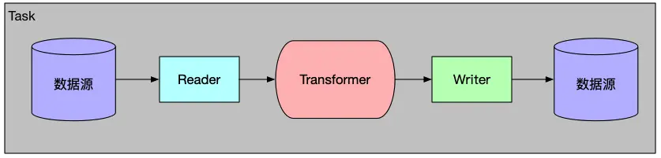

DataX 是阿里巴巴开源的一个异构数据源离线同步工具，致力于实现包括关系型数据库（MySQL、Oracle 等）、HDFS、Hive、ODPS、HBase、FTP 等各种异构数据源之间稳定高效的数据同步功能。

## 设计理念

异构数据源离线同步是将源端数据同步到目的端，但是端与端的数据源类型种类繁多，**在没有 DataX 之前，端与端的链路将组成一个复杂的网状结构**，非常零散无法将同步核心逻辑抽象出来，**DataX 的理念就是作为一个同步核心载体连接连接各类数据源，当我们需要数据同步时，只需要以插件的形式接入到 DataX 即可，将复杂的网状结构链路变成了一个星型结构**，如下图所示：

## 架构设计

用过 IDEA 的小伙都知道，IDEA 有很多非常棒的插件，用户可根据自身编程需求，下载相关的插件，DataX 也是使用这种可插拔的设计，采用了 Framework + Plugin 的架构设计，如下图所示：

有了插件，DataX 可支持任意数据源到数据源，只要实现了 Reader/Writer Plugin，官方已经实现了主流的数据源插件，比如 MySQL、Oracle、SQLServer 等，当然我们也可以开发一个 DataX 插件。

## 核心概念

DataX 核心主要由 Job、Task Group、Task、Channel 等概念组成：

### Job

**在 DataX 中用来描述一个源端到一个目的端的同步作业，是 DataX 数据同步面向用户的最小业务单元**。一个Job 对应 一个 JobContainer， JobContainer 负责 Job 的全局切分、调度、前置语句和后置语句等工作。

### Task Group

一组 Task 的集合，根据 DataX 的公平分配策略，公平地分配 Task 到对应的 TaskGroup 中。一个 TaskGroup 对应一个 TaskGroupContainer，负责执行一组 Task。

### Task

Job 的最小执行单元，一个 Job 可根据 Reader 端切分策略，且分成若干个 Task，以便于并发执行。Job、Task Group、Task 三者之间的关系可以用如下图表示：

根据切分策略将一个 Job 切分成多个 Task，根据分配策略将多个 Task 组成一个 TaskGroup。

### Channel

**DataX 会单独启动一条线程运行运行一个 Task**，而 Task 会持有一个 Channel，用作 Reader 与 Writer 的数据传输媒介，DataX 的数据流向都是按照 Reader—>Channel—>Writer 的方向流转，用如下图表示：

Channel 作为传输通道，即能充当缓冲层，同时还能对数据传输进行限流操作。

### Transformer

DataX 的 transformer 模式同时还提供了强大的数据转换功能，DataX 默认提供了丰富的数据转换实现类，用户还可以根据项目自身需求，扩展数据转换。

## 调度流程

DataX 将用户的 job.json 同步作业配置解析成一个 Job，DataX 通过 JobContainer 完成全局切分、调度、前置语句和后置语句等工作，整体调度流程用如下图表示：

### 切分策略

- 计算并发量（即 needChannelNumber 大小）
    - DataX有流控模式，其中，可以设置 bps 限速，tps 限速：

        - bps(字节每秒) 限速：needChannelNumber = 总 byteLimit / 单个 Channel byteLimit
        - tps(记录每秒) 限速：needChannelNumber = 总 recordLimit / 单个 Channel recordLimit

- 如果以上都没有设置，则**会根据用户在 job.setting.speed.channel 配置的并发数量设置 needChannelNumber**。

    - 据 needChannelNumber 将 Job 切分成多个 Task,这个步骤的具体切分逻辑交由相关插件去完成，例如 Rdb 对数据的拆分主要分成两类：

        - 如果**用户配置了具体的 Table 数量，那么就按照 Table 为最小单元进行拆分（即一个 Table 对应一个 Task）**，并生成对应的 querySql。

        - 如果用户还配置了 **splitPk，则会根据 splitPk 进行切分，具体逻辑是根据 splitPk 区间对 Table 进行拆分**，并生成对应的 querySql。
