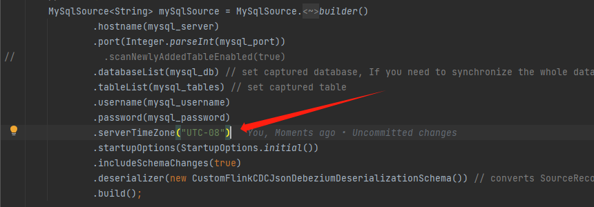

## The MySQL server has a timezone offset (28800 seconds behind UTC) which does not match the configured timezone Asia/Shanghai

出现这个问题的时候，就算使用下面的sql配置和mysql一样还是会出现错误。

```
show global variables like '%time_zone%'; 
```

解决办法



使用utc减去对应的秒就行了。utc+08是北京时间
```
serverTimeZone("UTC-08")
```

### 配置时区的小问题
**查询当前时间**
```
select curtime();
```

```
show variables like "%time_zone%";
```

```
 show variables like "%time_zone%";
+------------------+--------+
| Variable_name    | Value  |
+------------------+--------+
| system_time_zone | CST    |
| time_zone        | SYSTEM |
+------------------+--------+
 
# time_zone说明MySQL使用system的时区，system_time_zone说明system使用CST时区
# CST可视为美国、澳大利亚、古巴或中国的标准时间。
```
输入下面的语句，执行后，就可以将全局时区修改为东8区，即北京时间

```
set global time_zone = '+8:00';
```

输入下面的语句，执行后，就可以将当前会话的时区修改为东8区，即北京时间

```
set time_zone = '+8:00';
```

执行完成上面的SQL语句之后，如果想让时区立即生效，还需要执行下面的语句

```
flush privileges;
```

另外，还可以通过修改my.cnf配置文件来修改时区，如下所示：

```
# vim /etc/my.cnf ##在[mysqld]区域中加上
 
default-time_zone = '+8:00'
 
# /etc/init.d/mysqld restart ##重启mysql使新时区生效
```

### 读取时间问题

```
{
	"op": "d",
	"before": {
		"data": "2",
		"id": 1
	},
	"source": {
		"thread": 1667232,
		"server_id": 566338407,
		"version": "1.9.7.Final",
		"file": "mysql-bin.006831",
		"connector": "mysql",
		"pos": 15089998,
		"name": "mysql_binlog_source",
		"row": 0,
		"ts_ms": 1699842116000,
		"snapshot": "false",
		"db": "test",
		"table": "nihao"
	},
	"ts_ms": 1699842125977,
	"primarykey": "1"
}
```

- source里面的ts_ms时间才是正确的事件发生的时间（这个时间开始的时候是0，也就是读取全量的数据的时候是0，后面增量的时候就是时间发生的时间），外层的ts_ms会比正常时间慢9秒。
- datetime时间会装换成时间搓的类型，也就是这一块有时间问题。
- 处理的时候可以使用source.ts_ms，每个国家根据自己的时区不同，处理成相对北京时间的时间搓（比如数据库里面的时间是2023-11-13 02:11:14，flinkcdc读取过来以后是先装换成时间搓，在本地的时间以后就变成了2023-11-13 10:11:14，所以要处理下时间搓，对应flinkcdc采集过来的时间戳减去8个小时以后发送到kafka,这样就得到了每个国家的真实时间，然后存储到kafka和flume）。

## 'bogus data in log event; the first event 'mysql-bin.000002' at 211200498, 

### 解决办法

```
show variables like 'gtid_mode';
show variables like 'enforce_gtid_consistency';
show variables like 'slave_compressed_protocol';


SET GLOBAL gtid_mode = 'ON';
SET GLOBAL enforce_gtid_consistency = 'ON';
SET GLOBAL slave_compressed_protocol = 'ON';
```

### 对应问题的地址

> https://bugs.mysql.com/bug.php?id=84752

> https://forums.percona.com/t/multiple-slaves-error-bogus-data-in-log-event/5368


**对应问题**
> https://www.alibabacloud.com/help/zh/flink/support/faq-about-cdc