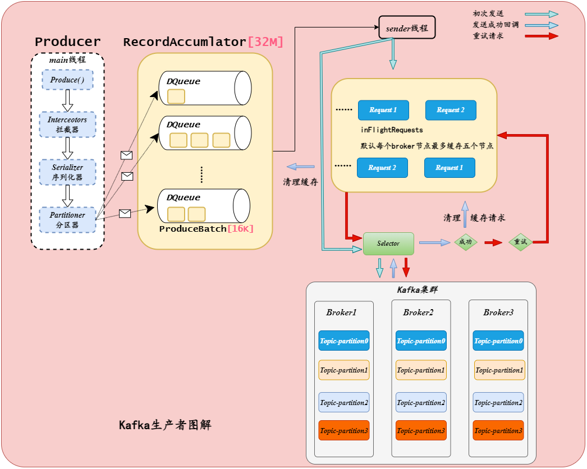

## 官方提供

[Flink CDC构建MySQL和Postgres上的 Streaming ETL](https://mp.weixin.qq.com/s/9OCEN6_KgIeF1DdMtmVdqA)

[Flink CDC 实现 MySQL 数据实时入 Apache Doris 数仓](https://mp.weixin.qq.com/s/-kWgCUrQjcg2ee3-Rd-Pog)

[基于 Flink CDC 同步 MySQL 分库分表，构建 Iceberg实时数据湖](https://mp.weixin.qq.com/s/mECOb5vSspPEsm6LZ8aN-g)

## 项目实战

知识准备
> 查看数据开发中的Apache Flink End-to-End-Exactly-Once

### Flink CDC 整库同步到Kafka
> 支持并发读取的 DataStream API
> 在 2.0 版本中，无锁算法，并发读取等功能只在 SQL API 上透出给用户，而 DataStream API 未透出给用户，2.1 版本支持了 DataStream API，可通过 MySqlSourceBuilder 创建数据源。用户可以同时捕获多表数据，借此搭建整库同步链路。同时通过 MySqlSourceBuilder#includeSchemaChanges 还能捕获schema 变更。

> 在 2.2 版本中MySQL CDC 支持动态加表
> 设想下假如你一个 CDC pipeline 监控了 4 张表，突然有天业务需求需要再加几张表，你肯定不想另起作业 (浪费资源)，那么这个 feature 可以让你在当前作业直接增加需要监控的表。新增表都是先做全量再优雅地切换到增量，遇到新增监控表时不用新起作业，极大地节约了资源。Flink CDC 网站也提供了该功能的使用文档[2]，用户在开发时可以参考。

由上可知，Flink CDC 2.0开始可以支持搭建整库同步链路，在2.2 版本支持动态加表，那么我们来实现一个动态加表的整库同步到Kafka案例，使用这个案例直接使用最近发布的2.4版本作为基础来实现。

#### 需求
1. MySQL整库的changelog数据同步到Kafka，数据不丢不重。

2. 支持动态的加入新表，加入以后能够在不停加的情况，新表的数据发送到Kafka。

3. 数据发送到Kafka的单行数据的changelog不乱序。

4. 可配置化。


#### 需求分析




#### 需求实现思路
| 需求      | 解决方案 |
| ----------- | ----------- |
| MySQL整库的changelog数据同步到Kafka，数据不丢不重。     | Flink CDC能够保证读取的时候不丢不重复，那么只要保证发送到Kafka的时候不丢就行了（具体原理和操作查看数据开发Apache Flink 的 End-to-End-Exactly-Once）。       |
| 支持动态的加入新表，加入以后能够在不停加的情况，新表的数据发送到Kafka。   | Flink CDC正则mysql_db=dbname mysql_tables=dbname.*，就能够实现动态表的监听不停机操作。       |
| 数据发送到Kafka的单行数据的changelog不乱序。     | 一张表对应一个topic,并且单行数据的crud操作的key用[tablename_id] 这样就能够使得单行数据到一个主题的一个分区，实现了数据不乱序。      |
| 可配置化。   | ParameterTool parameter = ParameterTool.fromArgs(args);把程序所有的变量抽象处理实现外部可配置化，达到开发接口实现整库同步的效果。       |

#### 实现的难点

Flink CDC 本身的序列化器是没有包含数据的主键的,那么得到主键的主键才能保证单行数据发送到Kafka数据不乱序，比如[tablename_id]，刚好下面伪代码可以得到对应的主键信息。

```java
 com.ververica.cdc.debezium.DebeziumDeserializationSchema
 public void deserialize(SourceRecord record, Collector<String> out)
        Schema sourceKeySchema = record.keySchema();
        List<Field> fields = sourceKeySchema.fields();
        //得到数据的表名
        String tableName = initDataInfo.getJSONObject("source").getString("table");
        resultPrimaryKey.append(tableName);
        //得到数据的主键数据
        for (Field field : fields) {
            String primaryKeyName = field.name();
            String primaryKeyValueItem="";
            if(initDataInfo.getJSONObject("after")!=null){
                primaryKeyValueItem= initDataInfo.getJSONObject("after").getString(primaryKeyName);
            }else{
                primaryKeyValueItem=initDataInfo.getJSONObject("before").getString(primaryKeyName);
            }
            resultPrimaryKey.append(primaryKeyValueItem);
        }

//上面实现的FlinkCDC序列化器装载进来。
        MySqlSource<String> mySqlSource = MySqlSource.<String>builder()
                .hostname(mysql_server)
                .port(Integer.parseInt(mysql_port))
                .scanNewlyAddedTableEnabled(true)
                .databaseList(mysql_db) // set captured database, If you need to synchronize the whole database, Please set tableList to ".*".
                .tableList(mysql_tables) // set captured table
                .username(mysql_username)
                .password(mysql_password)
//                .serverTimeZone(mysql_timezone)
                .startupOptions(StartupOptions.initial())
                .includeSchemaChanges(true)
                .deserializer(new CustomFlinkCDCJsonDebeziumDeserializationSchema()) // converts SourceRecord to JSON String
                .build();
```

最后得到的结果数据为，如下面的数据多了一个data_key和data_target_topic，这里加进去的主要作用是在Flink Kafka Product的时候能够知道发送到了那个主题，和对应的分区做好数据准备。

```json
{
	"op": "r",
	"data_key": "tablename_id",
	"data_target_topic": "databasename_tablename",
	"after": {
		"test1": "数据"
		"id": 89
	},
	"source": {
		"server_id": 0,
		"version": "1.3",
		"file": "",
		"connector": "mysql",
		"pos": 0,
		"name": "mysql_binlog_source",
		"row": 0,
		"ts_ms": 0,
		"snapshot": "false",
		"db": "库名",
		"table": "表名"
	},
	"ts_ms": 1691472223325
}
```

KafkaSink,自定义一些主题选择器，KeySerialization和ValueSerialization对之前的数据进行处理得到最初的Flink CDC 采集到的数据。

```java
        Properties properties = new Properties();
        properties.put(ProducerConfig.TRANSACTION_TIMEOUT_CONFIG,CommonString.CHECKPOINT_TIMEOUT+CommonString.CHECKPOINT_TIME*2);
        properties.setProperty(ProducerConfig.LINGER_MS_CONFIG, "2000");
        KafkaSink sink = KafkaSink.<String>builder()
                .setBootstrapServers(kafka_servsers)
                //自定义序列化器
                .setRecordSerializer(CustomKafkaRecordSerializationSchema.buildCustomKafkaRecordSerializationSchema())
                .setDeliverGuarantee(DeliveryGuarantee.EXACTLY_ONCE)
                .setTransactionalIdPrefix(kafka_transactionalIdprefix)
                .setKafkaProducerConfig(properties)
                .build();
        env
                .fromSource(mySqlSource, WatermarkStrategy.noWatermarks(), "CustomMySQL Source")
                .setParallelism(3).sinkTo(sink);
```

自定义序列化器代码
```java
/**
 * Selects a topic for the incoming record.
 *
 * @param <IN> type of the incoming record
 */
@PublicEvolving
public interface TopicSelector<IN> extends Function<IN, String>, Serializable {}

```

```java

public class CustomKafkaRecordSerializationSchema  {
    public static KafkaRecordSerializationSchema buildCustomKafkaRecordSerializationSchema(){
        return KafkaRecordSerializationSchema.builder()
                .setTopicSelector(new TopicSelector<String>() {
                    @Override
                    public String apply(String initData) {
                        JSONObject jsonObject = JSONObject.parseObject(initData);
                        String targetTopic = jsonObject.getString("topic");
                        return targetTopic;
                    }
                })
                .setValueSerializationSchema(new CustomFlinkKafkaSimpleStringValueSchema())
                .setKeySerializationSchema(new CustomFlinkKafkaSimpleStringKeySchema())
                .setPartitioner(new FlinkKafkaPartitioner<String>() {
                    @Override
                    public int partition(String record, byte[] key, byte[] value, String topic, int[] partitions) {
                        String keyString = new String(key, StandardCharsets.UTF_8);
                        int keyHashCode =  keyString.hashCode();
                        //确保指定的分区不为负数
                        int resHashNum=keyHashCode&0x7FFFFFFF;
                        return resHashNum%partitions.length;
                    }
                })
                .build();
    }
}
```

```java
CustomFlinkKafkaSimpleStringKeySchema
public byte[] serialize(String element) {
    JSONObject jsonObject = JSONObject.parseObject(element);
    String data_key = jsonObject.getString("data_key");
    return data_key.getBytes();
}
```

```java
CustomFlinkKafkaSimpleStringValueSchema
public byte[] serialize(String element) {
    JSONObject jsonObject = JSONObject.parseObject(element);
    jsonObject.remove("data_key");
    jsonObject.remove("data_target_topic");
    element=jsonObject.toJSONString();
    return element.getBytes(this.charset);
}
```

经过处理最后得到Flink CDC最原始的changelog数据，并且保证了**数据的整库同步，不丢不重复，动态加表，单行数据在Kafka不乱序(单行数据都根据自己的主键都发送到一个分区)**的需求。

```json
{
	"op": "r",
	"after": {
		"test1": "数据"
		"id": 89
	},
	"source": {
		"server_id": 0,
		"version": "1.3",
		"file": "",
		"connector": "mysql",
		"pos": 0,
		"name": "mysql_binlog_source",
		"row": 0,
		"ts_ms": 0,
		"snapshot": "false",
		"db": "库名",
		"table": "表名"
	},
	"ts_ms": 1691472223325
}
```
