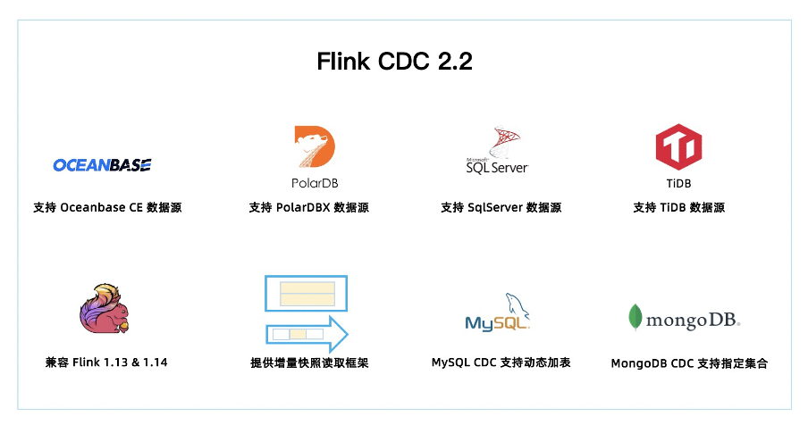
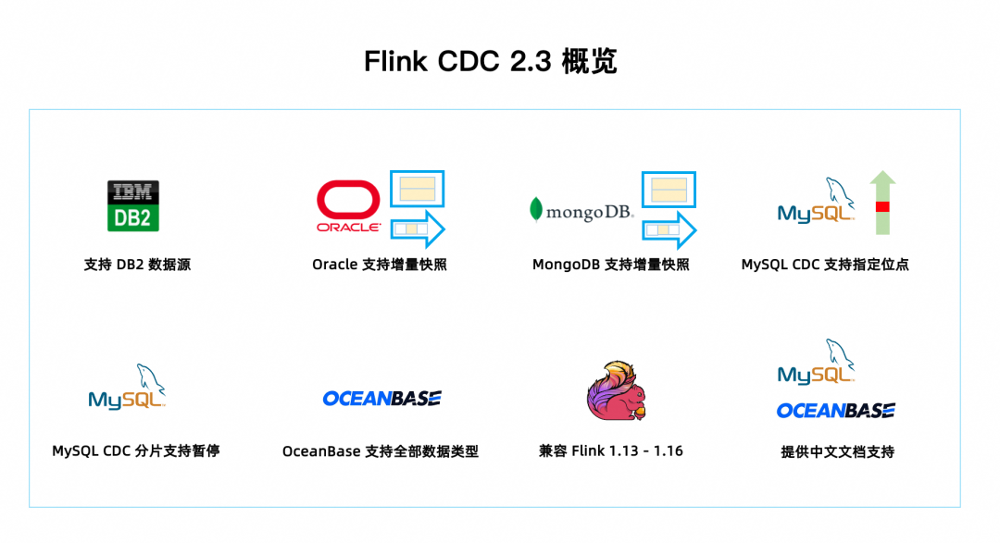

## Flink CDC 1.x

在 Flink CDC 1.x 版本时，MySQL CDC 存在三大痛点，影响了生产可用性。

- 一是 MySQL CDC 需要通过全局锁去保证全量和增量数据的一致性，而 **MySQL 的全局锁**会影响线上业务。

- 二是**只支持单并发读取，大表读取非常耗时**。

- 三是在**全量同步阶段，作业失败后只能重新同步**，稳定性较差。针对这些问题，Flink CDC 社区提出了 “增量快照读取算法”，同时实现了无锁读取、并行读取、断点续传等能力，一并解决了上述痛点。

## Flink CDC 2.x

### Flink CDC 2.0

提供 MySQL CDC 2.0，核心 feature 包括

- **并发读取**，全量数据的读取性能可以水平扩展；

- **全程无锁**，不对线上业务产生锁的风险；

- **断点续传**，支持全量阶段的 checkpoint。

TPC-DS 数据集中的 customer 表进行了测试，Flink 版本是 1.13.1，customer 表的数据量是 6500 万条，Source 并发为 8，全量读取阶段:

- MySQL CDC 2.0 用时 13 分钟；

- MySQL CDC 1.4 用时 89 分钟；

- 读取性能提升 6.8 倍。

### Flink CDC 2.1

> https://github.com/ververica/flink-cdc-connectors/releases/tag/release-2.1.0

2.1 版本包含 23 位贡献者贡献的 100+ PR，重点**提升了 MySQL CDC 连接器的性能和生产稳定性**，重磅**推出 Oracle CDC 连接器和 MongoDB CDC 连接器**。

- MySQL CDC 支持**百亿级数据的超大表，支持 MySQL 全部数据类型**，通过**连接池复用等优化大幅提升稳定性**。同时**提供支持无锁算法，并发读取的 DataStream API**，用户**可以借此搭建整库同步链路**；

- 新增了 Oracle CDC 连接器， **支持从 Oracle 数据库获取全量历史数据和增量变更数据**；

- 新增了 MongoDB CDC 连接器，**支持从 MongoDB 数据库获取全量历史数据和增量变更数据**；

- 所有连接器均支持了 metadata column 功能， 用户**通过 SQL 就可以访问库名，表名，数据变更时间等 meta 信息**，这对分库分表场景的数据集成非常实用；

- 支持 currentFetchEventTimeLag，currentEmitEventTimeLag，sourceIdleTime 监控指标

    这些指标遵循 FLIP-33 [1] 的连接器指标规范，可以查看 FLIP-33 获取每个指标的含义。其中，**currentEmitEventTimeLag 指标记录的是 Source 发送一条记录到下游节点的时间点和该记录在 DB 里产生时间点差值**，用于**衡量数据从 DB 产生到离开 Source 节点的延迟。用户可以通过该指标判断 source 是否进入了 binlog 读取阶段**：

    - 即当该指标为 0 时，**代表还在全量历史读取阶段**；

    - 当大于 0 时，则代表**进入了 binlog 读取阶段**。

### Flink CDC 2.2

> https://github.com/ververica/flink-cdc-connectors/releases/tag/release-2.2.0

2.2 版本共有 34 位社区贡献者参与贡献，累计贡献了 110+ commits。一图胜千言，本文通过下图带你一分钟快速了解 Flink CDC 2.2 版本的重大改进和核心特性。

- 2.2 版本新增 OceanBase，PolarDB-X，SqlServer，TiDB 四种数据源接入，均支持全量和增量一体化同步。至此，Flink CDC 已支持 12 种数据源。

- Flink CDC 兼容 Flink 1.13 和 Flink 1.14 两个大版本，2.2 版本的所有 Connector 都支持跑在 Flink 1.13.* 或 Flink 1.14.* 的集群上。

- 提供增量快照读取框架，方便其他连接器接入，其他连接器采用该框架后，便可以提供无锁算法，并发读取，断点续传等功能。

- **MySQL CDC 支持动态加表，该功能可以在无需重新读取已有表的基础上，增加需要监控的表，添加的表会自动先同步该表的全量数据再无缝切换到同步增量数据**，MySQL无锁算法提供抽象给其他连接器，解决MySQL CDC 通过心跳信息解决 binlog 过期问题。

- MongoDB CDC 支持正则表达式过滤集合，该功能可以让用户在作业中**指定所需监控的库名和集合名**，用户可以用一个作业中监控多个数据库或多个集合。

### Flink CDC 2.3

> https://github.com/ververica/flink-cdc-connectors/releases/tag/release-2.3.0

- 新增 Db2 CDC 连接器， 解锁读取 Db2 数据库，支持全量和增量一体化同步。

- MongoDB CDC，Oracle CDC 两大连接器均接入了增量快照框架，从而提供了无锁读取，并发读取和断点续传的能力。

- MySQL CDC 连接器在 2.3 版本里进行了诸多性能优化和稳定性大改进，极大提升了生产稳定性和性能,**支持指定位点启动,分片算法优化,稳定性提升**。

- Flink CDC 2.2 版本兼容了 Flink 1.13 和 Flink 1.14，**Flink CDC 2.3 在此基础上继续兼容了 Flink 1.15 & 1.16 大版本**，从而兼容了 Flink 的四个大版本。**这意味着 CDC 的 SQL connector 可以跑在不同的 Flink 集群上而无需任何修改，如果是 DataStream 用户也可以参考 SQL Connector 的打包方式，实现跨版本兼容**。

- OceanBase CDC 连接器支持将全部数据库类型对接到 Flink SQL，也就是说 OceanBase 所有类型的字段均支持同步。

- MySQL CDC 和 OceanBase CDC 连接器提供中文文档，这可以更好地帮助到中文用户。

### Flink CDC 2.4
> https://github.com/ververica/flink-cdc-connectors/releases/tag/release-2.4.0

- 新增 Vitess CDC 连接器，支持 Vitess 增量数据同步。

- PostgreSQL CDC，SQL Server CDC 两大连接器均接入了增量快照框架，从而提供了无锁读取，并发读取和断点续传的能力。

- 2.4 版本升级 Debezium 的依赖版本到 1.9.7.Final，引入了 Debezium 新版本的功能，优化和修复，比如：修复部分 DDL 无法解析的问题，修复解析 MySQL JSON 函数问题，Oracle 事件增加 scn 信息等。

- **增量快照框架在 2.4 版本增加了自动关闭全量阶段结束后的空闲 Reader 功能**，该功能非常实用，可以在生产环境节省资源。

- **MySQL CDC 连接器在 2.4 版本支持读取无主键表，同时支持新增表时原有实时同步链路不断流**(动态加表是2.2开始的，在之前的版本，新增表的时候会先同步完新表的全量数据，其他表才能够继续)。

- 社区 2.4 版本兼容 Flink 1.13 ~ 1.17 五个 Flink 版本。CDC 的 SQL Connector 可以跑在不同的 Flink 集群上而无需任何修改，实现跨版本兼容。如果是 Datastream 作业，则需要根据不同的 Flink 版本引入不同版本的 flink-shaded-guava 依赖，DataStream 用户可以参考 SQL Connector 的打包方式管理正确的依赖。

- MongoDB CDC 支持指定时间戳消费数据，支持 mongodb + srv 连接协议，并修复了若干问题，如：无法解析带连字符的库名，'poll.await.time.ms' 配置未生效，解析 DDL出现空指针等。

- OceanBase CDC 连接器支持 JDBC 参数设置，支持指定 Oracle 驱动，完善对 Oracle 数据类型的支持。
