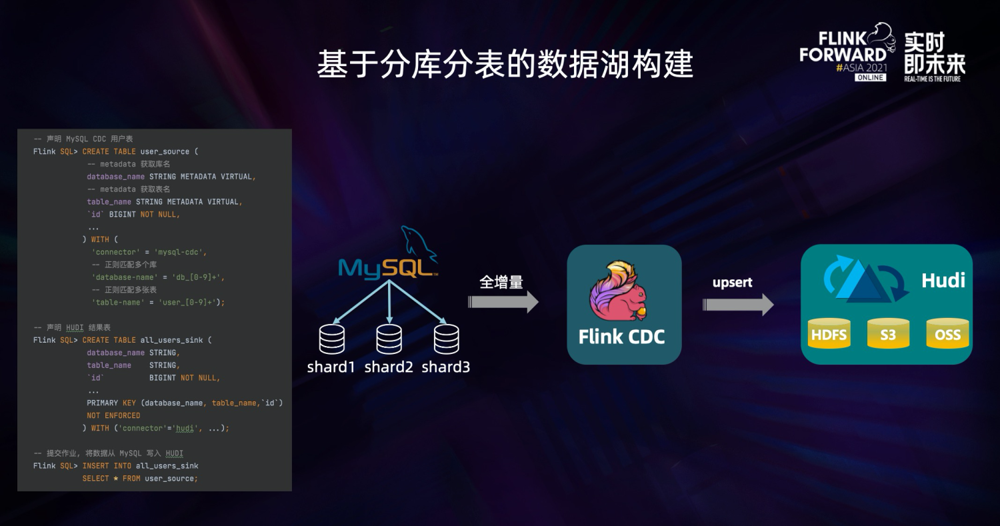

Flink CDC 的核心特性可以分成四个部分：

- 一是通过**增量快照读取算法，实现了无锁读取，并发读取，断点续传**等功能。

- 二是设计上对入湖友好，**提升了 CDC 数据入湖的稳定性**(这里也就是crud与湖同步，其实这样有好处也有坏处，好处是链路变短了，坏处是日志变更数据得不到)。

- 三是支持异构**数据源的融合，能方便地做 Streaming ETL**的加工。

- 四是**支持分库分表合并入湖**。接下来我们会分别介绍下这几个特性。

## 增量快照读取

在 Flink CDC 1.x 版本时，MySQL CDC 存在三大痛点，影响了生产可用性。

- 一是 MySQL CDC 需要通过全局锁去保证全量和增量数据的一致性，而 **MySQL 的全局锁**会影响线上业务。

- 二是**只支持单并发读取，大表读取非常耗时**。

- 三是在**全量同步阶段，作业失败后只能重新同步**，稳定性较差。针对这些问题，Flink CDC 社区提出了 “增量快照读取算法”，同时实现了无锁读取、并行读取、断点续传等能力，一并解决了上述痛点。

简单来说，增量快照读取算法的核心思路就是在**全量读取阶段把表分成一个个 chunk 进行并发读取**，在进入增量阶段后只需要**一个 task 进行单并发读取 binlog 日志**，在全量和增量自动切换时，通过无锁算法保障一致性。这种设计在提高读取效率的同时，进一步节约了资源。**实现了全增量一体化的数据同步**。这也是流批一体道路上一个非常重要的落地。

## 流式入湖

**（流式入湖会同步源库的crud操作到数据湖，也就是说上游修改更新了下游的数据湖也会对应的修改更新删除）**

Flink CDC 是一个流式入湖友好的框架。在早期版本的 Flink CDC 设计中，没有考虑数据湖场景，全量阶段不支持 Checkpoint，全量数据会在一个 Checkpoint 中处理，这对依靠 Checkpoint 提交数据的数据湖很不友好。Flink CDC 2.0 设计之初考虑了数据湖场景，是一种流式入湖友好的设计。设计上将全量数据进行分片，Flink CDC 可以将 **checkpoint 粒度从表粒度优化到 chunk 粒度，大大减少了数据湖写入时的 Buffer 使用**，对数据湖写入更加友好。

## 异构数据源融合
**（实际操作的时候会有数据缺少的情况）**

Flink CDC 区别于其他数据集成框架的一个核心点，就是在于 Flink 提供的流批一体计算能力。这使得 Flink CDC 成为了一个完整的 ETL 工具，不仅仅拥有出色的 E 和 L 的能力，还拥有强大的 Transformation 能力。因此我们可以轻松实现基于异构数据源的数据湖构建。

在上图左侧的 SQL 中，我们可以将 MySQL 中的实时产品表、实时订单表和 PostgreSQL 中的实时物流信息表进行实时关联，即 Streaming Join，关联后的结果实时更新到 Hudi 中，非常轻松地完成异构数据源的数据湖构建。

## 分库分表合并

在 OLTP 系统中，为了解决单表数据量大的问题，**通常采用分库分表的方式将单个大表进行拆分以提高系统的吞吐量。但是为了方便数据分析，通常需要将分库分表拆分出的表在同步到数据仓库、数据湖时，再合并成一个大表**。Flink CDC 可以轻松完成这个任务。

在上图左侧的 SQL 中，我们声明了一张 user_source 表去捕获所有 user 分库分表的数据，我们通过表的配置项 database-name、table-name 使用正则表达式来匹配这些表。并且，user_source 表也定义了两个 metadata 列来区分数据是来自哪个库和表。在 Hudi 表的声明中，我们将库名、表名和原表的主键声明成 Hudi 中的联合主键。在声明完两张表后，一条简单的 INSERT INTO 语句就可以将所有分库分表的数据合并写入 Hudi 的一张表中，完成基于分库分表的数据湖构建，方便后续在湖上的统一分析。