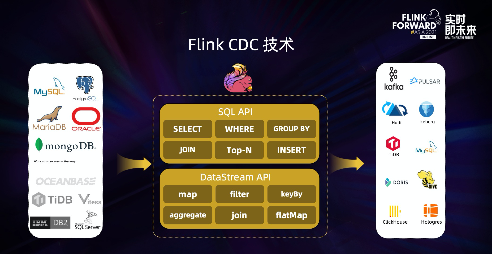

## Flink CDC 官网

> https://ververica.github.io/flink-cdc-connectors/master/

从广义的概念上讲，能够捕获数据变更的技术, 我们都可以称为 CDC 技术。通常我们说的 CDC 技术是一种用于捕获数据库中数据变更的技术。CDC 技术应用场景也非常广泛，包括：

- 数据分发，将一个数据源**分发给多个下游**，常用于业务解耦、微服务。

- 数据集成，将分散异构的**数据源集成到数据仓库**中，消除数据孤岛，便于后续的分析。

- 数据迁移，常用于**数据库备份、容灾**等。

Flink CDC 基于**数据库日志的 Change Data Caputre 技术**，实现了**全量和增量的一体化读取能力**，并借助 Flink 优秀的管道能力和丰富的上下游生态，支持捕获多种数据库的变更，并将这些变更实时同步到下游存储。

目前，Flink CDC 的上游已经支持了 MySQL、MariaDB、PG、Oracle、MongoDB 等丰富的数据源，对 Oceanbase、TiDB、SQLServer 等数据库的支持也已经在社区的规划中。

Flink CDC 的下游则更加丰富，支持写入 Kafka、Pulsar 消息队列，也支持写入 Hudi、Iceberg 等数据湖，还支持写入各种数据仓库。

同时，**通过 Flink SQL 原生支持的 Changelog 机制，可以让 CDC 数据的加工变得非常简单**。用户可以通过 SQL 便能实现数据库全量和增量数据的清洗、打宽、聚合等操作，极大地降低了用户门槛。 此外， Flink DataStream API 支持用户编写代码实现自定义逻辑，给用户提供了深度定制业务的自由度。

Flink CDC 技术的核心是**支持将表中的全量数据和增量数据做实时一致性的同步与加工**，让用户可以方便地获每张表的实时一致性快照。比如一张表中有历史的全量业务数据，也有增量的业务数据在源源不断写入，更新。Flink CDC 会实时抓取增量的更新记录，实时提供与数据库中一致性的快照，如果是更新记录，会更新已有数据。如果是插入记录，则会追加到已有数据，整个过程中，**Flink CDC 提供了一致性保障，即不重不丢**。

那么 Flink CDC 技术能给现有的数据入仓入湖架构带来什么样的改变呢？我们可以先来看看传统数据入仓的架构。

在**早期的数据入仓架构中，一般会每天 SELECT 全量数据导入数仓后再做离线分析**。这种架构有几个明显的缺点：

1. 每天查询全量的业务表会影响业务自身稳定性。

2. 离线天级别调度的方式，天级别的产出时效性差。

3. 基于查询方式，随着数据量的不断增长，对数据库的压力也会不断增加，架构性能瓶颈明显。

到了**数据仓库的 2.0 时代，数据入仓进化到了 Lambda 架构**，增加了实时同步导入增量的链路。整体来说，Lambda 架构的扩展性更好，也不再影响业务的稳定性，但仍然存在一些问题：

1. 依赖离线的定时合并，只能做到小时级产出，延时还是较大；

2. 全量和增量是割裂的两条链路；

3. 整个架构链路长，需要维护的组件比较多，该架构的全量链路需要维护 DataX 或 Sqoop 组件，增量链路要维护 Canal 和 Kafka 组件，同时还要维护全量和增量的定时合并链路。

对于传统数据入仓架构存在的问题，**Flink CDC 的出现为数据入湖架构提供了一些新思路。借助 Flink CDC 技术的全增量一体化实时同步能力，结合数据湖提供的更新能力，整个架构变得非常简洁。我们可以直接使用 Flink CDC 读取 MySQL 的全量和增量数据，并直接写入和更新到 Hudi**中。

这种简洁的架构有着明显的优势。首先，不会影响业务稳定性。其次，提供分钟级产出，满足近实时业务的需求。同时，全量和增量的链路完成了统一，实现了一体化同步。最后，**该架构的链路更短，需要维护的组件更少**。

