## Flink CDC 1.x 痛点
MySQL CDC 是 Flink CDC 中使用最多也是最重要的 Connector，本文下述章节描述 Flink CDC Connector 均为 MySQL CDC Connector。

随着 Flink CDC 项目的发展，得到了很多用户在社区的反馈，主要归纳为三个：

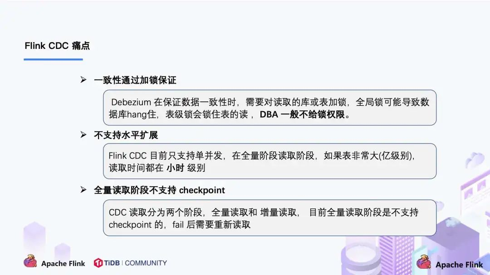

- **全量 + 增量读取的过程需要保证所有数据的一致性，因此需要通过加锁保证**，但是加锁在数据库层面上是一个十分高危的操作。底层 Debezium 在保证数据一致性时，**需要对读取的库或表加锁，全局锁可能导致数据库锁住，表级锁会锁住表的读**，DBA 一般不给锁权限。

- 不支持水平扩展，**因为 Flink CDC 底层是基于 Debezium，起架构是单节点，所以Flink CDC 只支持单并发**。在全量阶段读取阶段，如果表非常大 (亿级别)，读取时间在小时甚至天级别，用户不能通过增加资源去提升作业速度。

- 全量读取阶段不支持 checkpoint：CDC 读取分为两个阶段，全量读取和增量读取，**目前全量读取阶段是不支持 checkpoint 的，因此会存在一个问题：当我们同步全量数据时，假设需要 5 个小时，当我们同步了 4 小时的时候作业失败，这时候就需要重新开始**，再读取 5 个小时。

## Debezium 锁分析

Flink CDC 底层封装了 Debezium， Debezium 同步一张表分为两个阶段：

- 全量阶段：查询当前表中所有记录；

- 增量阶段：从 binlog 消费变更数据。

大部分**用户使用的场景都是全量 + 增量同步，加锁是发生在全量阶段**，目的是为了确定全量阶段的初始位点，保证增量 + 全量实现一条不多，一条不少，从而保证数据一致性。从下图中我们可以**分析全局锁和表锁的一些加锁流程**，**左边红色线条是锁的生命周期**，右边是 MySQL 开启可重复读事务**(默认)**的生命周期。

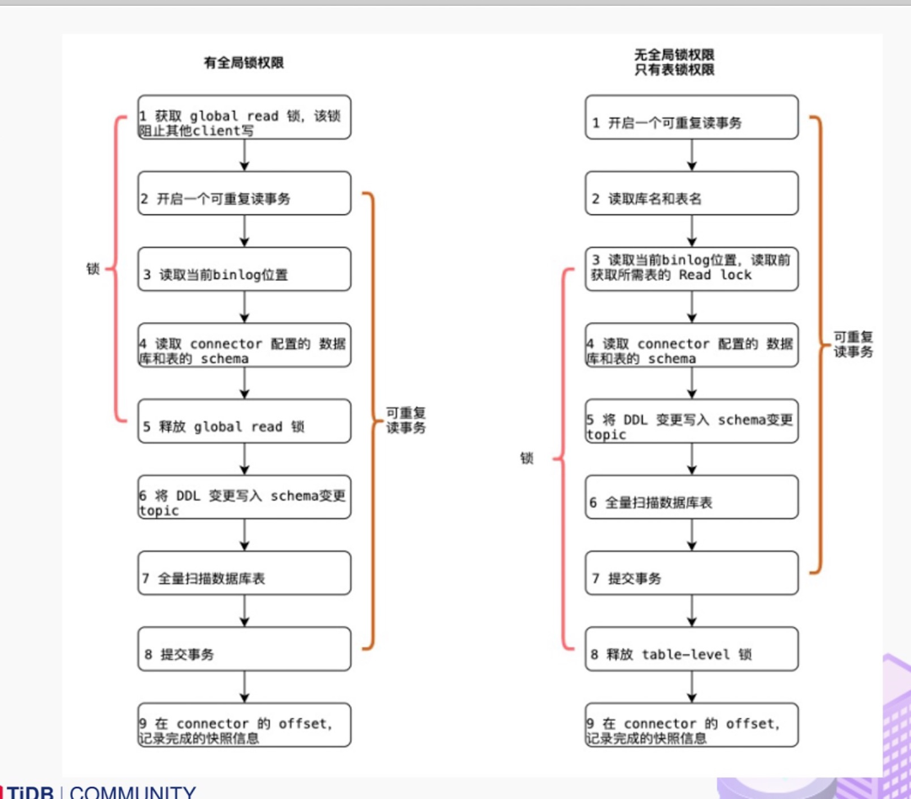

以全局锁为例，首先是获取一个锁，然后再去开启可重复读的事务。这里**锁住操作是读取 binlog 的起始位置和当前表的 schema。这样做的目的是保证 binlog 的起始位置和读取到的当前 schema 是可以对应上的**，因为表的 schema 是会改变的，比如如删除列或者增加列。在读取这两个信息后，SnapshotReader 会在可重复读事务里读取全量数据，在全量数据读取完成后，会启动 BinlogReader 从读取的 binlog 起始位置开始增量读取，从而保证全量数据 + 增量数据的无缝衔接。

表锁是全局锁的退化版，因为全局锁的权限会比较高，因此在某些场景，用户只有表锁。表锁锁的时间会更长，**因为表锁有个特征：锁提前释放了可重复读的事务默认会提交，所以锁需要等到全量数据读完后才能释放**。

经过上面分析，接下来看看这些锁到底会造成怎样严重的后果：

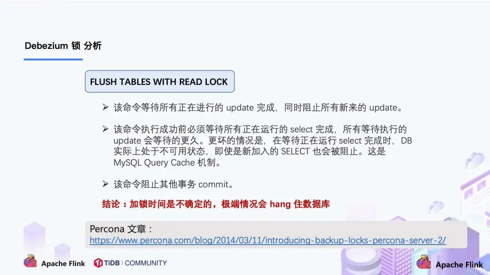

**Flink CDC 1.x 可以不加锁，能够满足大部分场景，但牺牲了一定的数据准确性**。Flink CDC 1.x 默认加全局锁，虽然能保证数据一致性，但存在上述 hang 住数据的风险。

## Flink CDC 2.0 设计 ( 以 MySQL 为例)

通过上面的分析，可以知道 2.0 的设计方案，核心要解决上述的三个问题，即支持无锁、水平扩展、checkpoint。

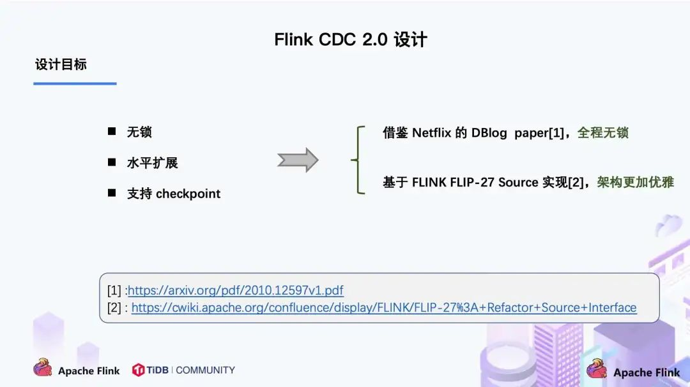

DBlog 这篇论文里描述的无锁算法如下图所示：

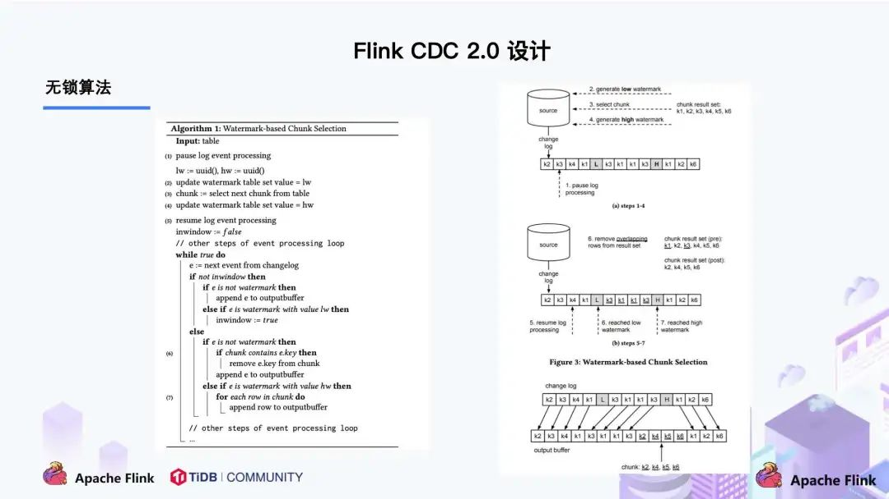

左边是 Chunk 的切分算法描述，Chunk 的切分算法其实和很多数据库的分库分表原理类似，**通过表的主键对表中的数据进行分片。假设每个 Chunk 的步长为 10，按照这个规则进行切分，只需要把这些 Chunk 的区间做成左开右闭或者左闭右开的区间**，保证衔接后的区间能够等于表的主键区间即可。

右边是每个 Chunk 的无锁读算法描述，该算法的**核心思想是在划分了 Chunk 后，对于每个 Chunk 的全量读取和增量读取，在不用锁的条件下完成一致性的合并**。Chunk 的切分如下图所示：

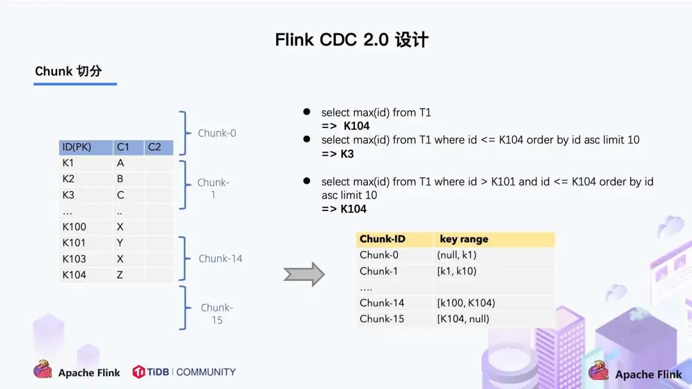

**因为每个 chunk 只负责自己主键范围内的数据，不难推导，只要能够保证每个 Chunk 读取的一致性，就能保证整张表读取的一致性**，这便是无锁算法的基本原理。

Netflix 的 DBLog 论文中 Chunk 读取算法是通过在 DB 维护一张信号表，再**通过信号表在 binlog 文件中打点，记录每个 chunk 读取前的 Low Position (低位点) 和读取结束之后 High Position (高位点) ，在低位点和高位点之间去查询该 Chunk 的全量数据。在读取出这一部分 Chunk 的数据之后，再将这 2 个位点之间的 binlog 增量数据合并到 chunk 所属的全量数据**，从而得到高位点时刻，该 chunk 对应的全量数据。

Flink CDC 结合自身的情况，在 Chunk 读取算法上做了去信号表的改进，不需要额外维护信号表，**通过直接读取 binlog 位点替代在 binlog 中做标记的功能**，整体的 chunk 读算法描述如下图所示：

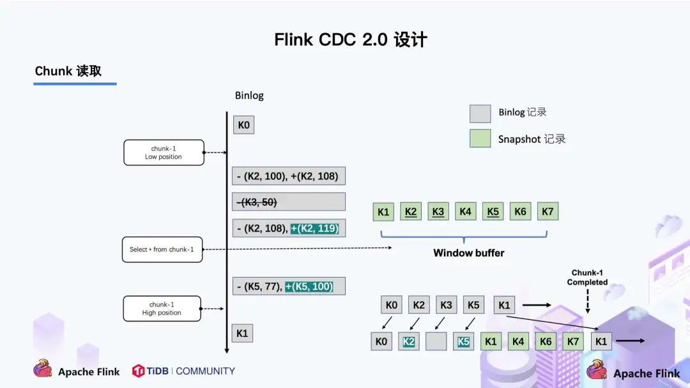

比如正在读取 Chunk-1，Chunk 的区间是 [K1, K10]，首先**直接将该区间内的数据 select 出来并把它存在 buffer 中**，**在 select 之前记录 binlog 的一个位点 (低位点)，select 完成后记录 binlog 的一个位点 (高位点)**。然后开始增量部分，消费从低位点到高位点的 binlog。

- 图中的 - ( k2,100 ) + ( k2,108 ) 记录表示这条数据的值从 100 更新到 108；

- 第二条记录是删除 k3；

- 第三条记录是更新 k2 为 119；

- **第四条记录是 k5 的数据由原来的 77 变更为 100**,这里也就是之前全量select之后的内存数据修复过程。

观察图片中右下角最终的输出，会发现在消费该 chunk 的 binlog 时，出现的 key 是k2、k3、k5，我们前往 buffer 将这些 key 做标记。

- 对于 k1、k4、k6、k7 来说，在高位点读取完毕之后，这些记录没有变化过，所以这些数据是可以直接输出的；

- 对于改变过的数据，则需要将增量的数据合并到全量的数据中，只保留合并后的最终数据。例如，**k2 最终的结果是 119 ，那么只需要输出 +(k2,119)，而不需要中间发生过改变的数据**。

通过这种方式，Chunk 最终的输出就是在高位点是 chunk 中最新的数据。

### 解决多个task保证一致性读

[在了解下面内容之前先了解下flink的datasource原理](https://nightlies.apache.org/flink/flink-docs-release-1.17/docs/dev/datastream/sources/)

上图描述的**是单个 Chunk 的一致性读，但是如果有多个表分了很多不同的 Chunk，且这些 Chunk 分发到了不同的 task 中，那么如何分发 Chunk 并保证全局一致性读呢**？

这个就是基于 FLIP-27 来优雅地实现的，通过下图可以看到有 SourceEnumerator 的组件，这个组件主要用于 Chunk 的划分，**划分好的 Chunk 会提供给下游的 SourceReader 去读取，通过把 chunk 分发给不同的 SourceReader 便实现了并发读取 Snapshot Chunk 的过程**，同时基于 FLIP-27 我们能较为**方便地做到 chunk 粒度的 checkpoint**。

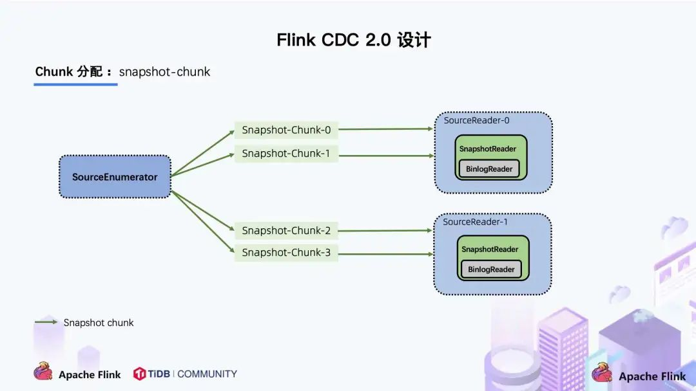

当 Snapshot Chunk 读取完成之后，需要有一个汇报的流程，如下图中橘色的汇报信息，将 Snapshot Chunk 完成信息汇报给 SourceEnumerator。

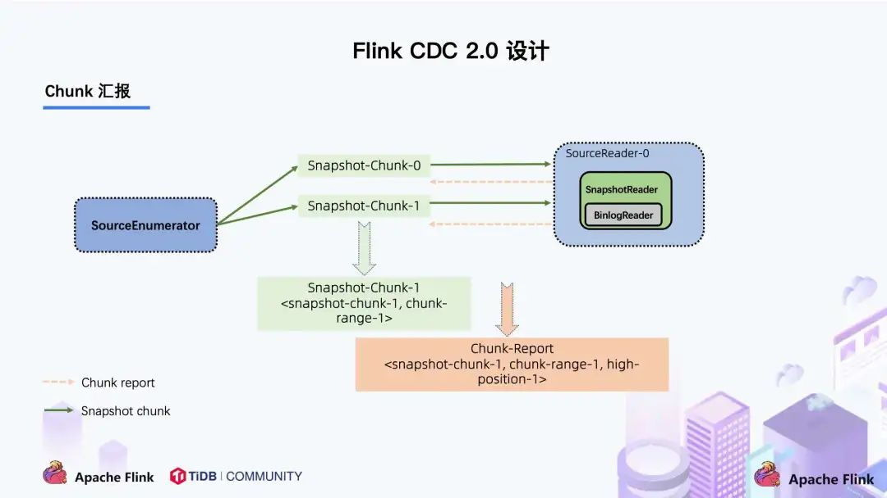

**汇报的主要目的是为了后续分发 binlog chunk** (如下图)。因为 Flink CDC 支持全量 + 增量同步，所以当所有 Snapshot Chunk 读取完成之后，还需要消费增量的 binlog，这是**通过下发一个 binlog chunk 给任意一个 Source Reader 进行单并发读取实现的**。

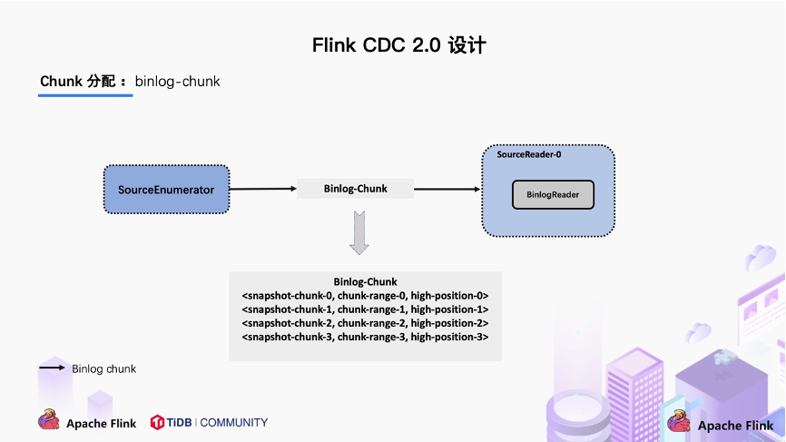

对于大部分用户来讲，其实无需过于关注如何无锁算法和分片的细节，了解整体的流程就好。

**总结**

整体流程可以概括为，首先通过主键对表进行 Snapshot Chunk 划分，再将 Snapshot Chunk 分发给多个 SourceReader，每个 Snapshot Chunk 读取时通过算法实现无锁条件下的一致性读，SourceReader 读取时支持 chunk 粒度的 checkpoint，在所有 Snapshot Chunk 读取完成后，下发一个 binlog chunk 进行增量部分的 binlog 读取，这便是 Flink CDC 2.0 的整体流程，如下图所示：

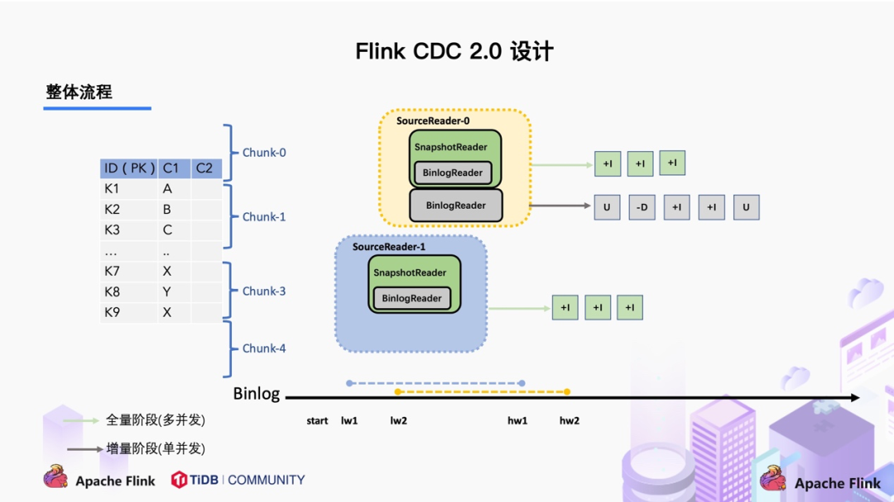

