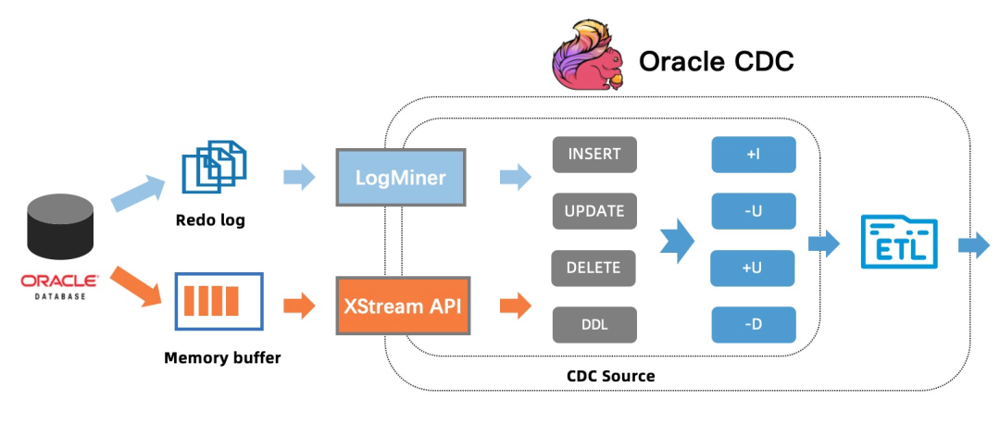
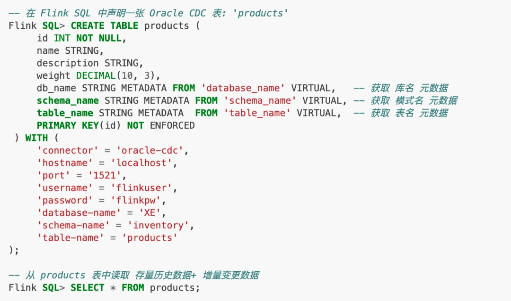
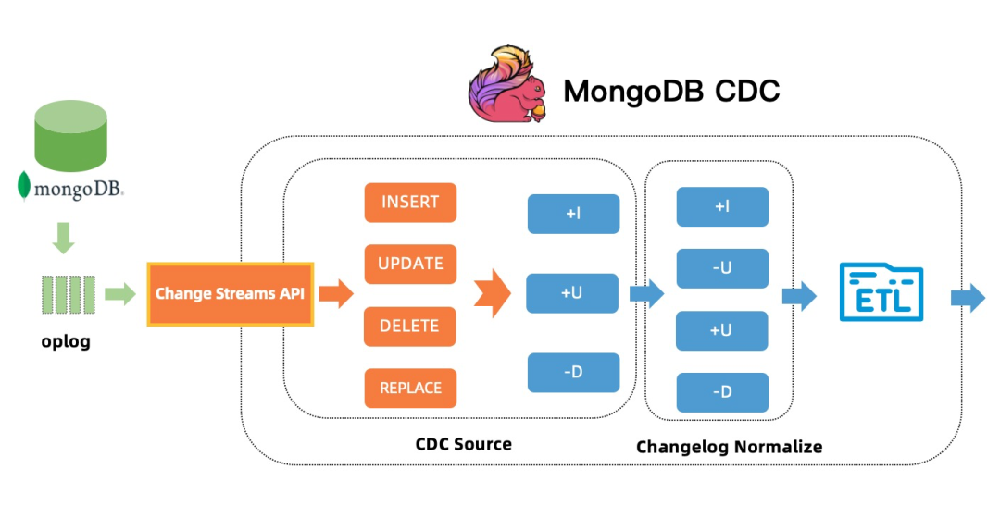
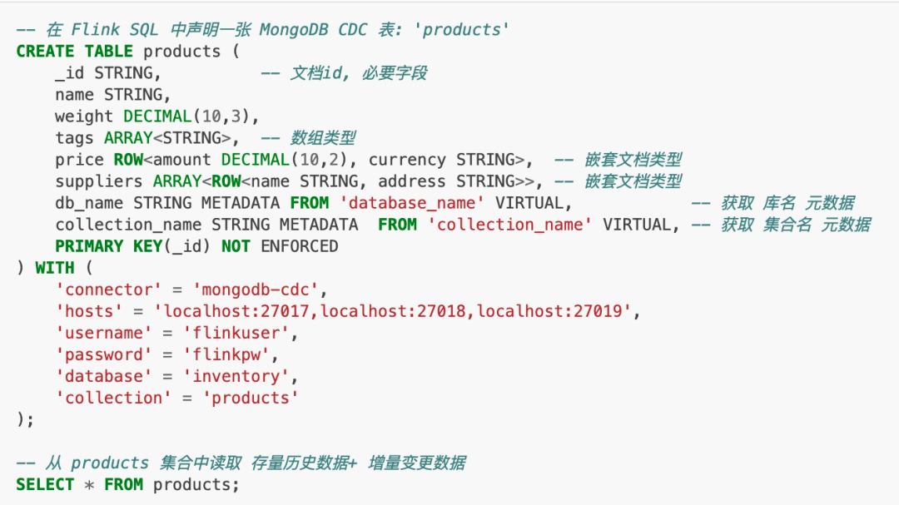

本文带着你 10 分钟了解 Flink CDC 2.1 版本的重大改进和核心功能。

> https://github.com/ververica/flink-cdc-connectors/releases/tag/release-2.1.0

2.1 版本包含 23 位贡献者贡献的 100+ PR，重点**提升了 MySQL CDC 连接器的性能和生产稳定性**，重磅**推出 Oracle CDC 连接器和 MongoDB CDC 连接器**。

- MySQL CDC 支持**百亿级数据的超大表，支持 MySQL 全部数据类型**，通过**连接池复用等优化大幅提升稳定性**。同时**提供支持无锁算法，并发读取的 DataStream API**，用户**可以借此搭建整库同步链路**；

- 新增了 Oracle CDC 连接器， **支持从 Oracle 数据库获取全量历史数据和增量变更数据**；

- 新增了 MongoDB CDC 连接器，**支持从 MongoDB 数据库获取全量历史数据和增量变更数据**；

- 所有连接器均支持了 metadata column 功能， 用户**通过 SQL 就可以访问库名，表名，数据变更时间等 meta 信息**，这对分库分表场景的数据集成非常实用；

## MySQL CDC 连接器改进详解

在 Flink CDC 2.0 版本里，MySQL CDC 连接器提供了无锁算法，并发读取，断点续传等高级特性, 一并解决了诸多生产实践上的痛点，随后大量用户开始投入使用并大规模上线。在上线过程中，我们配合用户解决了诸多生产问题，同时也开发了一些用户迫切需要的高优功能，Flink CDC 2.1 版本针对 MySQL CDC 连接器的改进主要包括两类，**一类是稳定性提升，一类是功能增强**。

### 稳定性提升

- 针对不同的主键分布，引入动态分片算法

    对主键是**非数值、Snowflake ID、稀疏主键、联合主键等场景，通过动态分析源表的主键分布的均匀程度，根据分布的均匀程度自动地计算分片大小，让切片更加合理，让分片计算更快**。动态分片算法能够很好地**解决稀疏主键场景下分片过多的，联合主键场景下分片过大等问题**，让**每个分片包含的行数尽量维持在用户指定的 chunk size**，这样用户**通过 chunk size 就能控制分片大小和分片数量，无需关心主键类型**。

- 支持百亿级超大规模表

    在表规模非常大时，以前会报 binlog 分片下发失败的错误，这是因为在超大表对应的 snapshot 分片会非常多，**而 binlog 分片需要包含所有 snapshot 分片信息，当 SourceCoordinator 下发 binglog 分片到 SourceReader 节点时，分片 size 超过 RPC 通信框架支持的最大 size 会导致分片下发失败**。虽然可以通过修改 RPC 框架的参数缓解分片 size 过大问题，但无法彻底解决。2.1 版本里通过将多个 snapshot 分片信息划分成 group 发送，一个 binlog 分片会切分成多个 group 逐个发送，从而彻底解决该问题。

- 引入连接池管理数据库连接，提升稳定性
    
    通过引入连接池管理数据库连接，一方面降低了数据库连接数，另外也**避免了极端场景导致的连接泄露**。

- 支持分库分表 schema 不一致时，缺失字段自动填充 NULL 值

### 功能增强

- 支持所有 MySQL 数据类型

    包括枚举类型、数组类型、地理信息类型等复杂类型。

- 支持 metadata column

    用户可以在 Flink DDL 中通过 db_name STRING METADATA FROM 'database_name' 的方式来访问库名(database_name)、表名（table_name）、变更时间（op_ts）等 meta 信息。这对分库分表场景的数据集成非常使用。

- 支持并发读取的 DataStream API

   在 2.0 版本中，无锁算法，并发读取等功能只在 SQL API 上透出给用户，而 DataStream API 未透出给用户，2.1 版本支持了 DataStream API，可通过 **MySqlSourceBuilder 创建数据源。用户可以同时捕获多表数据，借此搭建整库同步链路**。同时**通过 MySqlSourceBuilder#includeSchemaChanges 还能捕获 schema 变更**。

- 支持 currentFetchEventTimeLag，currentEmitEventTimeLag，sourceIdleTime 监控指标

    这些指标遵循 FLIP-33 [1] 的连接器指标规范，可以查看 FLIP-33 获取每个指标的含义。其中，**currentEmitEventTimeLag 指标记录的是 Source 发送一条记录到下游节点的时间点和该记录在 DB 里产生时间点差值**，用于**衡量数据从 DB 产生到离开 Source 节点的延迟。用户可以通过该指标判断 source 是否进入了 binlog 读取阶段**：

    - 即当该指标为 0 时，代表还在全量历史读取阶段；

    - 当大于 0 时，则代表进入了 binlog 读取阶段。

## 详解新增 Oracle CDC 连接器

Oracle 也是使用很广泛的数据库， Oracle CDC 连接器支持捕获并记录 Oracle 数据库服务器中发生的行级变更，其原**理是使用 Oracle 提供的 LogMiner [2] 工具或者原生的 XStream API [3] 从 Oracle 中获取变更数据**。

LogMiner 是 Oracle 数据库提供的一个分析工具，该工具可以解析 Oracle Redo 日志文件，从而将数据库的数据变更日志解析成变更事件输出。通过 LogMiner 方式时，Oracle 服务器对解析日志文件的进程做了严格的资源限制，所以对规模特别大的表，数据解析会比较慢，优点是 LogMiner 是可以免费使用的。

XStream API 是 Oracle 数据库为 Oracle GoldenGate (OGG) 提供的内部接口, 客户端可以通过 XStream API 高效地获取变更事件，其变更数据不是从 Redo 日志文件中获取，而是从 Oralce 服务器中的一块内存中直接读取，省去了数据落盘到日志文件和解析日志文件的开销，效率更高，但是必须购买 Oracle GoldenGate (OGG) 的 License。

Oracle CDC 连接器支持 LogMiner 和 XStream API 两种方式捕获变更事件。理论上能支持各种 Oracle 版本，目前 Flink CDC 项目里测试了 Oracle 11，12 和 19 三个版本。使用 Oracle CDC 连接器，用户只需要声明如下 Flink SQL 就能实时捕获 Oracle 数据库中的变更数据：

## 详解新增 MongoDB CDC 连接器

MongoDB CDC 连接器并不依赖 Debezium，是在 Flink CDC 项目里独立开发。MongoDB CDC 连接器支持捕获并记录 MongoDB 数据库中实时变更数据，其原理是伪装一个 MongoDB 集群里副本 [4]，利用 MongoDB 集群的高可用机制，该副本可以从 master 节点获取完整 oplog(operation log) 事件流。Change Streams API 则提供实时订阅这些 oplog 事件流的能力，可以将这些实时的 oplog 事件流推送给订阅的应用程序。

从 ChangeStreams API 获取的更新事件中，对于 update 事件，没有 update 事件的前镜像值，即 MongoDB CDC 数据源只能作为一个 upsert source。不过 Flink 框架会自动为 MongoDB CDC 附加一个 Changelog Normalize 节点，补齐 update 事件的前镜像值（即 UPDATE_BEFORE 事件)，从而确保 CDC 数据的语义正确性。

使用 MongoDB CDC 连接器，用户只需要声明如下 Flink SQL 就能实时捕获 MongoDB 数据库中的全量和增量变更数据，借助 Flink 强大的集成能力，用户可以非常方便地将 MongoDB 中的数据实时同步到 Flink 支持的所有下游存储。

整个数据捕获过程，用户不需要学习 MongoDB 的副本机制和原理，极大地简化了流程，降低了使用门槛。MongoDB CDC 也支持两种启动模式：

- 默认的initial 模式是先同步表中的存量的数据，然后同步表中的增量数据；
- latest-offset 模式则是从当前时间点开始只同步表中增量数据。

此外，MongoDB CDC 还提供了丰富的配置和优化参数，对于生产环境来说，这些配置和参数能够极大地提升实时链路的性能和稳定性。