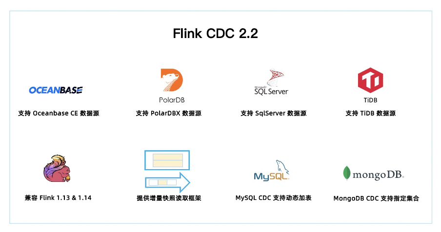
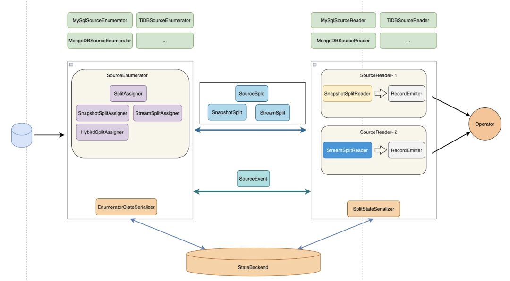

> https://github.com/ververica/flink-cdc-connectors/releases/tag/release-2.2.0

2.2 版本共有 34 位社区贡献者参与贡献，累计贡献了 110+ commits。一图胜千言，本文通过下图带你一分钟快速了解 Flink CDC 2.2 版本的重大改进和核心特性。

- 2.2 版本新增 OceanBase，PolarDB-X，SqlServer，TiDB 四种数据源接入，均支持全量和增量一体化同步。至此，Flink CDC 已支持 12 种数据源。

- Flink CDC 兼容 Flink 1.13 和 Flink 1.14 两个大版本，2.2 版本的所有 Connector 都支持跑在 Flink 1.13.* 或 Flink 1.14.* 的集群上。

- 提供增量快照读取框架，方便其他连接器接入，其他连接器采用该框架后，便可以提供无锁算法，并发读取，断点续传等功能。

- **MySQL CDC 支持动态加表，该功能可以在无需重新读取已有表的基础上，增加需要监控的表，添加的表会自动先同步该表的全量数据再无缝切换到同步增量数据**。

- MongoDB CDC 支持正则表达式过滤集合，该功能可以让用户在作业中**指定所需监控的库名和集合名**，用户可以用一个作业中监控多个数据库或多个集合。

## 新增 4 种数据源支持

Flink CDC 2.2 版本新增了 OceanBase CE，PolarDB-X，SqlServer，TiDB 四种数据源接入。其中新增 OceanBase CDC，SqlServer CDC，TiDB CDC 三个连接器，**而 PolarDB-X 的支持则是通过对 MySQL CDC 连接器进行兼容适配实现**。

- OceanBase CE

    OceanBase CE[3]是一款开源分布式数据库管理系统，同时支持在线事务处理与在线分析处理。OceanBase CDC 的实现机制是全量部分通过 JDBC 读取表中的历史数据，增量部分则是通过 OceanBase 提供 LogProxy Client 获取增量变更数据。

- PolarDB-X

    PolarDB-X[4]是一款云原生分布式数据库系统。**PolarDB-X 高度兼容 MySQL 系统及生态等特点**, 其**内部的日志节点提供了完全兼容 MySQL Binlog 格式和协议的增量消费能力**。这些特性使得 PolarDB-X 通过适配 MySQL CDC 即可快速接入 Flink CDC，PolarDB-X 的支持正是通过 MySQL CDC 适配实现，这种方式接入代价相对较小，**但却可以获取 MySQL CDC 连接器的全部能力**。

- SqlServer
     SqlServer[5]是一种使用广泛的数据库， SqlServer CDC 连接器支持捕获并记录 SqlServer 数据库服务器中发生的行级变更，其原理是使用 SqlServer 自身提供的 CDC 特性，SqlServer自身提供的 CDC 能力可以将数据库中指定的变更存档到指定的 change tables 中。SqlServer CDC 连接器首先通过 JDBC 读取表中的历史数据，再从 change tables 中或缺增量变更数据，从而实现全增量同步。   

- TiDB

    TiDB[6]是一款开源分布式关系型数据库，同时支持在线事务处理与在线分析处理。**TiDB CDC 的原理是通过直接读取其底层 TiKV 存储中的全量数据和增量数据实现数据捕获，其中全量部分是通过按 key 划分 range 读取，增量部分使用 TiDB 提供的 CDC Client 获取增量变更数据**。

## 详解核心 feature 和重要改进

### 核心 feature (mysql无锁方法提供抽象)

- **提供增量快照读取框架**

    大家都知道之前只有 MySQL CDC 支持无锁 + 多并发 + 全程断点续传等高级功能，这些功能最开始是在 2.0 版本中为 MySQL CDC 定制的增量快照读取算法实现，**2.2 版本将增量快照读取算法抽象成了公共框架，方便其他 connector 接入**。

    

    在增量框架完成后，其他 connector 只需要接入这个框架便可以提供无锁算法，并发读取，断点续传的能力。社区提供了一个基于增量快照框架的样例实现[7]，开发者可以参考该样例实现一个支持增量快照读取的 CDC Source。

- **兼容 Flink 1.13 & Flink 1.14**

    **在 2.2 版本之前，Flink CDC 连接器都只对应一个 Flink 大版本，比如很多用户反馈 Flink CDC 2.1 只能在 Flink 1.13 版本的集群上使用，没法在 Flink 1.14 的集群上使用**。为了帮用户解决此类问题， Flink CDC 2.2 版本兼容 Flink 1.13.* 和 Flink 1.14.* 两个大版本，这意味 2.2 版本的所有 Connector 既可以跑在 Flink 1.13.* 集群上，又可以跑在 Flink 1.14.* 的集群上。通过提供兼容多版本的能力，让 Flink CDC 在提供 1.14 支持的同时，还极大地降低用户的 connector 管理成本。

- **MySQL CDC 支持动态加表**

    设想下假如你一个 CDC pipeline 监控了 4 张表，突然有天业务需求需要再加几张表，你肯定不想另起作业 (浪费资源)，那么这个 feature 可以让你在当前作业直接增加需要监控的表。**新增表都是先做全量再优雅地切换到增量**，遇到新增监控表时不用新起作业，极大地节约了资源。Flink CDC 网站也提供了该功能的使用文档[2]，用户在开发时可以参考。

- **MongoDB CDC 支持自定义数据库，自定义集合**

    在 2.1 版本里 MongoDB CDC 只能捕获单个集合或者单个 DB 下的全部集合，2.2 版本提供了正则匹配支持，用户可以指定自己需要的多个库和多个表。

- MySQL CDC 支持 MySQL 5.6

    从 2.2 版本开始， **MySQL CDC 支持了 MySQL 5.6 版本，满足低版本的 MySQL 用户需求**。

### 重要改进（binglog过期问题）

- MySQL CDC 通过心跳信息解决 binlog 过期问题

    大家可能遇到过 binlog 过期问题，这种问题一般出现在更新缓慢的表身上，这是**因为 state 中记录的慢表位点总是最后一次更新的位点，假如 MySQL server 端只保留最近 1 天的 binlog，而某个慢表最近一天都没有更新过，那么 state 中记录的该表位点还是一天以前的位点**，当 MySQL server 清理 binlog 后，作业再次访问该位点就会报 binlog 无法找到的错误。**2.2 版本中通过心跳信息，将慢表的位点保持与当前 binlog 位点同步，避免了慢表 binlog 过期问题**。

- MySQL CDC 修复数组越界问题

    该问题的**根因是 MySQL CDC 依赖的第三方 binlog Client 存在数组越界 Bug**，且是一个和网络相关的不稳定复现 Bug。在 Flink CDC 2.2 版本中，社区对这个问题做了修复，提升了MySQL CDC binlog 读取阶段的稳定性。

- Oracle CDC 修复 Numeric 类型映射问题

    在 2.1 版本，Oracle CDC 在处理 Numeric 类型数据会出现转换异常，在 2.2 版本中做了修复。