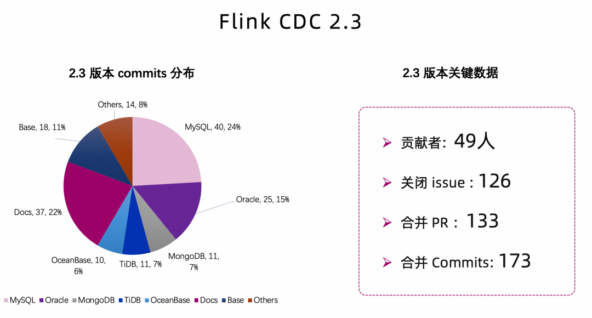
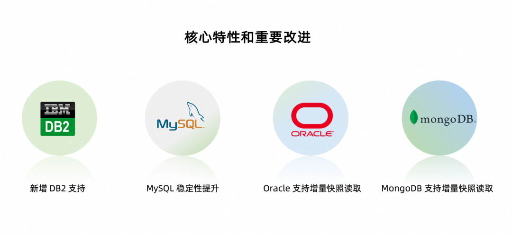
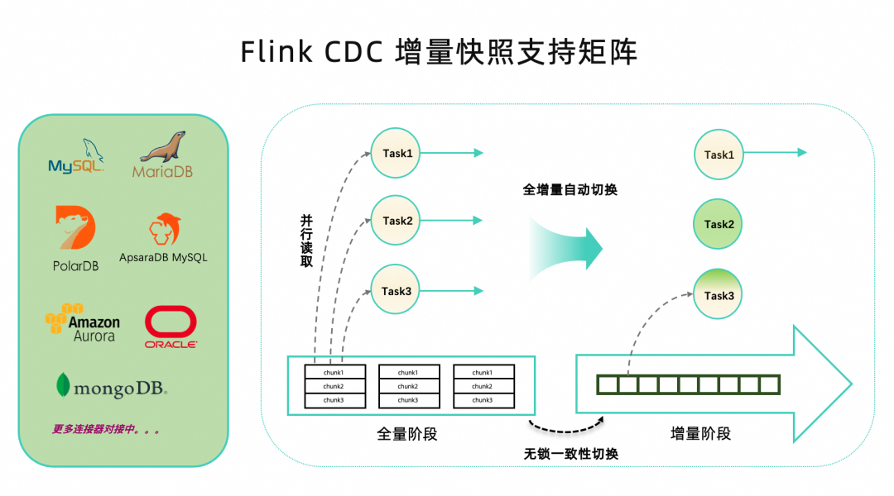

> https://github.com/ververica/flink-cdc-connectors/releases/tag/release-2.3.0

## Flink CDC 2.3 概述

2.3 版本共有 49 位社区贡献者参与贡献，累计解决 126 个 issue，合并了 133 个 PR，贡献者们累计贡献了 170+ 提交。从代码分布上看，MySQL CDC， MongoDB CDC， Oracle CDC，增量快照框架（flink-cdc-base）模块以及文档模块均为用户带来了很多特性和改进。

面对如此多的改进和特性，本文通过下图带你 3 分钟快速了解 Flink CDC 2.3 版本的重大改进和核心特性。

- 新增 Db2 CDC 连接器， 解锁读取 Db2 数据库，支持全量和增量一体化同步。

- MongoDB CDC，Oracle CDC 两大连接器均接入了增量快照框架，从而提供了无锁读取，并发读取和断点续传的能力。

- MySQL CDC 连接器在 2.3 版本里进行了诸多性能优化和稳定性大改进，极大提升了生产稳定性和性能。

- Flink CDC 2.2 版本兼容了 Flink 1.13 和 Flink 1.14，**Flink CDC 2.3 在此基础上继续兼容了 Flink 1.15 & 1.16 大版本**，从而兼容了 Flink 的四个大版本。**这意味着 CDC 的 SQL connector 可以跑在不同的 Flink 集群上而无需任何修改，如果是 DataStream 用户也可以参考 SQL Connector 的打包方式，实现跨版本兼容**。

- OceanBase CDC 连接器支持将全部数据库类型对接到 Flink SQL，也就是说 OceanBase 所有类型的字段均支持同步。

- MySQL CDC 和 OceanBase CDC 连接器提供中文文档，这可以更好地帮助到中文用户。

## 详解核心特性和重要改进

Flink CDC 2.3 版本带来了诸多重要的改进和特性，本文挑选最重要的四个进行深入解读。

- **新增 Db2 CDC 连接器**

    Db2 是 IBM 开发的关系型数据库 [3]。Db2 CDC 连接器可以捕获 Db2 数据库中表的行级变更，其实现原理是基于 ASN Capture/Apply agents 提供的 SQL 复制能力 ，将数据库中开启 capture mode 的表的变更存到指定的 change table 中。Db2 CDC 连接器首先通过  JDBC 读取表中的历史数据，再从 change table 中获取增量变更数据，从而实现全增量同步。

- **MongoDB CDC，Oracle CDC 连接器支持增量快照算法**

    在 Flink CDC 2.3 版本中，MongoDB CDC 连接器和 Oracle CDC 连接器都对接到了 Flink CDC 增量快照框架上，实现了增量快照算法，从而提供无锁读取，并行读取和断点续传的功能。

    

    至此，Flink CDC 支持增量快照算法的数据源不断扩大，在接下来的版本中，社区也在规划让更多的连接器对接到增量快照框架上。

- **MySQL CDC 连接器优化**

    作为社区最受用户关注的 MySQL CDC 连接器，2.3 版本中社区引入了诸多高级特性，极大地提升了性能和稳定性，具体包括：

    - **支持指定位点启动**

        MySQL CDC 连接器支持从指定的位点启动作业。可以通过 timestamp，binlog offset 或 binlog gtid 的方式指定作业启动时的 binlog 具体位置，还支持设置为 earliest-offset 从最早的 binlog 位点启动作业。

    - **分片算法优化**

        2.3 版本对全量阶段分片算法进行优化。**将目前的同步分片改为异步进行，支持用户指定主键中某一列作为分片的切分列**，并且分片过程支持 checkpoint，提升了全量读取阶段时因为同步分片阻塞导致的性能问题。

    - **稳定性提升**

        MySQL CDC 连接器支持全部字符集对接到 Flink SQL，解锁更多用户场景，支持宽容默认值提升作业对不规范 DDL 的容忍度，支持自动获取数据库的时区从而解决时区问题。

    - **性能提升**

        2.3 版本 MySQL CDC**重点优化了内存和读取性能，通过 JM 里的 meta 复用和 TM 中流式读取等改进降低了 JM 和 TM 的内存使用；**同时通过优化 binlog 解析逻辑提升了 binlog 读取性能。

- **其他改进**
- Flink CDC 2.3 版本兼容了 Flink 1.13，1.14，1.15 和 1.16 四个大版本，极大地降低用户 Connector 的升级和运维成本。

- OceanBase CDC 修复了时区问题，支持全类型对接到 Flink SQL，并提供了更多的配置项，支持更灵活的配置。如新增加 table-list 配置项，支持访问多张 OceanBase 数据表等。

- MongoDB CDC 支持了更多的数据类型，优化了捕获表的筛选过程。

- TiDB CDC 修复了全增量切换时数据丢失问题，支持读取时 region 切换。

- Postgres CDC 支持 geometry 类型，开放了更多配置项，支持配置 changelog mode 来过滤发送的数据。

- SqlServer CDC 支持了更多的版本，并对文档 [4]进行完善。

- MySQL CDC 和 OceanBase CDC 连接器提供了中文文档 [5][6]，此外还对 OceanBase CDC 连接器提供了视频教程 [7]。