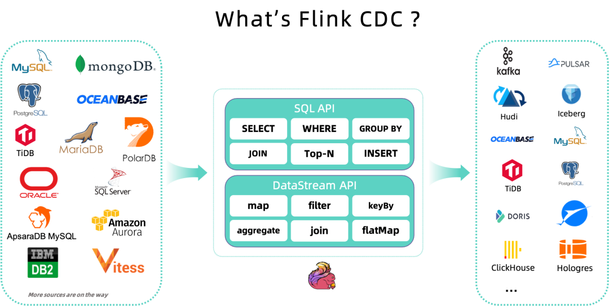
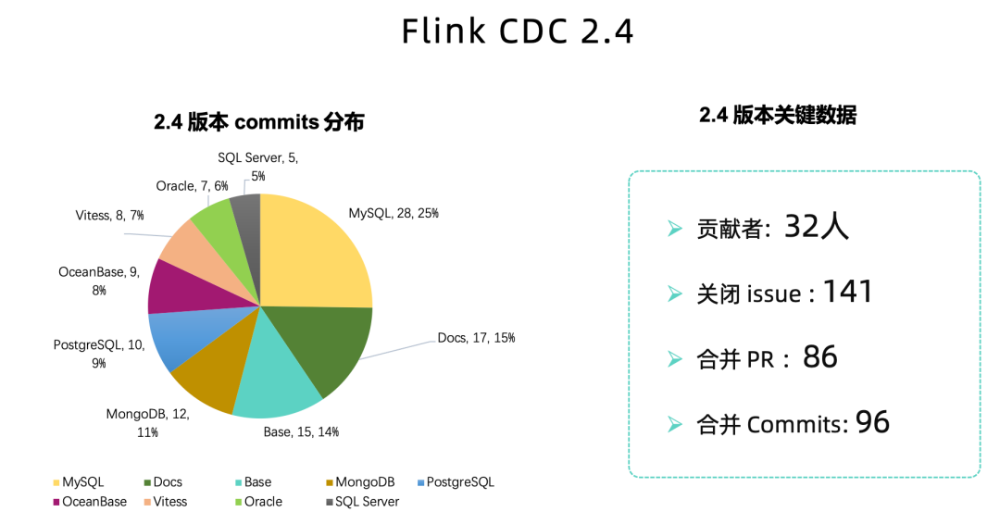
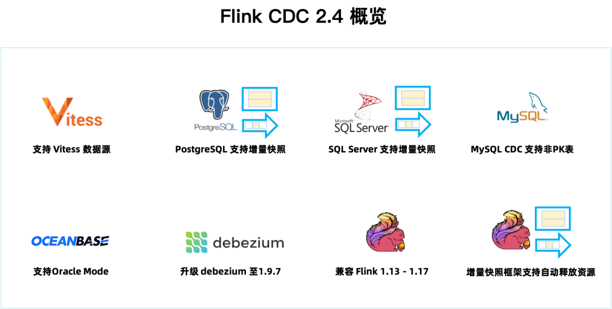
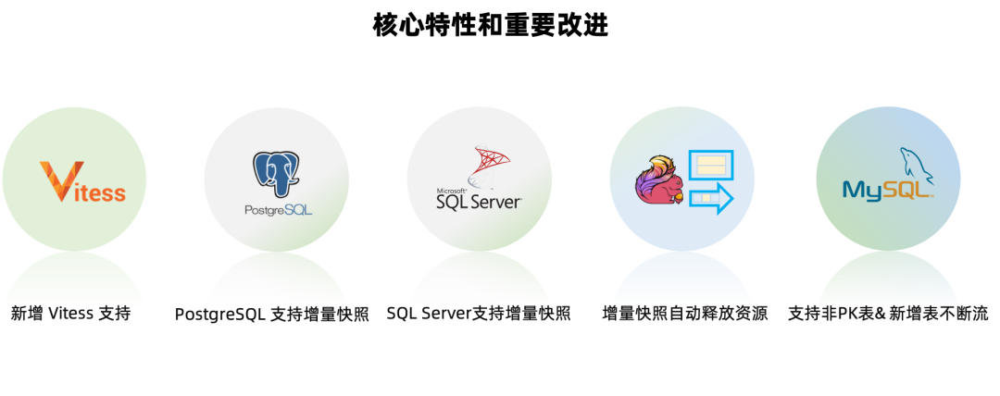
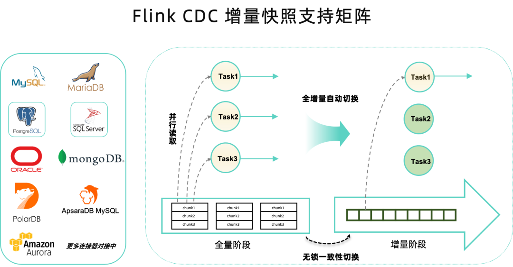

## Flink CDC 简介

Flink CDC [1] 是基于数据库的日志 CDC 技术，实现了全增量一体化读取的数据集成框架。配合 Flink 优秀的管道能力和丰富的上下游生态，Flink CDC 可以高效实现海量数据的实时集成。

作为新一代的实时数据集成框架，**Flink CDC 具有全增量一体化、无锁读取、并行读取、表结构变更自动同步、分布式架构等技术优势**，同时社区提供了完善的中英文文档支持 [2]。在 Flink CDC 开源的三年时间里，社区发展迅速，目前 Flink CDC 社区已有 91 位贡献者，7 位 Maintainer 成员，社区钉钉群(群号: 33121212) 超过 8900 人。

## Flink CDC 2.4 概览
> https://github.com/ververica/flink-cdc-connectors/releases/tag/release-2.4.0

2.4 版本共有 32 位社区贡献者参与贡献，计解决 141 个 issue，合并了 86 个PR，贡献了 96 个 commits。从代码分布上看，MySQL CDC, MongoDB CDC, PostgreSQL CDC，增量快照框架（flink-cdc-base）模块以及文档模块均为用户带来了很多特性和改进。

本文通过下图带你 10 分钟快速了解 Flink CDC 2.4 版本的重大改进和核心特性。

- 新增 Vitess CDC 连接器，支持 Vitess 增量数据同步。

- PostgreSQL CDC，SQL Server CDC 两大连接器均接入了增量快照框架，从而提供了无锁读取，并发读取和断点续传的能力。

- 2.4 版本升级 Debezium 的依赖版本到 1.9.7.Final，引入了 Debezium 新版本的功能，优化和修复，比如：修复部分 DDL 无法解析的问题，修复解析 MySQL JSON 函数问题，Oracle 事件增加 scn 信息等。

- **增量快照框架在 2.4 版本增加了自动关闭全量阶段结束后的空闲 Reader 功能**，该功能非常实用，可以在生产环境节省资源。

- **MySQL CDC 连接器在 2.4 版本支持读取无主键表，同时支持新增表时原有实时同步链路不断流**(动态加表是2.2开始的，在之前的版本，新增表的时候会先同步完新表的全量数据，其他表才能够继续)。

- 社区 2.4 版本兼容 Flink 1.13 ~ 1.17 五个 Flink 版本。CDC 的 SQL Connector 可以跑在不同的 Flink 集群上而无需任何修改，实现跨版本兼容。如果是 Datastream 作业，则需要根据不同的 Flink 版本引入不同版本的 flink-shaded-guava 依赖，DataStream 用户可以参考 SQL Connector 的打包方式管理正确的依赖。

- MongoDB CDC 支持指定时间戳消费数据，支持 mongodb + srv 连接协议，并修复了若干问题，如：无法解析带连字符的库名，'poll.await.time.ms' 配置未生效，解析 DDL出现空指针等。

- OceanBase CDC 连接器支持 JDBC 参数设置，支持指定 Oracle 驱动，完善对 Oracle 数据类型的支持。

### 详解核心特性和重要改进

- 深入解读

Flink CDC 2.4 版本带来了很多重要的改进和特性，本文挑选最重要的五个进行进一步解读。

### 新增 Vitess CDC 连接器

Vitess [3] 是一个用于部署，扩展和管理大型 MySQL 实例集群的数据库解决方案。Vitess 的 VStream 是一个变更事件订阅服务，它能够提供与来自 Vitess 集群底层 MySQL 分片的二进制日志相同的信息。下游可以订阅一个 keyspace 的多个分片，很方便的实现 Vitess 的下游 CDC 处理工具。Vitess CDC 连接器利用 VStream 获取数据变更消息并发送，目前只支持读取增量阶段的变更同步，相当于仅支持 latest 的启动模式。

Vitess CDC 连接器的支持背后还有个小故事，该 Connector 是来自 Vinted 的 Simonas Gelazevicius 开发，秉持 upstream first 的开源贡献精神，这位贡献者从 2.0 版本就请求社区合并。但是这个数据源国内用户非常少，各个Maintainer 都不熟悉其技术细节，所以一直没能合并到社区主干分支。Simonas Gelazevicius 在 Flink CDC 社区每发布一个版本后都会主动 rebase PR, 这股坚持打动了社区全体 Maintainer 成员，社区 Maintainer 任庆盛和方盛凯主动学习 Vitess 相关技术，帮助 review 并改进 PR。最终该连接器由贡献者Simonas Gelazevicius， Gintarasm ，方盛凯和任庆盛共同完成。

### PostgreSQL CDC 和 SQL Server CDC连接器接入增量快照框架

2.4 版本中，PostgreSQL CDC 连接器和 SQL Server CDC 连接器都对接到了 Flink CDC 增量快照框架上，实现了增量快照算法，从而提供无锁读取，并行读取和断点续传的功能。

- PostgreSQL CDC 连接器支持增量快照原理

  PostgreSQL CDC 连接器需要结合 logical decoding [4] 功能读取 PostgreSQL 事务日志中的变更数据，这需要启动一个在整个集群中唯一的 Replication Slot，并在 output plugin [5] 的帮助下处理这些变更，通过记录读取到的 WAL 位点来实现增量阶段的切换和故障恢复。

    增量快照框架除了在增量阶段需要读取变更数据，在全量阶段对每个 SnapshotSplit 也需要启动 Backfill Task 同步做快照时发生的变更。为了避免 Replication Slot 出现冲突，PostgreSQL CDC 连接器采用以下方法建立 Slot。首先 ‘slot.name’ 配置项为必填，需要用户指定，这里指定的 slot name 会用在增量阶段启动的 Slot，并且这个 Slot 在作业启动时就会创建，在作业停止后也不会删除，以此来保证增量阶段读到启动后完整的变更数据，并可以从 Checkpoint 重启。对于全量阶段每个 Backfill Task 的 Slot，会使用“slotname_subTaskId”的命名风格，为了避免冲突和浪费 Slot 资源，这些 Slot 将会在全量读取停止后删除。

- SQL Server CDC连接器支持增量快照原理

    SQL Server CDC 连接器通过变更数据捕获功能 [6] 读取指定数据库和表的变更数据，并存到专门建立的 change table 中。这需要对指定的数据库和表开启 CDC 功能，来获取行级别的变更。通过记录数据库日志的 LSN （Log Sequence Number），来实现增量阶段的切换和故障恢复。

    至此，Flink CDC 支持增量快照算法的数据源不断扩大，在接下来的版本中，社区也在规划让更多的连接器对接到增量快照框架上。

- 增量快照框架支持自动释放资源

    Flink CDC 的增量快照框架有两个主要阶段：全量阶段和增量阶段。这两个阶段的并行度并不相同，全量阶段支持多并行度，加快大量数据的同步过程，增量阶段读取变更日志，需要使用单并发保证事件的顺序和正确性。在全量阶段读取结束后，**由于增量阶段只需要一个并发，会出现大量的空闲 Reader，比较浪费资源。2.4 版本使用增量快照连接器时，支持配置打开自动关闭空闲 Reader 的功能来关闭这些空闲 Reader。由于这个功能依赖于 Flink 1.14 之后支持的 Checkpoint on finished Task 特性，所以只支持在 Flink 1.14 或更新的 Flink 版本上使用**。

### MySQL CDC 连接器功能更新

作为社区最受用户关注的 MySQL CDC 连接器，2.4 版本中社区引入了一些高级特性，具体包括：

1. 支持无主键表

    MySQL CDC 连接器 2.4 版本支持使用无主键表，**相比于有有主键的 MySQL 表，无主键表存在一些使用上需要额外注意的事项。无主键表使用时需要通过 ‘scan.incremental.snapshot.chunk.key-column’ 配置指定一列作为分片列，用于将表分为多个分片进行同步，建议选择有索引的列作为分片列，使用无索引的列将会导致全量阶段多并发同步时使用表锁**。其次，**选择的分片列需要保证不存在数据的更新操作（比如从 1 更新到 2），如果存在更新操作，则只能保证 At-Least-Once 语义**。

2. 支持新增表实时不断流

    MySQL CDC 之前在处理新增表时，原有的实时同步链路会发生断流现象，**需要等待新增加表的全量读取结束后，才会继续进行同步**，会对延迟敏感的用户造成较大影响。例如，**新增加的表历史数据比较多，完成新增表的全量同步需要花费 30 分钟，那么对于已经处于增量阶段的表，将需要等待 30 分钟后才可以继续同步属于该表的增量数据**。2.4 版本对新增表的处理逻辑进行进一步优化，确保新增加的表的全量阶段不会影响已有的实时同步链路，极大地提升了用户体验。

3. 问题修复

     2.4 版本中，MySQL CDC 连接器对社区用户反馈的使用问题进行了修复，**如指定 Binlog 位点消费无法从 savepoint 启动，数据库存在特殊字符无法处理，大小写敏感导致的分片错误问题等**。

### 其他改进

- Debezium 版本依赖升级到 1.9.7.Final 版本，引入对应 Debezium 版本的新功能和修复。

- Flink CDC 2.4 版本兼容了 Flink 1.13 ~ 1.17 五个大版本，极大地降低用户 Connector 的升级和运维成本。

- OceanBase CDC 连接器支持 JDBC 参数设置，支持指定驱动，完善对 Oracle 数据类型的支持，同时修复了异常重连总是失败等问题。

- MongoDB CDC 支持指定时间戳消费数据，支持 mongodb + srv 连接协议，并修复如无法解析带连字符的库名，'poll.await.time.ms' 配置未生效，解析 DDL 出现空指针等问题。

- Oracle CDC 修复了全量阶段存在的数据正确性问题。

- **所有 CDC 连接器支持打印配置信息，便于排查问题**。

## 未来规划

Flink CDC 开源社区的发展，得益于全体贡献者的无私贡献和 Maintainer 成员出色的社区工作，更离不开广大 Flink CDC 用户群体的积极使用和反馈报错。Flink CDC 社区将会坚持做好开源社区的建设, 当前社区正在规划 2.5 版本 [7], 欢迎贡献者和用户积极反馈，在接下来的版本，社区主要方向会围绕下述四个方面展开：

- 丰富数据源

    支持更多的数据源，并推动增量快照框架在各个 CDC 连接器的使用，让更多的数据源支持无锁读取、并发读取、断点续传等特性。

- 优化增量快照框架

    对增量快照框架接入中遇到的问题进行优化，各个 CDC 连接器在增量快照框架可重用的代码进行提取整理。

- 完善限流与监控

    提供限流功能，以降低全量阶段对数据库产生的查询压力。提供更丰富的监控指标，可以获取到任务进度相关指标监控任务状态。

- 更丰富的使用方式

    支持 At least once 语义，支持 Snapshot only 的启动模式等，可以为使用者提供更多的场景应用。

- 收敛支持的 Flink 版本

    随着 Flink 版本逐渐增多，CDC 为兼容多个Flink版本的维护压力也逐渐增加。参考目前 Flink 连接器的规则 [8]，在后续版本中，CDC 连接器将会考虑仅支持 Flink 最新的 3-4 个版本。