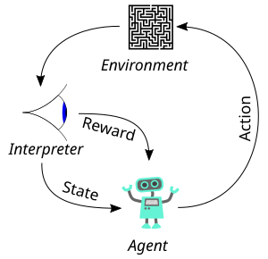

## 〇、强化学习整体图景：一张图看懂角色与数据流

强化学习只有**两个核心角色**：**智能体 (Agent)**（做决策的"玩家"）和**环境 (Environment)**（被玩的"游戏/世界"），它们在一个**闭环循环**里反复交互，产生所有数据。下面这张图是强化学习交互循环的"行业标准图示"：

> **图来源与版权**：维基百科 Wikimedia Commons [Reinforcement learning diagram.svg](https://commons.wikimedia.org/wiki/File:Reinforcement_learning_diagram.svg)，作者 Megajuice，以 **CC0 1.0 公共领域协议**发布，可自由使用、修改、商用。
>
> **图中各要素对应关系（从左往右读）**：
> - 左半部分「机器人头像」= **Agent（智能体）**：决策主体，代码里就是我们写的 `Agent` 类
> - 右半部分「迷宫 + 眼睛观察」= **Environment（环境）**：CartPole/Gymnasium 就是这里面的"迷宫"
> - 从 Agent → Environment 的箭头 **Action** = 动作 $A_t$（代码里的 `env.step(action)` 入参）
> - 从 Environment → Agent 的两条返回箭头：
>   - **State** = 状态/观察 $S_t$（CartPole 里 4 个浮点数组成的小车位置/速度/杆角/杆角速度）
>   - **Reward** = 即时奖励 $R_t$（CartPole 每活一步 +1）

上图的**读法（一个时间步 t 的完整故事，正好对应 CartPole 代码的一次循环）**：

| 步骤 | 谁做什么 | 对应代码 | 产生的数据 | 谁拿到 |
|---|---|---|---|---|
| ① | 环境 `reset()` 初始化一局 | `state, _ = env.reset()` | 初始状态 $S_0$ | 智能体观察到 $S_0$ |
| ② | 智能体用策略 $\pi(\cdot \mid S_t)$ 采样一个动作 | `action, _ = agent.get_action(state)` | 动作 $A_t$ | 送入环境 `env.step(action)` |
| ③ | 环境按转移概率 $P(\cdot \mid S_t,A_t)$ 演化下一状态，按奖励函数 $R(\cdot)$ 算奖励，同时判断是否结束 | `next_state, reward, terminated, truncated, _ = env.step(action)` | $(S_{t+1},\ R_{t+1},\ done)$ | 返回给智能体 |
| ④ | 当 `done = True`（杆歪 or 玩满 500 步），一局结束打包成轨迹 | `episode = agent.rollout(env)` | 整条轨迹 $\tau = (S_0,A_0,R_1,S_1,\dots,S_T)$ | 收集送入训练，更新策略 $\pi$ 让下次做得更好 |

> ⚡ 直觉类比（玩超级玛丽，图里的"迷宫"正好对应游戏画面）：
> - **Environment（右半部分的迷宫）** = 马里奥游戏程序（重力、蘑菇、坑、计分板），代码写好不让你看
> - **Agent（左半部分的机器人）** = 玩家（大脑策略 π：看到画面 State_t 就按方向键/跳跃 → 出 Action_t）
> - **State 箭头（眼睛←迷宫）** = 当前画面像素 / 马里奥位置速度（4 个数的 CartPole 状态就是它的极简版）
> - **Action 箭头（机器人→迷宫）** = 按键：左 / 右 / 跳 / 不按
> - **Reward 箭头（迷宫→机器人小方块）** = 每走 1 帧 +1（CartPole 正是这种"每活着一步 +1"）/ 吃到金币 +100 / 掉坑里 -1000
> - 游戏结束条件 = 掉坑里（terminated）or 通关 500 步（truncated）

---

## 一、强化学习基本概念

强化学习（Reinforcement Learning, RL）是机器学习的一个分支，智能体（Agent）通过与环境（Environment）交互，在试错过程中学习策略（Policy），以最大化累积奖励（Cumulative Reward）。

### 1.1 核心要素

| 符号 | 名称 | 说明 |
|------|------|------|
| $S$ | 状态空间（State Space） | 所有可能状态的集合 |
| $A$ | 动作空间（Action Space） | 所有可能动作的集合 |
| $R$ | 奖励函数（Reward Function） | $R(s, a, s')$ 表示在状态 $s$ 执行动作 $a$ 转移到 $s'$ 获得的即时奖励 |
| $P$ | 状态转移概率（Transition Probability） | $P(s' \mid s, a)$ 表示从 $s$ 执行 $a$ 转移到 $s'$ 的概率 |
| $\gamma$ | 折扣因子（Discount Factor） | $\gamma \in [0, 1]$，权衡即时奖励与未来奖励 |
| $\pi$ | 策略（Policy） | $\pi(a \mid s)$ 表示在状态 $s$ 下选择动作 $a$ 的概率 |

### 1.2 交互过程

在每个时间步 $t$：
1. 智能体观察环境状态 $S_{t} \in S$
2. 根据策略选择动作 $A_{t} \sim \pi(\cdot \mid S_{t})$
3. 环境转移到新状态 $S_{t+1} \sim P(\cdot \mid S_{t}, A_{t})$
4. 智能体获得即时奖励 $R_{t+1} = R(S_{t}, A_{t}, S_{t+1})$

---

## 二、核心数学公式（推导 + 设计动机）

### 2.1 回报（Return） —— "把整条轨迹打成分数"

折扣回报定义为从时间步 $t$ 开始的累积折扣奖励之和：

$$
G_{t} \;=\; R_{t+1} \;+\; \gamma R_{t+2} \;+\; \gamma^{2} R_{t+3} \;+\; \cdots \;=\; \sum_{k=0}^{\infty} \gamma^{k} R_{t+k+1}
$$

#### 回报的递推关系（后续所有推导的"种子"）

把下标整体平移一位，我们得到 $t+1$ 时刻的回报：

$$
G_{t+1} = R_{t+2} + \gamma R_{t+3} + \gamma^{2} R_{t+4} + \cdots = \sum_{k=0}^{\infty} \gamma^{k} R_{t+k+2}
$$

代入 $G_{t}$ 的展开式：

$$
\begin{aligned}
G_{t}
  &= R_{t+1} + \gamma \big(\, \underbrace{R_{t+2} + \gamma R_{t+3} + \gamma^{2} R_{t+4} + \cdots}_{=\; G_{t+1}} \,\big) \\[4pt]
  &= R_{t+1} + \gamma\, G_{t+1}
\end{aligned}
$$

$$
\boxed{\;G_{t} \;=\; R_{t+1} \;+\; \gamma\, G_{t+1}\;}
$$

这个看起来简单的 "当前回报 = 即时奖励 + 折扣乘下一个回报" 的递推式，是后面**贝尔曼方程、TD 学习、Q-Learning** 全部公式的源头。

#### 为什么科学家要定义「折扣回报」，而不是直接看即时奖励 $R_{t}$？

| 动机 | 说明 |
|---|---|
| **决策有后效** | 现实中"现在的决定"会影响未来（例：现在花 1 块钱学技能，明年赚 10 块），单看 $R_{t}$ 会鼓励"短视"行为。 |
| **经济学现值** | 与经济学"折现"概念一致——明年 100 元不如今天 100 元有价值，$\gamma$ 量化这一偏好。 |
| **防止求和发散** | 如果任务没有终止（无限地平线），$\sum_{k} R_{t+k+1}$ 会趋向 $+\infty$，无法比较两条轨迹；乘以 $\gamma^{k} \to 0$ 保证当 $\gamma < 1$ 时 $G_{t}$ 几乎一定有限。 |
| **可实现有限步近似** | $\gamma$ 越接近 0，智能体越"短视"；越接近 1，越"深谋远虑"。在有限步 $T$ 内若 $\gamma \ll 1$，前面若干步贡献已占总回报绝大部分。 |

---

### 2.2 状态价值函数 $V^{\pi}(s)$ —— "站在 $s$ 这一步，按策略 $\pi$ 玩下去，期望能得多少分？"

#### 定义

$$
V^{\pi}(s) \;\triangleq\; \mathbb{E}_{\pi}\left[\, G_{t} \;\big|\; S_{t} = s \,\right]
$$

即：从状态 $s$ 出发，后续**所有动作按 $\pi$ 选**、**所有转移按 $P$ 走**，把所有可能轨迹的回报 $G_{t}$ 做**概率加权平均**。

#### 为什么要取「期望」，不能直接拿某一次 $G_{t}$？

因为环境是**随机的**，策略也是**随机的**。同是"摆杆偏左 5°"这个状态，每次重玩都可能走出完全不同的轨迹（有时下一步就倒，有时再坚持 100 步）。单次 $G_{t}$ 波动极大，只有**期望 $\mathbb{E}$** 才能给状态一个**稳定、可比较**的"好坏度量"。

把 $G_{t}$ 的定义代入 $V^{\pi}(s)$，得到：

$$
V^{\pi}(s) \;=\; \mathbb{E}_{\pi}\left[\; \sum_{k=0}^{\infty} \gamma^{k} R_{t+k+1} \;\bigg|\; S_{t} = s \;\right]
$$

---

### 2.3 动作价值函数 $Q^{\pi}(s, a)$ —— "站在 $s$，先**强制**选动作 $a$，然后再按 $\pi$ 玩下去，期望能得多少分？"

$$
Q^{\pi}(s, a) \;\triangleq\; \mathbb{E}_{\pi}\left[\, G_{t} \;\big|\; S_{t} = s,\; A_{t} = a \,\right]
$$

#### 为什么已经有了 $V^{\pi}$，还需要 $Q^{\pi}$？

**$V^{\pi}(s)$ 回答的是"状态 $s$ 好不好"，但没告诉你"在 $s$ 下该选哪个动作"**。因为 $V^{\pi}(s)$ 里已经对所有动作做了加权平均：

$$
V^{\pi}(s) = \sum_{a \in A} \pi(a \mid s) \cdot Q^{\pi}(s, a)
$$

想象 $s$ 有 10 个动作，其中 9 个很烂但 $\pi$ 几乎从不选，1 个极好；$V^{\pi}(s)$ 仍然可能很高——但你**挑动作**时，必须知道每个动作的独立价值 $Q^{\pi}(s,a_{i})$，才能判断哪个 $a_{i}$ 最优。所以：

- 想**评估**一个策略有多好：用 $V^{\pi}$
- 想**选动作 / 改进策略**：必须用 $Q^{\pi}$（或它的相对版本——优势函数 $A^{\pi}$）

同理，$Q^{\pi}$ 用 $V^{\pi}$ 展开（执行完 $a$ 之后到了 $s'$，后续价值就是 $V^{\pi}(s')$）：

$$
Q^{\pi}(s, a) \;=\; \sum_{s' \in S} P(s' \mid s, a)\Big[\,R(s,a,s') + \gamma\,V^{\pi}(s')\,\Big]
$$

---

### 2.4 优势函数 $A^{\pi}(s, a)$ —— "选 $a$ 比策略的平均水平**好（或差）多少**？"

$$
A^{\pi}(s, a) \;\triangleq\; Q^{\pi}(s, a) \;-\; V^{\pi}(s)
$$

直观解释：
- $A^{\pi}(s,a) > 0$：动作 $a$ 比"在 $s$ 下按 $\pi$ 随机选"的平均收益好，应该被**加强**
- $A^{\pi}(s,a) < 0$：动作 $a$ 比平均还差，应该被**削弱**
- 对任意 $s$，必有 $\sum_{a} \pi(a \mid s)\,A^{\pi}(s,a) = 0$（平均的优势为 0）

#### 为什么科学家要定义优势函数（为什么策略梯度里用 $A$ 比用 $Q$ 或 $G$ 更好）？

核心原因：**降低方差**。

在策略梯度公式里，更新方向等于 $\nabla \log \pi_{\theta}(a \mid s)$ 乘上一个"标量权重"（该动作有多好）。权重是 $G_{t}$、$Q_{t}$ 还是 $A_{t}$，公式都**无偏**，但：

| 权重选择 | 方差 | 原因 |
|---|---|---|
| 原始回报 $G_{t}$ | 最大 | 包含整条轨迹累积的随机波动 |
| 动作价值 $Q^{\pi}(s,a)$ | 中等 | 消掉了未来随机性，但保留"这个状态整体价值的基线" |
| 优势 $A^{\pi}(s,a)$ | 最小 | 减掉 $V^{\pi}(s)$（状态平均基线）后，**只保留动作间相对差异** |

用 $A$ 作为权重，梯度估计更稳定、收敛更快，这也是 A2C / PPO / TRPO 等现代算法一律使用优势函数的原因。

---

### 2.5 贝尔曼方程（Bellman Equations）—— 价值函数的「自洽性条件」

> 贝尔曼方程**不是凭空假设**。它是把 "回报的递推 $G_{t} = R_{t+1} + \gamma G_{t+1}$" 两端取期望、再把条件期望展开，直接推出来的。

#### 2.5.1 状态价值 $V^{\pi}$ 的贝尔曼方程 —— 完整推导

**第 1 步：从定义出发，替换 $G_{t}$**

$$
V^{\pi}(s) = \mathbb{E}_{\pi}\left[\,G_{t} \mid S_{t} = s\,\right]
  = \mathbb{E}_{\pi}\left[\,R_{t+1} + \gamma G_{t+1} \mid S_{t} = s\,\right]
$$

**第 2 步：线性期望拆开两项**

$$
V^{\pi}(s) = \mathbb{E}_{\pi}\left[\,R_{t+1} \mid S_{t} = s\,\right] + \gamma\,\mathbb{E}_{\pi}\left[\,G_{t+1} \mid S_{t} = s\,\right]
$$

**第 3 步：对"动作 $A_{t}$、下一状态 $S_{t+1}$"用**全期望法则**（Law of Total Expectation）做两层边缘化**

> 全期望：$\mathbb{E}[X] = \mathbb{E}\left[\,\mathbb{E}[X \mid Y]\,\right]$。这里先对 $A_{t}$ 条件化，再对 $S_{t+1}$ 条件化。

第一项（即时奖励的期望）：

$$
\begin{aligned}
\mathbb{E}_{\pi}\left[\,R_{t+1} \mid S_{t} = s\,\right]
  &= \sum_{a \in A} \pi(a \mid s) \;\mathbb{E}\left[\,R_{t+1} \mid S_{t}=s,\;A_{t}=a\,\right] \\
  &= \sum_{a \in A} \pi(a \mid s) \sum_{s' \in S} P(s' \mid s,a) \; R(s,a,s')
\end{aligned}
$$

第二项（未来回报的期望）：利用**马尔可夫性**——给定 $S_{t+1}=s'$ 后，$G_{t+1}$ 的分布**不再依赖**更早的 $S_{t}$（这也是为什么 RL 要求环境满足马尔可夫假设）：

$$
\begin{aligned}
\mathbb{E}_{\pi}\left[\,G_{t+1} \mid S_{t} = s\,\right]
  &= \sum_{a \in A} \pi(a \mid s) \sum_{s' \in S} P(s' \mid s,a) \;\mathbb{E}_{\pi}\left[\,G_{t+1} \mid S_{t}=s,\;A_{t}=a,\;S_{t+1}=s'\,\right] \\
  &= \sum_{a \in A} \pi(a \mid s) \sum_{s' \in S} P(s' \mid s,a) \;\underbrace{\mathbb{E}_{\pi}\left[\,G_{t+1} \mid S_{t+1}=s'\,\right]}_{=\;V^{\pi}(s')} \\
  &= \sum_{a \in A} \pi(a \mid s) \sum_{s' \in S} P(s' \mid s,a) \;V^{\pi}(s')
\end{aligned}
$$

**第 4 步：把两项加起来，提出公共求和因子**

$$
\boxed{\;
V^{\pi}(s) = \sum_{a \in A} \pi(a \mid s) \sum_{s' \in S} P(s' \mid s, a) \;\Big[\; R(s, a, s') + \gamma V^{\pi}(s') \;\Big]
\;}
$$

> **理解**：左边 "站在 $s$ 的长期价值" = 右边 "（按策略选动作 $a$ → 按环境转移到 $s'$）得到的即时奖励 $R$ + 下一步的长期价值 $\gamma V^{\pi}(s')$，再对所有 $(a,s')$ 求期望"。

#### 2.5.2 动作价值 $Q^{\pi}$ 的贝尔曼方程 —— 完整推导

同法，对定义代入 $G_{t} = R_{t+1} + \gamma G_{t+1}$：

$$
Q^{\pi}(s, a)
= \mathbb{E}_{\pi}\left[\,R_{t+1} + \gamma G_{t+1} \mid S_{t}=s,\;A_{t}=a\,\right]
$$

此时动作已被固定为 $a$，只需对 $S_{t+1}$ 做一层边缘化：

$$
Q^{\pi}(s, a) = \sum_{s' \in S} P(s' \mid s,a)\Big[\,R(s,a,s') + \gamma\,\mathbb{E}_{\pi}[G_{t+1} \mid S_{t+1}=s']\,\Big]
$$

但后续的价值是"到了 $s'$ 再按策略选 $a'$"，即：

$$
\mathbb{E}_{\pi}[G_{t+1} \mid S_{t+1}=s'] = V^{\pi}(s') = \sum_{a' \in A} \pi(a' \mid s')\,Q^{\pi}(s', a')
$$

代回即得 $Q^{\pi}$ 的贝尔曼方程（纯用 $Q$ 自洽表示）：

$$
\boxed{\;
Q^{\pi}(s, a) = \sum_{s' \in S} P(s' \mid s, a) \left[\, R(s, a, s') + \gamma \sum_{a' \in A} \pi(a' \mid s')\,Q^{\pi}(s', a') \,\right]
\;}
$$

#### 为什么叫「方程」而不叫「定义」？科学家为什么这么在乎它？

因为两边都出现了同一个未知函数 $V^{\pi}$（或 $Q^{\pi}$）——它是一个**泛函方程**，不是"右边算完给左边赋值"的定义式。它的重要性：

| 作用 | 说明 |
|---|---|
| **把无限求和"有限化"** | 原本要算 $\sum_{k=0}^{\infty} \gamma^{k} R_{t+k+1}$，现在转化为 $V$ 之间的一步关系，可通过**迭代**求解（值迭代 / 策略迭代）。 |
| **是不动点（Fixed Point）** | 对有限 MDP + $\gamma<1$，压缩映射定理保证贝尔曼算子有**唯一不动点**，即真实的 $V^{\pi}$。所以"反复套这个方程"必然收敛——这是所有 RL 算法收敛性证明的根基。 |
| **直接催生 TD 学习** | 方程的两边可以分别用**样本**估计，两边的差值就是 TD 误差，用来做"就地增量更新"，不用等 episode 结束。 |

---

### 2.6 贝尔曼最优方程（Bellman Optimality Equations）—— "所有可能策略中最好的那个，满足什么方程？"

先定义"最优"的偏序关系：

$$
\pi \succeq \pi' \quad\Longleftrightarrow\quad \forall s \in S,\;\; V^{\pi}(s) \geq V^{\pi'}(s)
$$

**有限 MDP 定理**（Sutton & Barto §3.6 的经典结论）：只要状态/动作有限、$\gamma<1$，就一定存在至少一个**确定性**的策略 $\pi_{*}$ 满足 $\pi_{*} \succeq \pi,\;\forall \pi$。这样的 $\pi_{*}$ 叫**最优策略**。对应的价值函数记为：

$$
V_{*}(s) \;\triangleq\; \max_{\pi}\; V^{\pi}(s), \qquad
Q_{*}(s, a) \;\triangleq\; \max_{\pi}\; Q^{\pi}(s, a)
$$

#### 2.6.1 $V_{*}$ 最优方程的推导

站在某个 $s$，最优价值怎么来的？

- 首先我们**不再按某个固定 $\pi$ 平均动作**，而是可以"对每个状态挑那个对我们最有利的动作 $a$"（这是定义里的 $\max_{\pi}$ 决定的）。
- 一旦挑好动作 $a$，后续就由环境 $P(s' \mid s,a)$ 和后续的"最优价值 $V_{*}(s')$"决定，不再有选择。

所以：

$$
V_{*}(s) = \max_{a \in A}\; \mathbb{E}\Big[\,R_{t+1} + \gamma V_{*}(S_{t+1}) \;\big|\; S_{t}=s,\;A_{t}=a\,\Big]
$$

再把期望对 $S_{t+1}$ 展开：

$$
\boxed{\;
V_{*}(s) = \max_{a \in A} \sum_{s' \in S} P(s' \mid s, a) \Big[\, R(s, a, s') + \gamma V_{*}(s') \,\Big]
\;}
$$

> **对比 $V^{\pi}$ 的贝尔曼方程**：原来的 $\sum_{a} \pi(a \mid s)$（对动作按 $\pi$ 取平均）被替换成了 $\max_{a}$（自由选择最好的动作）。

#### 2.6.2 $Q_{*}$ 最优方程的推导

同理：

$$
\boxed{\;
Q_{*}(s, a) = \sum_{s' \in S} P(s' \mid s, a) \Big[\, R(s, a, s') + \gamma \max_{a' \in A} Q_{*}(s', a') \,\Big]
\;}
$$

#### 2.6.3 如何从 $Q_{*}$ 还原出 $\pi_{*}$？

在每个状态 $s$，直接挑让 $Q_{*}(s,a)$ 最大的那个动作（确定性贪心策略）：

$$
\pi_{*}(a \mid s) = \begin{cases}
1 & \text{if } a = \arg\max_{a' \in A}\; Q_{*}(s, a') \\
0 & \text{otherwise}
\end{cases}
$$

这就是为什么**Q-Learning 类算法"拿到 Q 值就能决策"**：只要 $Q$ 逼近 $Q_{*}$，$\arg\max Q$ 就是（近似）最优动作。

#### 科学家为什么用 $\max$？为什么不是"取平均"或"取中位数"？

因为我们求的是**存在性最优**：存在至少一条决策链能达到这么高的价值，$\max$ 表达的是"我们有能力选动作"。对比三种汇总方式：

| 汇总 | 语义 | 何时用 |
|---|---|---|
| $\sum_{a} \pi(a \mid s)(\dots)$ | "按策略 $\pi$ 的平均价值" | **评估**一个给定策略 |
| $\max_{a} (\dots)$ | "选对我最有利的动作能有多好" | **最优控制 / 寻找最优策略** |
| $\min_{a} (\dots)$ | "对手故意选最坏结果会有多差" | 对抗博弈 / 鲁棒控制（minimax） |

RL 的目标是"最大化智能体收益"，因此最优方程用 $\max$ 正好刻画它。

---

## 三、经典算法公式（从理论到可实现的更新规则）

### 3.1 从「贝尔曼最优方程」到 Q-Learning —— 每一步从哪来

#### 第 0 步：回忆 $Q_{*}$ 的最优方程

$$
Q_{*}(s, a) = \sum_{s'} P(s' \mid s,a) \Big[\, R(s,a,s') + \gamma \max_{a'} Q_{*}(s', a') \,\Big]
$$

右边这一坨，就定义成 Q-Learning 的 **TD 目标（Target）**：

$$
y \;\triangleq\; r + \gamma \max_{a'} Q(s', a')
$$

> 直观：既然最优 $Q_{*}$ 必须满足 "$Q_{*} =$ 一步转移后的期望（$R + \gamma \max Q_{*}'$）"，那就把每一次采样到的 $(s,a,r,s')$ 当作"对方程右边的单点估计"，让 $Q(s,a)$ 往这个目标靠近一点。

#### 第 1 步：为什么更新写成 $Q \leftarrow Q + \alpha(\dots)$？

这是**随机近似（Stochastic Approximation, SA）**的标准增量平均形式。假设我们有一列样本 $y_{1}, y_{2}, \dots$（它们的期望正好等于某个真值 $\theta_{*}$），想在线估计真值。可以用滑动平均：

$$
\theta_{k} \;=\; \theta_{k-1} + \alpha_{k} \big(\, y_{k} - \theta_{k-1} \,\big)
$$

其中 $\alpha_{k}$ 是第 $k$ 次更新的学习率。经典 SA 收敛条件（Robbins-Monro）要求：

$$
\sum_{k} \alpha_{k} = \infty, \qquad \sum_{k} \alpha_{k}^{2} < \infty
$$

直观含义：① $\alpha$ 不能衰减太快，否则永远到不了真值；②也不能太大，否则来回震荡。实际训练中常用简单的常数 $\alpha$（如 0.001、0.01），配合缓慢下降学习率也能满足需要。

#### 第 2 步：Q-Learning 最终更新规则

把 SA 的目标替换成上面定义的 TD 目标 $y$，就得到了单样本版 Q-Learning：

$$
\boxed{\;
Q(S_{t}, A_{t}) \;\leftarrow\; Q(S_{t}, A_{t}) + \alpha \Big[\, \underbrace{R_{t+1} + \gamma \max_{a} Q(S_{t+1}, a)}_{\text{TD 目标 } y} - Q(S_{t}, A_{t}) \,\Big]
\;}
$$

方括号里这一项 $\delta_{t}$ 就是 **TD 误差**：

$$
\delta_{t} \;=\; R_{t+1} + \gamma \max_{a} Q(S_{t+1}, a) - Q(S_{t}, A_{t})
$$

> **为什么叫 Off-Policy（离策略）？**
> 行为策略（生成样本的策略，常是 $\varepsilon$-greedy）和目标策略（我们在优化的贪心策略 $\arg\max Q$）不是同一个。体现在：我们用"当前下一步动作 $A_{t+1}$ 实际选了啥"没关系，直接套 $\max_{a}$，所以哪怕样本是"很蠢的探索策略"采的，也能学到最优策略。

---

### 3.2 SARSA（On-Policy TD 控制）

SARSA 名字来源于更新依赖的五元组：$(S_{t}, A_{t}, R_{t+1}, S_{t+1}, A_{t+1})$。它和 Q-Learning 的唯一差别就是**TD 目标**里不用 $\max_{a}$，而是用**下一时刻真正被执行的动作 $A_{t+1}$**的 Q 值：

$$
\boxed{\;
Q(S_{t}, A_{t}) \;\leftarrow\; Q(S_{t}, A_{t}) + \alpha \Big[\, R_{t+1} + \gamma Q(S_{t+1}, A_{t+1}) - Q(S_{t}, A_{t}) \,\Big]
\;}
$$

> **为什么叫 On-Policy（同策略）？** 因为用来更新的目标 $Q(S_{t+1}, A_{t+1})$ 中 $A_{t+1}$ 就是当前行为策略选出来的（和产生 $S_{t}\to A_{t}$ 用的是同一个策略）。通常行为策略就是带探索的 $\varepsilon$-greedy，所以 SARSA 学到的 Q 值是"一个 $\varepsilon$-greedy 策略真实能拿到的长期回报"，一般比 Q-Learning 更保守但更安全。

#### 适用场景
- Q-Learning：样本来源混杂、有离线数据、我们只关心最终最优动作 → 优先
- SARSA：智能体在学的过程中本身就在真实环境跑（比如工业机器人、在线推荐），需要"学出来的价值估计和它真正用的策略一致"，避免过度乐观 → 优先

---

### 3.3 蒙特卡洛（Monte Carlo, MC）每次访问更新

MC 的核心思想：**等一整局（episode）玩完，拿到真实的回报 $G_{t}$，用它来更新 Q/S 值**。所以 MC 不需要 $\gamma Q(S_{t+1},A_{t+1})$ 这种"用自己估计自己"的 bootstrap（自举）。

$$
\boxed{\;
Q(s,\ a) \;\leftarrow\; Q(s,\ a) + \alpha \Big[\, G(s, a) - Q(s,\ a) \,\Big]
\;}
$$

其中 $G(s, a)$ 是这一局中"状态 $s$ 选了 $a$ 之后"从那个时间步开始的**真实**（不是估计）折扣回报。

#### MC vs TD：为什么两种更新都成立？

| 方法 | 用的目标 | 偏差 | 方差 | 能否增量更新（不等局结束）|
|---|---|---|---|---|
| MC | 真实回报 $G_{t}$（样本无偏，但单个样本噪） | 0（目标无偏） | 大（整条轨迹加和） | ❌ 必须每局结束 |
| TD（Q-Learning / SARSA）| $R + \gamma Q(\dots)$（$Q$ 本身是估计）| 有（初始化的 $Q$ 不对）| 小（只看一步）| ✅ 每一步都更 |

两者本质是**偏差-方差权衡**的两种极端。科学家研究了几十年，实际最常用的是混合体：**$n$-步 TD**（看未来 $n$ 步真实奖励，再用 $Q$ 接后面），在偏差和方差之间取最优折中。

---

### 3.4 策略梯度（Policy Gradient）和 REINFORCE —— "直接学策略 $\pi_{\theta}$，不学 Q"

上面所有方法都是"先学价值函数，再从价值函数里导出策略（贪心选）"，称为**基于价值（Value-Based）**的方法。
策略梯度类则是**直接参数化策略 $\pi_{\theta}(a \mid s)$，把目标 $J(\theta)$ 对 $\theta$ 求梯度、做梯度上升**，叫**基于策略（Policy-Based）**。

#### 目标函数

我们希望最大化"从初始分布 $d_{0}(s)$ 采样到的初始状态出发，整局的期望总奖励"：

$$
J(\theta) \;=\; \mathbb{E}_{s_{0} \sim d_{0}}\Big[\, V^{\pi_{\theta}}(s_{0}) \,\Big] \;=\; \mathbb{E}_{\pi_{\theta}}\Big[\,\sum_{t=0}^{T} R_{t+1} \,\Big]
$$

（无限地平线情况用平稳分布加权的平均奖励/折扣奖励形式，结论形式一样，此处不赘述。）

#### 策略梯度定理（最关键的一步推导：log-derivative trick）

我们要算 $\nabla_{\theta} J(\theta)$。核心技巧是**对数导数恒等式**：

$$
\nabla_{\theta} p(x; \theta) = p(x; \theta) \cdot \nabla_{\theta} \log p(x; \theta)
$$

> 这一步为什么叫"trick"？因为它把"对概率 $p$ 求梯度"变成了"概率本身 × 对 $\log p$ 求梯度"，从而能把概率写成期望形式：$\mathbb{E}[\nabla \log p \cdot (\dots)]$。

整条轨迹 $\tau = (S_{0}, A_{0}, \dots, S_{T})$ 的概率：

$$
P_{\theta}(\tau) = d_{0}(S_{0})\prod_{t=0}^{T-1} \pi_{\theta}(A_{t} \mid S_{t})\,P(S_{t+1} \mid S_{t},A_{t})
$$

取对数：

$$
\log P_{\theta}(\tau) = \log d_{0}(S_{0}) + \sum_{t=0}^{T-1}\log \pi_{\theta}(A_{t} \mid S_{t}) + \sum_{t=0}^{T-1}\log P(S_{t+1} \mid S_{t},A_{t})
$$

两边对 $\theta$ 求导，注意：$d_{0}$ 和 $P$ **不含** $\theta$，它们的导数都是 0。只剩下：

$$
\nabla_{\theta} \log P_{\theta}(\tau) = \sum_{t=0}^{T-1}\nabla_{\theta} \log \pi_{\theta}(A_{t} \mid S_{t})
$$

目标函数也用轨迹期望写成：

$$
J(\theta) = \mathbb{E}_{\tau \sim P_{\theta}}\Big[\, R(\tau) \,\Big], \qquad R(\tau) = \sum_{t=0}^{T} R_{t+1}
$$

应用 log-derivative trick：

$$
\nabla_{\theta} J(\theta)
= \mathbb{E}_{\tau \sim P_{\theta}}\Big[\, \nabla_{\theta} \log P_{\theta}(\tau) \cdot R(\tau) \,\Big]
= \mathbb{E}_{\pi_{\theta}}\Big[\; \Big(\sum_{t=0}^{T-1} \nabla_{\theta} \log \pi_{\theta}(A_{t} \mid S_{t})\Big)\, R(\tau) \;\Big]
$$

但上面的形式里，**每一个时间步的 $\nabla \log \pi_{t}$ 都乘了整条轨迹的总奖励**，这是"因果关系"不对的：$t$ 时刻的动作 $A_{t}$ 不可能影响 $t$ 之前已经发生过的奖励。**因果修正**：把总奖励 $R(\tau)$ 换成"从 $t$ 起算的回报 $G_{t}$"（仍然无偏，但方差显著变小）——就得到经典的 REINFORCE（同 Monte Carlo 策略梯度）：

$$
\boxed{\;
\nabla_{\theta} J(\theta) = \mathbb{E}_{\pi_{\theta}}\left[\, \sum_{t=0}^{T-1} \nabla_{\theta} \log \pi_{\theta}(A_{t} \mid S_{t}) \cdot G_{t} \,\right]
\;}
$$

再进一步用优势函数 $A_{t}$ 替换 $G_{t}$（优势 = $Q_{t} - V_{t}$，减去基线，进一步降方差），就是现代 Actor-Critic 方法（如 A2C、PPO）的梯度形式：

$$
\nabla_{\theta} J(\theta) = \mathbb{E}_{\pi_{\theta}}\left[\, \sum_{t=0}^{T-1} \nabla_{\theta} \log \pi_{\theta}(A_{t} \mid S_{t}) \cdot A_{t} \,\right]
$$

---

### 3.5 DQN（Deep Q-Network）—— 用神经网络 + 两个关键技巧稳定 Q 学习

用参数为 $\theta$ 的神经网络 $Q_{\theta}(s,a)$ 来近似 $Q_{*}(s,a)$。损失定义为：让当前网络输出 $Q_{\theta}(s,a)$ 靠近 "目标网络 $\theta^{-}$ 给出的 TD 目标"。

$$
\boxed{\;
L(\theta) = \mathbb{E}_{(s, a, r, s') \sim \mathcal{D}} \left[\, \Big(\, \underbrace{r + \gamma \max_{a'} Q_{\theta^{-}}(s', a')}_{\text{TD 目标（冻结的 target net）}} - Q_{\theta}(s, a) \,\Big)^{2} \,\right]
\;}
$$

其中：
- $\mathcal{D}$ 是**经验回放缓存（Experience Replay Buffer）**
- $\theta^{-}$ 是**目标网络（Target Network）** 参数，每 $N$ 步才和 $\theta$ 同步一次

#### 为什么科学家要加这两个东西？朴素 Q 表 → 神经网络到底哪里变坏了？

Q-Learning 的收敛证明要求两个前提：① 每个 $(s,a)$ 对被无限多次访问；② 更新是**平稳不动点方程的随机近似**。但把 Q 换成神经网络后：

| 朴素 DQN 遇到的问题 | 症状 | 解决方案 |
|---|---|---|
| **样本高度自相关** | 同一条 episode 相邻几步的 $(s,a,r,s')$ 几乎一样，梯度方向相似 → 网络过拟合局部片段，把之前学的东西"灾难性遗忘" | **经验回放 $\mathcal{D}$**：把所有 transition 存到大 buffer，训练时**均匀/优先**采样 mini-batch，打散相关性 → 梯度像 i.i.d. |
| **目标在动** | TD 目标用的是同一个网络 $Q_{\theta}(s',a')$，每次更新 $\theta$ 后，目标自己也漂移 → 像打"追自己尾巴的狗"，不收敛甚至发散 | **目标网络 $\theta^{-}$**：把目标侧参数**冻结**，定期复制 $\theta \to \theta^{-}$，让目标在一段时间内稳定 |

这两个技巧是 DQN 能在 Atari 上跑到人类水平的关键，没有它们，深度 Q 学习基本跑不起来。

---

### 3.6 PPO（Proximal Policy Optimization）—— Clipped 目标为什么长这样？

PPO 在策略梯度基础上解决一个核心痛点：**一次更新步太大，新策略 $\pi_{\theta}$ 和采样本的旧策略 $\pi_{\theta_{\text{old}}}$ 差太远，训练会炸**。它的做法是引入重要性采样比（IS ratio）：

$$
r_{t}(\theta) \;=\; \frac{\pi_{\theta}(A_{t} \mid S_{t})}{\pi_{\theta_{\text{old}}}(A_{t} \mid S_{t})}
$$

- $r_{t} \approx 1$：新旧策略在 $(S_{t},A_{t})$ 上基本一致
- $r_{t} \gg 1$：新策略**明显更偏好**采样到的这个动作
- $r_{t} \ll 1$：新策略**明显更不偏好**这个动作

PPO 的 Clip 目标（被优化的是"替代目标" surrogate objective）：

$$
\boxed{\;
L^{\text{CLIP}}(\theta) = \mathbb{E}_{t} \left[\, \min\left(\, r_{t}(\theta) \hat{A}_{t},\;\; \text{clip}\big(r_{t}(\theta),\ 1-\epsilon,\ 1+\epsilon\big)\, \hat{A}_{t} \,\right) \,\right]
\;}
$$

#### 这两个 $\min$ 分支在干什么？画图直觉一下。

**情况 A：$\hat{A}_{t} > 0$（这个动作是好动作，应该加强）**
- 未裁剪分支：$r_{t} \cdot \hat{A}_{t}$（$r_{t}$ 越大收益越大，鼓励提升好动作概率）
- 裁剪分支：$\min(r_{t}, 1+\epsilon) \cdot \hat{A}_{t}$（但 $r_{t} > 1+\epsilon$ 后收益不再涨 → 限制"一次提太多"）

**情况 B：$\hat{A}_{t} < 0$（这个动作是坏动作，应该削弱）**
- 未裁剪分支：$r_{t} \cdot \hat{A}_{t}$（$r_{t}$ 越小，数值越小 → 越能被 $\min$ 选中，鼓励减小坏动作概率）
- 裁剪分支：$\max(r_{t}, 1-\epsilon) \cdot \hat{A}_{t}$（乘负数后等价：一旦 $r_{t} < 1-\epsilon$，收益不再继续涨 → 限制"一次砍太多"）

**$\min$ 的作用**：永远选择"更保守"的那个值。也就是说，PPO-Clip 在**不会把更新做太大**的前提下，尽可能优化期望优势。它在理论上没有 TRPO 的 KL 散度硬约束那么"严谨"，但实现极其简单、在超参数 $\epsilon \in \{0.1, 0.2\}$ 下几乎总是有效，因此成为工业界最常用的 on-policy 算法。

---

## 四、倒立摆环境说明

倒立摆（CartPole-v1）是经典控制任务：
- **状态维度**：4维（小车位置、小车速度、摆杆角度、摆杆角速度）
- **动作空间**：离散（0=向左推，1=向右推）
- **奖励**：每保持平衡一步 +1
- **终止条件**：摆杆偏离垂直 > 12°，或小车出界，或达到 500 步

训练目标：在连续 100 个 episode 中平均奖励 $\geq 475$。
