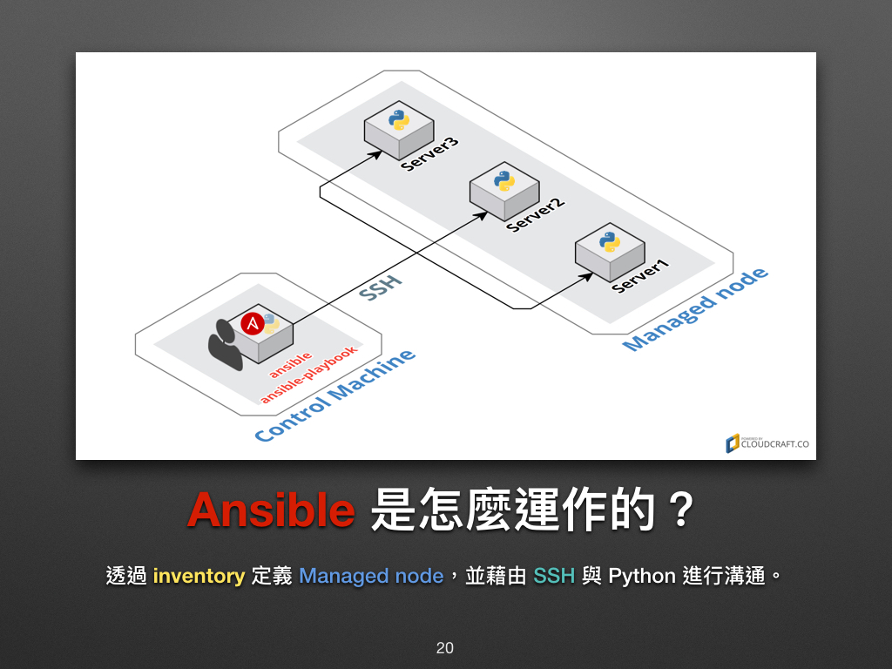

## Ansible 的命名由来？

此名取自 Ansible 作者最喜爱的《安德的游戏》1 小说，而这部小说更被后人改编成电影 －《战争游戏》。2

大家或许早在电影中就已看过安塞波 (Ansible)，它是虚构的超光速通讯装置。片中主角安德 (Ender) 和他的伙伴们透过 Ansible 跨越时空指挥无数的战舰，就好比我们操控海量的远端服务器一样。


## 使用 Ansible 需要具备什么基础知识？

- 具备 Linux 服务器 (server) 基础操作和管理经验。
- 会使用 ssh 远端连线至 server。
- 知道基本的标准输入 (stdin) 输出 (stdout) 等观念。
- 会安装 Linux 套件。
- 知道 sudo 指令在做什么，并且会使用它。
- 知道什么是档案权限，并且会修改它。
- 知道如何启用和停止系统服务 (Daemon / Service)。
- 会撰写简易的脚本 (Script)。

您已成功踏入 Ansible 的大门，恭喜你！

## Ansible 是怎么运作的？



换句话说，当 Control Machine (主控端) **可以用 SSH 连上 Managed node**，且被连上的机器里**有预载 Python 时，Ansible 就可以运作了**！

- Control Machine 指的是我们**主要会在上面操作 Ansible 的机器**。它可以是我们平时用的电脑、手机 1 或机房里的某一台机器，也可以把它想成是一般 Lab 练习里的 Workstation。

- Managed node 则是**被 Ansible 操纵的机器**。在很多的 Lab 练习里会用 Server 来称呼它。

## Ansible相关教程

> https://juejin.cn/post/6993582807641489438#heading-1

> https://ansible-tran.readthedocs.io/en/latest/docs/intro_getting_started.html


## 安装 Ansible 工具

首先，需要在您的服务器中**任选一台作为部署机（ops）**，Ansible 工具只需要在该节点上安装一次。**打通 ops 与其他服务器之间的免密访问后，所有的部署工作都可以在 ops 上完成**。

> 如果没有特别说明，以下的命令都在 ops 节点上执行。

### 安装工具

```shell
yum install ansible -y
```

## 单机版本Hello World

```shell
ansible localhost -m command -a 'echo Hello World.'
```

```
localhost | CHANGED | rc=0 >>
Hello World.
```
## 集群版本Hello World

配置主机清单（主控节点已经能够免密登录的机器）。

```shell
vi hosts
```

```ini
h1 ansible_ssh_port=22
h2 ansible_ssh_port=22
h3 ansible_ssh_port=22
h4 ansible_ssh_port=22
h5 ansible_ssh_port=22
h6 ansible_ssh_port=22
h7 ansible_ssh_port=22
```

当已上的设置都完成了，我们就可以在终端机练习 Ansible 了！

```shell
ansible -i hosts all -m command -a 'echo Hello World on Vagrant.'

ansible -i hosts all -m shell -a " uptime "

ansible -i hosts all -m shell -a " date '+%D %T.%6N' "

```

## 系统配置文件

### 主要配置文件

```shell
sudo vi /etc/ansible/ansible.cfg
```

### 配置主机清单

```shell
sudo vi  /etc/ansible/hosts
```

```
[wsr]
h1
```

### 指定主机组执行

```shell
ansible wsr -m shell -a " date '+%D %T.%6N' "
```
