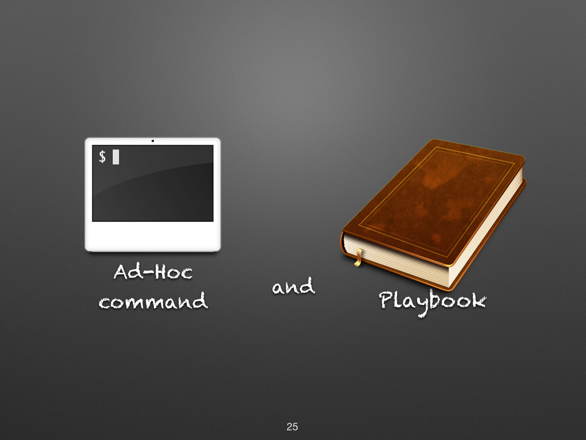
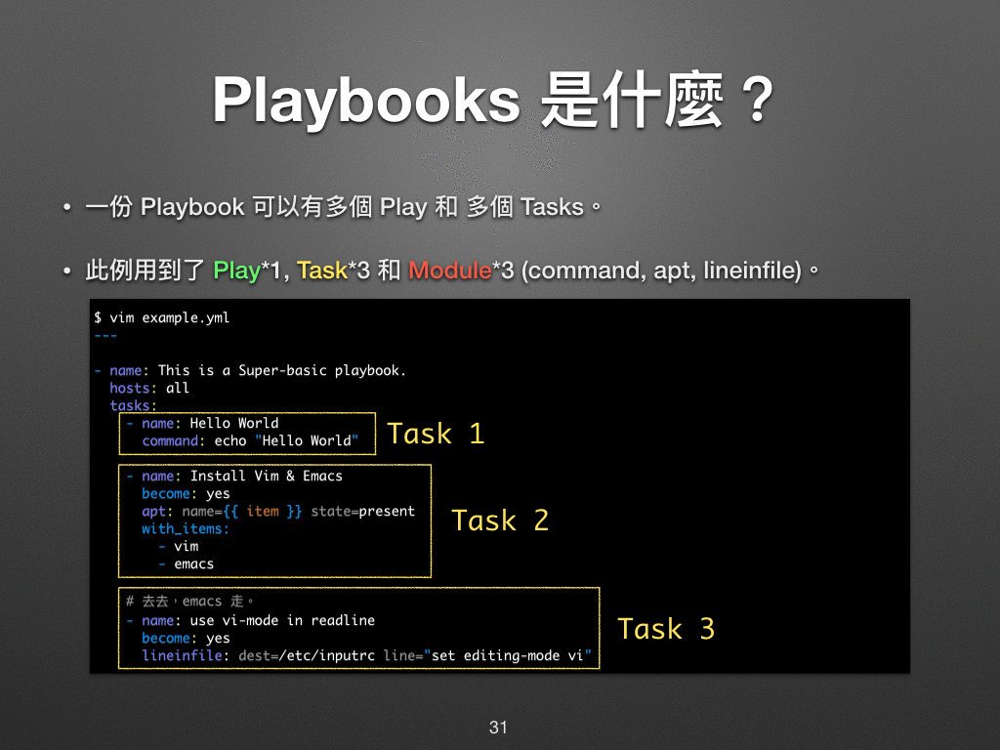

## 操作方式

一般来说，我们可以用 **Ad-Hoc command** 和 **Playbook** 两种方式来操作 Ansible。



前者是透过一次次简短的指令来操作 Ansible，而**后者则是先把任务写好，然后再一次执行**。两者的关系就**好比我们在 Linux Shell 里打指令和先写个 Shell Script 再执行一样**。

### Ad-Hoc Commands 是什么？

Ad-Hoc Commands 可以翻译为简短地指令，在这里冻仁会用指令操作模式来形容它，以常见的 ping 和 echo 操作为例。

**ping**

```shell
ansible -i hosts all -m ping
```

```
server1 | SUCCESS => {
    "changed": false,
    "ping": "pong"
}
```

**echo**

```shell
ansible -i hosts all -m command -a "echo Hello World"
```

从以上的例子中可以看到 **Ad-Hoc commands 一次只能处理一件事情**，这即是它与 Playbooks 最大的差异。

### Playbooks 是什么？

简而言之，Playbooks 是 Ansible 的脚本 (Script)，而且还是个比传统 Shell Script 还强大数百倍的脚本！如果今天只能记住一件事，请记住 Ansible 最好用、最厉害的就是它的 Playbook！

在一份 Playbook 中，可以有多个 Play、多个 Task 和多个 Module。

- Play：通常为某个特定的目的，例如：
    - ```Setup a official website with Drupal``` (借由 Drupal 建置官网)
    - ```Restart the API service``` (重开 API 服务)
- Task：是要实行 Play 这个目地所需做的每个步骤，例如：
    - ```Install the Nginx``` (安裝 Nginx)
    - ```Kill the djnago process``` (强制停止 django 的行程)
- Module：Ansible 所提供的各种操作方法，例如：
    ```-apt: name=vim state=present``` (使用 apt 套件安装 vim)
    ```-command: /sbin/shutdown -r now``` (使用 shutdown 的指令重新开机)



**Hello World Playbook**

- 来写一下我们的第一个 playbook！请建立一个 hello_world.yml 的档案，并将 --- 开始的内容都写进去。

```shell
vi hello_world.yml
```

```yml
---

- name: say 'hello world'
  hosts: all
  tasks:

    - name: echo 'hello world'
      command: echo 'hello world'
      register: result

    - name: print stdout
      debug:
        msg: ""
```

- 执行 playbook：在这个范例中，我们执行了 1 个 Play、3 个 Task 和 2 个 Module。

```shell
ansible-playbook -i hosts hello_world.yml
```

```shell
PLAY [say 'hello world'] *******************************************************

TASK [setup] *******************************************************************
ok: [server1]

TASK [echo 'hello world'] ******************************************************
changed: [server1]

TASK [print stdout] ************************************************************
ok: [server1] => {
    "msg": "hello world"
}

PLAY RECAP *********************************************************************
server1                    : ok=3    changed=1    unreachable=0    failed=0
```

### 没有 Ansible 时，我们是怎么操作的？

在此附上 Linux Shell 上的传统作法，来比对两者的操作。

**Shell (command line, cli, console)**

- ping

```
$ ping -c 1 8.8.8.8
PING 8.8.8.8 (8.8.8.8): 56 data bytes
64 bytes from 8.8.8.8: icmp_seq=0 ttl=44 time=10.022 ms

--- 8.8.8.8 ping statistics ---
1 packets transmitted, 1 packets received, 0.0% packet loss
round-trip min/avg/max/stddev = 10.022/10.022/10.022/0.000 ms
```

- echo

```shell
$ echo Hello World
Hello World
```

- Shell Script

建立 hello_world.sh 档案。

```shell
#!/bin/bash
echo 'Hello World'
```

执行。

```
$ bash hello_world.sh
Hello World
```

## 后话

大家或许会问，会写 script 就够用了，为什么还要会写 playbook 呢？在此列了几个理由给大家参考：

- 若有现成的 script，我们可以用 shell module 来执行它，这部份虽不冲突，但使用 shell module 会造成每次跑 playbook 都会重复执行，不像其它 module 执行过就不会再执行了。
- 用 Ansible 的 module 可以**把很多杂乱的指令给标准化**，例如不同的 Linux 发行版本在安装套件时需代各种不同的参数。
- 在现有的 cloud native 的架构下，传统的 Shell Script 已不符使用，一般而言 Shell Script 只能对一台机器 (instance) 进行操作。

相信大家都知道要怎么操作 Ansible 了，好好享受 Ansible 带给我们的乐趣吧！