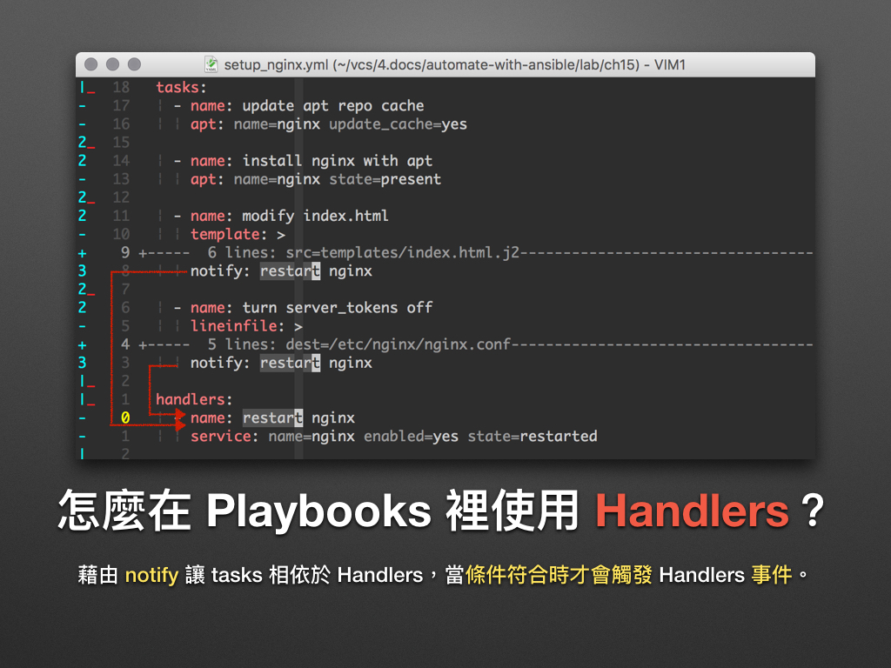

## Setup

使用 Playbooks 时，Ansible 会自动执行 setup module 以收集各个 Managed node 的 facts。从 IP 位址、作业系统、CPU 等资讯应有尽有。

```shell
ansible -i hosts all -m setup > setup.txt
```

## Template 系统


我们只需事先定义变数和模板 (Templates)，**即可用它动态产生远端的 Shell Scripts、设定档 (Configure) 等**。换句话说，我们可以用一份 template 来产生开发 (Development)、测试 (Test) 和正式环境 (Production) 等不同的环境设定。

### 举例说明

1. 准备文件。 

```shell
vi hello_world.txt.j2
Hello "{{ dynamic_word }}" ↑ ↑ ↑
```

- 由于 Ansible 是借由 Jinja2 来写作 template 系统，所以请使用 *.j2  的副档名。

- 上面的"{{ dynamic_word }}"代表我们在此 template 里使用了名为 dynamic_word 的变数。


2. 建立 playbook，并加入变数。

```shell
vi template_demo.yml 
```

```yml
---
- name: Play the template module 
  hosts: all 
  vars: 
    dynamic_word: "World"

  tasks: 
    - name: generation the hello_world.txt file
      template: 
        src: hello_world.txt.j2 
        dest: /tmp/hello_world.txt 

    - name: show file context 
      command: cat /tmp/hello_world.txt
      register: result 

    - name: print stdout 
      debug:
        msg: "{{ result.stdout }}"
```

- dynamic_word 变数设了一个预设值 World。
- 使用了 template module，并指定了档案的来源 (src) 和目的地 (dest)。
- 之后的 2 个 tasks 则是把 template module 产生出来的档案给印出来。

3. 执行 playbook。

```shell
ansible-playbook -i hosts template_demo.yml
```

执行完以后所有的机器都生成了/tmp/hello_world.txt文件。并且内容为Hello "World" ↑ ↑ ↑。

通过 -e 参数将 dynamic_word 覆写成 Day50。

```shell
ansible-playbook -i hosts template_demo.yml -e "dynamic_word=Day50"
```

```
[root@h6 ~]# cat /tmp/hello_world.txt
Hello "Day50" ↑ ↑ ↑
```

### 怎么让 Playbooks 切换不同的环境？

1. 在 Playbooks 里除了用 vars 来宣告变数以外，还可以用 vars_files 来 include 其它的变数档案。

```yml
---
- name: Play the template module 
  hosts: all 
  vars: 
    dynamic_word: "World"

  vars_files: 
    - vars/test.yml 
    - vars/development.yml

  tasks: 
    - name: generation the hello_world.txt file
      template: 
        src: hello_world.txt.j2 
        dest: /tmp/hello_world.txt 

    - name: show file context 
      command: cat /tmp/hello_world.txt
      register: result 

    - name: print stdout 
      debug:
        msg: "{{ result.stdout }}"

```

2. 建立 vars/development.yml, vars/test.yml 和 vars/production.yml 档案，接下来将依不同的环境 include 不同的变数档案 (vars files)，这样就可以用同一份 playbook 切换环境了！

**Development**

```shell
mkdir vars
cd vars
vi development.yml
dynamic_word: "development"
```

**Test**

```shell
mkdir vars
cd vars
vi test.yml
dynamic_word: "test"
```

3. 执行playbook，并通过 -e 切换各个环境。

```shell
  vars_files: 
    - vars/test.yml 
    - vars/development.yml
要执行那个就保留那个文件，比如就是要test里面的变量那么就
  vars_files: 
    - vars/test.yml 
要执行那个就保留那个文件，比如就是要development里面的变量那么就
  vars_files: 
    - vars/development.yml
ansible-playbook -i hosts template_demo.yml
ansible-playbook -i hosts template_demo.yml
```

## Handlers

Handler 本身是一种非同步的 callback function ；在这里则是指关连于特定 tasks 的事件 (event) 触发机制。当这些特定的 tasks 状态为被改变 (changed) 且都已被执行时，才会触发一次 event。



以上图为例，要触发 restart nginx 这个 handler，需符合以下条件：

- modify index.html 或 turn server_tokens off 两个 tasks 中，至少有一个状态为 changed。
- 所有关连到 restart nginx handler 的 tasks 都已被执行。 

**基本使用**

```yml
---

- name: setup the nginx
 hosts: all
 become: true
 vars:
   username: "ironman"
   mail: "chusiang (at) drx.tw"
   blog: "http://note.drx.tw"

 tasks:
   # 执行 'apt-get update' 指令。
   - name: update apt repo cache
     apt: name=nginx update_cache=yes

   # 执行 'apt-get install nginx' 指令。
   - name: install nginx with apt
     apt: name=nginx state=present

   # 于网页根目录 (DocumentRoot) 编辑 index.html。
   - name: modify index.html
     template: >
       src=templates/index.html.j2
       dest=/usr/share/nginx/html/index.html
       owner=www-data
       group=www-data
       mode="644"
       backup=yes
     notify: restart nginx

   # (security) 关闭 server_tokens：移除 server_tokens 前的 '#' 字元。
   - name: turn server_tokens off
     lineinfile: >
       dest=/etc/nginx/nginx.conf
       regexp="server_tokens off;"
       insertafter="# server_tokens off;"
       line="server_tokens off;"
       state=present
     notify: restart nginx

 # handlers 
 #
 # * 当确认事件有被触发才会动作。
 # * 一个 handler 可被多个 task 通知 (notify)，并于 tasks 跑完才会执行。
 handlers:
   # 执行 'sudo service nginx restart' 指令。
   - name: restart nginx
     service: name=nginx enabled=yes state=restarted

 # post_tasks:
 #
 # 在 tasks 之后执行的 tasks。
 post_tasks:
   # 检查网页内容。
   - name: review http state
     command: "curl -s http://localhost"
     register: web_context

   # 印出检查结果。
   - name: print http state
     debug: msg=
```