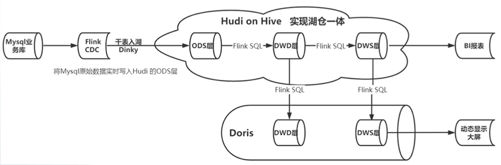

## 基本初创公司大数据平台架构v1.0


### 缺点

- Debezium 仅能单机部署，只能单并发读取binlog日志。
- Clickhouse存储的是大量的明细数据，会导致Clickhouse变得臃肿。
- Pulsar与Clickhouse之间缺少数据处理的过程。
- Clickhouse单表性能强劲，但是多表join性能差。

## 大数据平台架构v2.0



- Flink CDC通过读取Mysql数据库的Binlog日志，实时捕获数据变更。
- 使用Hudi on Hive 会将ODS层源数据信息自动同步到Hive中，便于管理。
- 使用Flink SQL将Hudi的ODS层数据拉宽写入到Hudi的DWD层，便于后续的数仓建模。
- DWD层通过join和轻度聚合进入DWS层可直接用于BI报表。


### 缺点

- 通过Hudi仅能实现准实时Hudi延迟较高。
- 流式日志数据未纳入。
- 基于开源组件维护不方便。

## 大数据平台架构v3.0（流批一体架构）

### 数据流转图


### 优点

- 主要的优点是弥补Kappa架构数据治理还有批处理的问题，实时还是在消息系统里面，但是数据的存储是保存在了Paimon数据湖中，这样流计算完以后，还能保存下来提供给批处理执行。

- 处理速度相对上面的几种架构要快，因为批处理是在数据湖里面，数据湖里面有大量的数据，批处理可以利用这些数据，所以速度会快一些。

- 批处理和流处理可以同时进行，批处理的结果可以作为流处理的输入，这样就形成了流批一体。

### 缺点

- 对于数据湖来说，按现在的情况还是对于数据仓库的支持有一些欠缺，数据仓库的一个重点是保存历史数据，**但是数据湖是保存原始数据的副本，那么相对来说就会少了一些数据变更的数据存储**，这样数据湖的数据存储，相对于数据仓库来说，会少一些。

### 技术选型

- Flink CDC 实现数据实时采集。
- Flink SQL 实现数据实时计算。
- StarRocks 实现数据实时分析。
- Paimon 实现数据实时入湖。
- Data V数据可视化。

## 架构


- Flink CDC 实现数据实时采集。
- 基于FlinkSQL流批一体架构。
- Kafka和Paimon的数据下沉。
- StarRocks与DataV数据可视化。

## 实战

### 环境准备

> 资源要在同一个区域（在同一个VPC），就是能够互相访问就行。

**MySQL**

```sql
show variables like '%log_bin%';
show master logs;
```

```shell
# 默认配置文件
cat /etc/my.cnf
```

**安装JDK**

```shell
yum list java

yum install java-1.8.0-openjdk-devel.x86_64

# 对应的安装目录查看
cd /usr/lib/jvm/

```

配置环境变量

```shell
vi /etc/profile.d/myevn.conf

#java
export JAVA_HOME=/usr/lib/jvm/java-1.8.0-openjdk-1.8.0.312.b07-2.el8_5.x86_64
export JRE_HOME=$JAVA_HOME/jre
export CLASSPATH=.:$JAVA_HOME/lib:$JRE_HOME/lib:$CLASSPATH
export PATH=$PATH:$JRE_HOME/bin:$JAVA_HOME/bin:$CLASSPATH


source /etc/profile.d/myevn.conf
```

**安装Zookeeper**

```shell
mkdir -p /export/software /export/server /export/data

cd /export/software

wget https://archive.apache.org/dist/zookeeper/zookeeper-3.5.10/apache-zookeeper-3.5.10-bin.tar.gz

# 解压
cd /export/software
tar -zxf apache-zookeeper-3.5.10-bin.tar.gz -C /export/server/

#创建软链接
cd /export/server
ln -s apache-zookeeper-3.5.10-bin/ zookeeper

# 创建/export/data/zkdata目录
cd /export/data
mkdir zkdata

# 修改zoo.cfg文件
cd /export/server/zookeeper/conf
cp zoo_sample.cfg zoo.cfg
vim zoo.cfg

#修改
dataDir=/export/data/zkdata
#文件最后添加 2888心跳端口 3888选举端口
server.1=192.168.255.46:2888:3888
#192.168.255.46为内网ip

#创建myid文件
mkdir -p /export/data/zkdata
echo 1 >/export/data/zkdata/myid

#启动
cd /export/server/zookeeper/bin/
nohup ./zkServer.sh start & > out.log
```

**安装Kafka**

```shell
#下载安装包
cd /export/software
wget https://downloads.apache.org/kafka/3.5.0/kafka_2.12-3.5.0.tgz

#解压安装包
cd /export/software/
tar -xvzf  kafka_2.12-3.5.0.tgz -C /export/server/

#创建软链接
cd /export/server
ln -s kafka_2.12-3.5.0 /export/server/kafka

#创建/export/data/kafka-logs目录
cd /export/data
mkdir kafka-logs

```

```shell
#修改配置
cd /export/server/kafka/config
vim server.properties

# 指定broker的id
broker.id=0
# 指定 kafka的绑定监听的地址
listeners=PLAINTEXT://192.168.255.46:9092
# 指定Kafka数据的位置
log.dirs=/export/data/kafka-logs
# 配置zk节点
zookeeper.connect=192.168.255.46:2181
```

> 注意:配置文件中要填入服务器内网ip,而不能填入域名,否则会导致后续flink连接不上kafka。

```shell
# 配置环境变量
vi /etc/profile.d/myevn.conf

#kafka
export KAFKA_HOME=/export/server/kafka
export PATH=:$PATH:${KAFKA_HOME}/bin

source /etc/profile.d/myevn.conf
```

```shell
# 启动服务
cd /export/server/kafka/bin/
nohup ./kafka-server-start.sh -daemon ../config/server.properties & >out.log
```

```shell
# 常用命令
cd /export/server/kafka/bin/
kafka-topics.sh --list --bootstrap-server 192.168.255.46:9092
#创建topic
kafka-topics.sh --create --topic test --bootstrap-server 192.168.255.46:9092 
#启动消费者
kafka-console-consumer.sh --bootstrap-server 192.168.255.46:9092 --topic test --from-beginning 
```

**安装MySQL**

```shell
# 下载解压
mkdir -p /export/server/mysql5.7   /export/software/
cd  /export/software/
wget  https://cdn.mysql.com/archives/mysql-5.7/mysql-5.7.29-1.el7.x86_64.rpm-bundle.tar
tar xvf /export/software/mysql-5.7.29-1.el7.x86_64.rpm-bundle.tar -C /export/server/mysql5.7 
cd /export/server/mysql5.7 

#卸载mariadb
yum remove mariadb mariadb-server mariadb-libs

# 安装Rpm
rpm -ivh mysql-community-common-5.7.29-1.el7.x86_64.rpm mysql-community-libs-5.7.29-1.el7.x86_64.rpm mysql-community-client-5.7.29-1.el7.x86_64.rpm mysql-community-server-5.7.29-1.el7.x86_64.rpm
```

>注意:如果报错error: Failed dependencies:
libaio.so.1()(64bit) is needed by mysql-community-server-5.7.29-1.el7.x86_64 ​ libaio.so.1(LIBAIO_0.1)(64bit) is needed by mysql-community-server-5.7.29-1.el7.x86_64 ​ libaio.so.1(LIBAIO_0.4)(64bit) is needed by mysql-community-server-5.7.29-1.el7.x86_64

系统缺少依赖:安装如果缺少依赖 使用 yum install -y 安装缺少的组件即可。

```shell
yum install -y perl.x86_64
yum install -y libaio.x86_64
yum install -y net-tools.x86_64
```

```shell
#初始化服务和修改文件权限
mysqld --initialize
chown mysql:mysql /var/lib/mysql -R

# 启动服务并设置开机自启
systemctl start mysqld.service
systemctl enable mysqld.service

#登录Mysql修改密码及配置远程登录
Pass=$(grep 'A temporary password' /var/log/mysqld.log |awk '{print $NF}')
mysql -uroot -p"$Pass"
mysql>
alter user user() identified by "123456";
use mysql;
GRANT ALL PRIVILEGES ON *.* TO 'root'@'%' IDENTIFIED BY '123456' WITH GRANT OPTION;
FLUSH PRIVILEGES; 
exit;
```

### Flink CDC 数据采集

**准备数据**

```sql
-- 创建数据库bxg和bxg_1(bxg是业务数据库,bxg_1是模拟流数据需要的备份数据库)

create database if not exists bxg character set utf8;
```
SQL 实验脚本下载

> 链接：https://pan.baidu.com/s/11OoHAUwD0Wwde8V2mS-P0Q 
提取码：yyds 
--来自百度网盘超级会员V5的分享

**模拟数据**

- 直接用insert测试方便。

**建表**

```sql
create database if not exists mysql;
DROP TABLE IF EXISTS mysql.mysql_oe_stu_course_order;
CREATE TABLE if not exists mysql.mysql_oe_stu_course_order (
    `id` INT,
    `student_course_id` INT,
    `order_id` STRING,
    `order_detail_id` STRING,
    `create_time` TIMESTAMP(3),
    `update_time` TIMESTAMP(3),
    `delete_flag` BOOLEAN,
    PRIMARY KEY (`id`) NOT ENFORCED
) WITH (
    'connector' = 'mysql',
    'hostname' = 'rm-cn-zsk3diubc000qk.rwlb.rds.aliyuncs.com',
    'port' = '3306',
    'username' = 'testflink',
    'password' = 'fhakjsdhfk123@@',
    'database-name' = 'bxg',
    'table-name' = 'oe_stu_course_order'
);

CREATE TABLE if not exists mysql.mysql_oe_stu_course (
    `id` INT,
    `student_id` STRING,
    `course_id` INT,
    `status` TINYINT,
    `contract_status` TINYINT,
    `learn_status` TINYINT,
    `service_days` SMALLINT,
    `service_expires` TIMESTAMP(3),
    `validity_days` INT,
    `validity_expires` TIMESTAMP(3),
    `terminate_cause` TINYINT,
    `effective_date` TIMESTAMP(3),
    `finished_time` TIMESTAMP(3),
    `total_progress` DECIMAL(10,2),
    `purchase_time` INT,
    `create_time` TIMESTAMP(3),
    `update_time` TIMESTAMP(3),
    `delete_flag` BOOLEAN,
    PRIMARY KEY (`id`) NOT ENFORCED
) WITH (
    'connector' = 'mysql',
    'hostname' = 'rm-cn-zsk3diubc000qk.rwlb.rds.aliyuncs.com',
    'port' = '3306',
    'username' = 'testflink',
    'password' = 'fhakjsdhfk123@@',
    'database-name' = 'bxg',
    'table-name' = 'oe_stu_course'
);


CREATE TABLE if not exists mysql.mysql_oe_order (
    `id` STRING,
    `channel` STRING,
    `student_id` STRING,
    `order_no` STRING,
    `total_amount` DECIMAL(10,2),
    `discount_amount` DECIMAL(10,2),
    `charge_against_amount` DECIMAL(10,2),
    `payable_amount` DECIMAL(10,2),
    `status` TINYINT,
    `pay_status` TINYINT,
    `pay_time` TIMESTAMP(3),
    `paid_amount` DECIMAL(10,2),
    `effective_date` TIMESTAMP(3),
    `terminal` TINYINT,
    `refund_status` TINYINT,
    `refund_amount` DECIMAL(10,2),
    `refund_time` TIMESTAMP(3),
    `create_time` TIMESTAMP(3),
    `update_time` TIMESTAMP(3),
    `delete_flag` BOOLEAN,
    PRIMARY KEY (id) NOT ENFORCED
) WITH (
    'connector' = 'mysql',
    'hostname' = 'rm-cn-zsk3diubc000qk.rwlb.rds.aliyuncs.com',
    'port' = '3306',
    'username' = 'testflink',
    'password' = 'fhakjsdhfk123@@',
    'database-name' = 'bxg',
    'table-name' = 'oe_order'
);

CREATE TABLE if not exists mysql.mysql_oe_course (
    `id` INT,
    `grade_name` STRING,
    `bigimg_path` STRING,
    `video_url` STRING,
    `img_alt` STRING,
    `description` STRING,
    `detailimg_path` STRING,
    `smallimg_path` STRING,
    `sort` INT,
    `status` STRING,
    `learnd_count` INT,
    `learnd_count_flag` INT,
    `original_cost` DECIMAL(10,2),
    `current_price` DECIMAL(10,2),
    `course_length` DECIMAL(10,2),
    `menu_id` INT,
    `is_free` BOOLEAN,
    `course_detail` STRING,
    `course_detail_mobile` STRING,
    `course_detail1` STRING,
    `course_detail1_mobile` STRING,
    `course_plan_detail` STRING,
    `course_plan_detail_mobile` STRING,
    `course_detail2` STRING,
    `course_detail2_mobile` STRING,
    `course_outline` STRING,
    `common_problem` STRING,
    `common_problem_mobile` STRING,
    `lecturer_id` INT,
    `is_recommend` INT,
    `recommend_sort` INT,
    `qqno` STRING,
    `description_show` INT,
    `rec_img_path` STRING,
    `pv` INT,
    `course_type` INT,
    `default_student_count` INT,
    `study_status` INT,
    `online_course` INT,
    `course_level` INT,
    `content_type` INT,
    `recommend_type` INT,
    `employment_rate` STRING,
    `employment_salary` STRING,
    `score` STRING,
    `cover_url` STRING,
    `offline_course_url` STRING,
    `outline_url` STRING,
    `project_page_url` STRING,
    `preschool_test_flag` BOOLEAN,
    `service_period` INT,
    `included_validity_period` TINYINT,
    `validity_period` INT,
    `qualified_jobs` STRING,
    `work_year_min` INT,
    `work_year_max` INT,
    `promote_flag` BOOLEAN,
    `create_person` STRING,
    `update_person` STRING,
    `create_time` TIMESTAMP(3),
    `update_time` TIMESTAMP(3),
    `is_delete` BOOLEAN,
    PRIMARY KEY (`id`) NOT ENFORCED
) WITH (
    'connector' = 'mysql',
    'hostname' = 'rm-cn-zsk3diubc000qk.rwlb.rds.aliyuncs.com',
    'port' = '3306',
    'username' = 'testflink',
    'password' = 'fhakjsdhfk123@@',
    'database-name' = 'bxg',
    'table-name' = 'oe_course'
);

```

执行测试


### 维表数据下沉到Paimon

先创建Paimon的Catalog。


```sql
create database if not exists paimontest.dim;
CREATE TABLE if not exists paimontest.dim.dim_oe_course(
    `id` INT,
    `grade_name` STRING,
    `bigimg_path` STRING,
    `video_url` STRING,
    `img_alt` STRING,
    `description` STRING,
    `detailimg_path` STRING,
    `smallimg_path` STRING,
    `sort` INT,
    `status` STRING,
    `learnd_count` INT,
    `learnd_count_flag` INT,
    `original_cost` DECIMAL(10,2),
    `current_price` DECIMAL(10,2),
    `course_length` DECIMAL(10,2),
    `menu_id` INT,
    `is_free` BOOLEAN,
    `course_detail` STRING,
    `course_detail_mobile` STRING,
    `course_detail1` STRING,
    `course_detail1_mobile` STRING,
    `course_plan_detail` STRING,
    `course_plan_detail_mobile` STRING,
    `course_detail2` STRING,
    `course_detail2_mobile` STRING,
    `course_outline` STRING,
    `common_problem` STRING,
    `common_problem_mobile` STRING,
    `lecturer_id` INT,
    `is_recommend` INT,
    `recommend_sort` INT,
    `qqno` STRING,
    `description_show` INT,
    `rec_img_path` STRING,
    `pv` INT,
    `course_type` INT,
    `default_student_count` INT,
    `study_status` INT,
    `online_course` INT,
    `course_level` INT,
    `content_type` INT,
    `recommend_type` INT,
    `employment_rate` STRING,
    `employment_salary` STRING,
    `score` STRING,
    `cover_url` STRING,
    `offline_course_url` STRING,
    `outline_url` STRING,
    `project_page_url` STRING,
    `preschool_test_flag` BOOLEAN,
    `service_period` INT,
    `included_validity_period` INT,
    `validity_period` INT,
    `qualified_jobs` STRING,
    `work_year_min` INT,
    `work_year_max` INT,
    `promote_flag` BOOLEAN,
    `create_person` STRING,
    `update_person` STRING,
    `create_time` TIMESTAMP(3),
    `update_time` TIMESTAMP(3),
    `is_delete` BOOLEAN,
   PRIMARY KEY (id) NOT ENFORCED
);
```

MySQL数据写入到Paimon。

```sql
insert into paimontest.dim.dim_oe_course
select * from mysql.mysql_oe_course;

#启动成功以后查询下数据
select * from paimontest.dim.dim_oe_course;
```

如下查询Paimon表，如果有数据那么说明创建成功。


### Flink CDC 接入MySQL数据到Kafka

创建Kafka Topic。

```shell
# 常用命令
cd /export/server/kafka/bin/
./kafka-topics.sh --list --bootstrap-server 192.168.255.46:9092

./kafka-topics.sh --create --topic ods_oe_order --bootstrap-server 192.168.255.46:9092 
./kafka-topics.sh --create --topic ods_oe_stu_course --bootstrap-server 192.168.255.46:9092 
./kafka-topics.sh --create --topic ods_oe_stu_course_order --bootstrap-server 192.168.255.46:9092 
```

创建Flink CDC读取MySQL数据到Kafka。

```sql
create database if not exists dw;
CREATE TABLE if not exists dw.kafka_ods_oe_stu_course_order (
    `id` INT,
    `student_course_id` INT,
    `order_id` STRING,
    `order_detail_id` STRING,
    `create_time` TIMESTAMP(3),
    `update_time` TIMESTAMP(3),
    `delete_flag` BOOLEAN,
    proctime as proctime(),
   PRIMARY KEY (id) NOT ENFORCED
) WITH (
  'connector' = 'upsert-kafka',
  'topic' = 'ods_oe_stu_course_order',
  'properties.bootstrap.servers' = '192.168.255.46:9092',
  'key.format' = 'json',
  'value.format' = 'json'
);

CREATE TABLE if not exists dw.kafka_ods_oe_stu_course (
    `id` INT,
    `student_id` STRING,
    `course_id` INT,
    `status` INT,
    `contract_status` INT,
    `learn_status` INT,
    `service_days` INT,
    `service_expires` TIMESTAMP(3),
    `validity_days` INT,
    `validity_expires` TIMESTAMP(3),
    `terminate_cause` INT,
    `effective_date` TIMESTAMP(3),
    `finished_time` TIMESTAMP(3),
    `total_progress` DECIMAL(10,2),
    `purchase_time` INT,
    `create_time` TIMESTAMP(3),
    `update_time` TIMESTAMP(3),
    `delete_flag` BOOLEAN,
    proctime as proctime(),
   PRIMARY KEY (id) NOT ENFORCED
) WITH (
  'connector' = 'upsert-kafka',
  'topic' = 'ods_oe_stu_course',
  'properties.bootstrap.servers' = '192.168.255.46:9092',
  'key.format' = 'json',
  'value.format' = 'json'
);

CREATE TABLE if not exists dw.kafka_ods_oe_order (
    `id` STRING,
    `channel` STRING,
    `student_id` STRING,
    `order_no` STRING,
    `total_amount` DECIMAL(10,2),
    `discount_amount` DECIMAL(10,2),
    `charge_against_amount` DECIMAL(10,2),
    `payable_amount` DECIMAL(10,2),
    `status` INT,
    `pay_status` INT,
    `pay_time` TIMESTAMP(3),
    `paid_amount` DECIMAL(10,2),
    `effective_date` TIMESTAMP(3),
    `terminal` INT,
    `refund_status` INT,
    `refund_amount` DECIMAL(10,2),
    `refund_time` TIMESTAMP(3),
    `create_time` TIMESTAMP(3),
    `update_time` TIMESTAMP(3),
    `delete_flag` BOOLEAN,
    proctime as proctime(),
   PRIMARY KEY (id) NOT ENFORCED
) WITH (
  'connector' = 'upsert-kafka',
  'topic' = 'ods_oe_order',
  'properties.bootstrap.servers' = '192.168.255.46:9092',
  'key.format' = 'json',
  'value.format' = 'json'
);
```

写入数据到Kafka
> 创建mysql_to_kafka_ods作业草稿,代码如下因为是多个insert语句写在一个文件中,要写在BEGIN STATEMENT SET;END;语句中.语句中options进行了注释,默认是同步所有数据.打开注释,只同步最新的数据。

```sql
BEGIN STATEMENT SET;
insert into dw.kafka_ods_oe_stu_course_order
select *
from mysql.mysql_oe_stu_course_order
-- /*+ OPTIONS('scan.startup.mode' ='latest-offset') */
;

insert into dw.kafka_ods_oe_stu_course
select *
from mysql.mysql_oe_stu_course
-- /*+ OPTIONS('scan.startup.mode' ='latest-offset') */
;

insert into dw.kafka_ods_oe_order
select *
from mysql.mysql_oe_order
-- /*+ OPTIONS('scan.startup.mode' ='latest-offset') */
;
END;
```
查询数据。

```sql
select * from dw.kafka_ods_oe_order;
```


命令消费测试

```shell
cd /export/server/kafka/bin/

./kafka-console-consumer.sh --bootstrap-server 192.168.255.46:9092 --topic ods_oe_order --from-beginning
```

结果。

```json
{"id":"168e4fba9c5b453f8f5e775b12c561cf","channel":"BXG","student_id":"67d7edd954a211ea982f525400e0a58f","order_no":"200221200l5af9MJ7Rwq","total_amount":8.8E+3,"discount_amount":0,"charge_against_amount":0,"payable_amount":8.8E+3,"status":1,"pay_status":2,"pay_time":"2022-02-21 20:07:13","paid_amount":8.8E+3,"effective_date":"2022-02-21 20:07:13","terminal":0,"refund_status":0,"refund_amount":0,"refund_time":null,"create_time":"2022-02-21 20:05:23","update_time":"2022-02-21 20:05:45","delete_flag":false}
{"id":"9de7398d1da24c3784b7d5faace64fab","channel":"BXG","student_id":"2c9081a36f89060d016f9df7e5aa0013","order_no":"20011316V5Kjxa3330XX","total_amount":22,"discount_amount":0,"charge_against_amount":0,"payable_amount":22,"status":1,"pay_status":2,"pay_time":"2022-01-13 16:16:36","paid_amount":22,"effective_date":"2022-01-13 16:16:36","terminal":0,"refund_status":0,"refund_amount":0,"refund_time":null,"create_time":"2022-01-13 16:14:48","update_time":"2022-01-13 16:16:32","delete_flag":false}
```

### Kafka数据同步到Paimon的ods层

```sql

create database if not exists paimontest.ods;

CREATE TABLE if not exists paimontest.ods.paimon_ods_oe_stu_course_order (
    `id` INT,
    `student_course_id` INT,
    `order_id` STRING,
    `order_detail_id` STRING,
    `create_time` TIMESTAMP(3),
    `update_time` TIMESTAMP(3),
    `delete_flag` BOOLEAN,
    `proctime` timestamp,
     dt string comment '日期',
   PRIMARY KEY (id,dt) NOT ENFORCED
)  partitioned by (dt)
;

CREATE TABLE if not exists paimontest.ods.paimon_ods_oe_stu_course (
    `id` INT,
    `student_id` STRING,
    `course_id` INT,
    `status` INT,
    `contract_status` INT,
    `learn_status` INT,
    `service_days` INT,
    `service_expires` TIMESTAMP(3),
    `validity_days` INT,
    `validity_expires` TIMESTAMP(3),
    `terminate_cause` INT,
    `effective_date` TIMESTAMP(3),
    `finished_time` TIMESTAMP(3),
    `total_progress` DECIMAL(10,2),
    `purchase_time` INT,
    `create_time` TIMESTAMP(3),
    `update_time` TIMESTAMP(3),
    `delete_flag` BOOLEAN,
    `proctime` timestamp,
    dt string comment '日期',
   PRIMARY KEY (id,dt) NOT ENFORCED
) partitioned by (dt)
;

CREATE TABLE if not exists paimontest.ods.paimon_ods_oe_order (
    `id` STRING,
    `channel` STRING,
    `student_id` STRING,
    `order_no` STRING,
    `total_amount` DECIMAL(10,2),
    `discount_amount` DECIMAL(10,2),
    `charge_against_amount` DECIMAL(10,2),
    `payable_amount` DECIMAL(10,2),
    `status` INT,
    `pay_status` INT,
    `pay_time` TIMESTAMP(3),
    `paid_amount` DECIMAL(10,2),
    `effective_date` TIMESTAMP(3),
    `terminal` INT,
    `refund_status` INT,
    `refund_amount` DECIMAL(10,2),
    `refund_time` TIMESTAMP(3),
    `create_time` TIMESTAMP(3),
    `update_time` TIMESTAMP(3),
    `delete_flag` BOOLEAN,
    `proctime` timestamp,
    dt string comment '日期',
   PRIMARY KEY (id,dt) NOT ENFORCED
) partitioned by (dt)
;

```

数据导入。

```sql
BEGIN STATEMENT SET;
insert into paimontest.ods.paimon_ods_oe_stu_course_order
select
    *,
    date_format(create_time,'yyyy-MM-dd') as dt
from dw.kafka_ods_oe_stu_course_order;
insert into paimontest.ods.paimon_ods_oe_stu_course
select
    *,
    date_format(create_time,'yyyy-MM-dd') as dt
from dw.kafka_ods_oe_stu_course;
insert into paimontest.ods.paimon_ods_oe_order
select
    *,
    date_format(create_time,'yyyy-MM-dd') as dt
from dw.kafka_ods_oe_order;
END;
```

测试写入数据是否成功。

```sql
select * from paimontest.ods.paimon_ods_oe_order;
select * from paimontest.ods.paimon_ods_oe_stu_course_order;
select * from paimontest.ods.paimon_ods_oe_stu_course;
```


### 流批一体处理

#### 流批一体处理DWD层(kafka)

先创建对应的主题。

```shell
cd /export/server/kafka/bin/
./kafka-topics.sh --bootstrap-server 192.168.255.46:9092 --create --topic dwd_oe_stu_course_order 
```

在Flink中创建对应的表。

```sql
CREATE TABLE if not exists dw.kafka_dwd_oe_stu_course_order (
     `id` int,
     `stu_course_id` int,
     `order_id` string,
     `course_id` int,
     `stu_course_status` int,
     `stu_course_status_des` string,
     `stu_course_delete_flag` BOOLEAN,
     `payable_amount` decimal(10,2),
     `pay_status` int,
     `pay_time` TIMESTAMP(3),
     `paid_amount` decimal(10,2),
     `refund_status` int,
     `order_delete_flag` boolean,
     `grade_name` string,
     `is_complete_order` boolean,
     PRIMARY KEY (`id`) NOT ENFORCED
) WITH (
  'connector' = 'upsert-kafka',
  'topic' = 'dwd_oe_stu_course_order',
  'properties.bootstrap.servers' = '192.168.255.46:9092',
  'key.format' = 'json',
  'value.format' = 'json'
);
```

Kafk的ods层数据进行打宽操作。

```sql
insert into dw.kafka_dwd_oe_stu_course_order
SELECT
    `osco`.`id`,
    `osco`.`student_course_id`,
    `osco`.`order_id`,
    `osc`.`course_id`,
    `osc`.`status` as `stu_course_status`,
     case `osc`.`status` when 0 then '试学' when 1 then '生效' when 2 then '待生效' when -1 then '停课' else '退费' end as `stu_course_status_des`,
    `osc`.`delete_flag` as `stu_course_delete_flag`,
    `oo`.`payable_amount`,
    `oo`.`pay_status`,
    `oo`.`pay_time`,
    `oo`.`paid_amount`,
    `oo`.`refund_status`,
    `oo`.`delete_flag` as `order_delete_flag`,
    `oc`.`grade_name`,
    if (oo.`payable_amount`>0 and `oo`.`pay_status`=2 and `oo`.`delete_flag` = false and `osc`.`delete_flag` = false, true, false) as is_complete_order
FROM dw.kafka_ods_oe_stu_course_order AS osco
LEFT JOIN dw.kafka_ods_oe_stu_course AS osc
ON osc.id = osco.student_course_id
LEFT JOIN dw.kafka_ods_oe_order AS oo
ON oo.id = osco.order_id
LEFT JOIN paimontest.dim.dim_oe_course
/*+ OPTIONS('lookup.join.cache.ttl' = '1h') */ for SYSTEM_TIME AS OF osc.`proctime` AS oc
ON oc.id = osc.course_id
;
```

>http://wuchong.me/blog/2020/02/25/demo-building-real-time-application-with-flink-sql/

> join维表的时候使用 for SYSTEM_TIME AS OF osc.`proctime`，如果需要使用历史版本的维表数据，可以使用该语法。可以理解为当时的快照维表数据。

验证数据。

```sql
select * from dw.kafka_dwd_oe_stu_course_order;
```


消费kafka数据。

```shell
cd /export/server/kafka/bin/

./kafka-console-consumer.sh --bootstrap-server 192.168.255.46:9092 --topic dwd_oe_stu_course_order --from-beginning
```

得到的结果。

```json
{"id":1434413,"stu_course_id":2389883,"order_id":"d352f58419c243fc931c1e6fb4ffa3ae","course_id":1000938,"stu_course_status":1,"stu_course_status_des":"生效","stu_course_delete_flag":false,"payable_amount":0,"pay_status":0,"pay_time":null,"paid_amount":0,"refund_status":0,"order_delete_flag":false,"grade_name":"贝贝微课","is_complete_order":false}
{"id":1435265,"stu_course_id":2390775,"order_id":"2e5c292c04ee498392df62a3133dc830","course_id":957,"stu_course_status":2,"stu_course_status_des":"待生效","stu_course_delete_flag":false,"payable_amount":1.298E+6,"pay_status":2,"pay_time":"2022-09-10 15:48:11","paid_amount":1.298E+6,"refund_status":0,"order_delete_flag":false,"grade_name":"UI/UE设计在线就业班","is_complete_order":true}
null
{"id":1434414,"stu_course_id":2389884,"order_id":"aa4d3fdae9704f6b8548561d0f5fcb65","course_id":1000936,"stu_course_status":1,"stu_course_status_des":"生效","stu_course_delete_flag":false,"payable_amount":0,"pay_status":0,"pay_time":null,"paid_amount":0,"refund_status":0,"order_delete_flag":false,"grade_name":"笔记兼容测试","is_complete_order":false}
{"id":1435262,"stu_course_id":2390772,"order_id":"5d36d9fd02ae45a5a69db46f688dd03f","course_id":956,"stu_course_status":1,"stu_course_status_des":"生效","stu_course_delete_flag":false,"payable_amount":1.498E+4,"pay_status":2,"pay_time":"2022-09-10 11:36:44","paid_amount":1.498E+4,"refund_status":0,"order_delete_flag":false,"grade_name":"JavaEE在线就业班","is_complete_order":true}
```

#### 流批一体处理DWS层(kafka)

创建kafka的主题。

```shell
cd /export/server/kafka/bin/

./kafka-topics.sh --bootstrap-server 192.168.255.46:9092 --create --topic dws_course_revenue
./kafka-topics.sh --bootstrap-server 192.168.255.46:9092 --create --topic dws_overall_revenue
./kafka-topics.sh --list --bootstrap-server 192.168.255.46:9092


./kafka-console-consumer.sh --bootstrap-server 192.168.255.46:9092 --topic dwd_oe_stu_course_order --from-beginning

```

用Flink实时写入到kafka的DWS层数据。

```sql
CREATE TABLE if not exists dw.kafka_dws_course_revenue(
    `course_id` int,
    `date` string,
    `total_cnt` bigint,
    `toatal_money` decimal(38,4),
    `avg` decimal(38,4),
    `stu_course_order_status` string,
    PRIMARY KEY (`course_id`,`date`) NOT ENFORCED
) WITH (
  'connector' = 'upsert-kafka',
  'topic' = 'dws_course_revenue',
  'properties.bootstrap.servers' = '192.168.255.46:9092',
  'key.format' = 'json',
  'value.format' = 'json'
);

CREATE TABLE if not exists dw.kafka_dws_overall_revenue (
    `course_id` int,
    `course_name` string,
    `paid_count` bigint,
    `paid_amount` decimal(38,4),
    PRIMARY KEY (`course_id`) NOT ENFORCED
) WITH (
  'connector' = 'upsert-kafka',
  'topic' = 'dws_overall_revenue',
  'properties.bootstrap.servers' = '192.168.255.46:9092',
  'key.format' = 'json',
  'value.format' = 'json'
);
```

输入写入到kafka。

```sql
BEGIN STATEMENT SET;

INSERT INTO dw.kafka_dws_course_revenue
SELECT
    ifnull(course_id,-1) as course_id,
    '合计' AS `date`,
    count(1) AS `total_cnt`,
    CASE WHEN count(1) >0 THEN sum(paid_amount) ELSE 0 END  AS  `toatal_money`,
    CASE WHEN count(1) >0 THEN sum(paid_amount) / if(count(1)<=0,1,count(1)) ELSE 0 END AS `avg`,
    CONCAT('【',cast(course_id as string),'】',grade_name)  as  `stu_course_order_status`
FROM dw.kafka_dwd_oe_stu_course_order
WHERE is_complete_order = true
  AND stu_course_status not in (8)
GROUP BY course_id,grade_name

union

select
    ifnull(course_id,-1) as course_id,
    ifnull(date_format(pay_time, 'yyyy/MM/dd'),'-1') as `date`,
    count(1) AS `total_cnt`,
    CASE WHEN count(1) > 0 THEN sum(paid_amount) ELSE 0 END AS `toatal_money`,
    CASE WHEN count(1) > 0 THEN sum(paid_amount) / if(count(1)=0,1,count(1)) ELSE 0 END AS `avg`,
    LISTAGG(stu_course_status_des) as `stu_course_order_status`
from dw.kafka_dwd_oe_stu_course_order
WHERE is_complete_order is true
group by course_id,date_format(pay_time, 'yyyy/MM/dd');


INSERT INTO dw.kafka_dws_overall_revenue
SELECT
    ifnull(course_id,-1) as course_id,
    grade_name AS `course_name`,
    COUNT(CASE WHEN (is_complete_order is true AND refund_status not in (-1))
                   THEN order_id
               ELSE null
        END)  AS `paid_count`,
    SUM(CASE WHEN (is_complete_order is true AND refund_status not in (-1))
                 THEN paid_amount
             ELSE null
        END) AS  `paid_amount`
FROM dw.kafka_dwd_oe_stu_course_order
GROUP BY course_id,grade_name;

END;
```

验证数据。

```sql
select * from dw.kafka_dws_course_revenue;
```


#### 流批一体处理DWD层(paimon)

创建Paimon表。

```sql
create database if not exists paimontest.dwd;
CREATE TABLE if not exists paimontest.dwd.paimon_dwd_oe_stu_course_order (
     `id` int,
     `stu_course_id` int,
     `order_id` string,
     `course_id` int,
     `stu_course_status` int,
     `stu_course_status_des` string,
     `stu_course_delete_flag` BOOLEAN,
     `payable_amount` decimal(10,2),
     `pay_status` int,
     `pay_time` TIMESTAMP(3),
     `paid_amount` decimal(10,2),
     `refund_status` int,
     `order_delete_flag` boolean,
     `grade_name` string,
     `is_complete_order` boolean,
     PRIMARY KEY (`id`) NOT ENFORCED
)
;
```

Kafka的dwd层数据写入到Paimon表

```sql
insert into paimontest.dwd.paimon_dwd_oe_stu_course_order
select * from dw.kafka_dwd_oe_stu_course_order;
```

验证数据。

```sql
select * from paimontest.dwd.paimon_dwd_oe_stu_course_order;
```


#### 流批一体处理DWS层(paimon)

创建Paimon的dws表。

```sql
create database if not exists paimontest.dws;
CREATE TABLE if not exists paimontest.dws.paimon_dws_course_revenue(
    `course_id` int,
    `date` string,
    `total_cnt` bigint,
    `toatal_money` decimal(38,4),
    `avg` decimal(38,4),
    `stu_course_order_status` string,
    PRIMARY KEY (`course_id`,`date`) NOT ENFORCED
)
;

CREATE TABLE if not exists paimontest.dws.paimon_dws_overall_revenue (
    `course_id` int,
    `course_name` string,
    `paid_count` bigint,
    `paid_amount` decimal(38,4),
    PRIMARY KEY (`course_id`) NOT ENFORCED
)
;
```

把Kafka的dws层数据写入到Paimon表

```sql
BEGIN STATEMENT SET;

insert into paimontest.dws.paimon_dws_course_revenue
select
*
from dw.kafka_dws_course_revenue
;

insert into paimontest.dws.paimon_dws_overall_revenue
select
*
from dw.kafka_dws_overall_revenue
;

END;
```

数据验证。

```sql
select * from paimontest.dws.paimon_dws_overall_revenue;
```


### 结果导入StarRocks

创建StarRocks的dws表。

```sql
create database if not exists dws;

CREATE TABLE IF NOT EXISTS dws.dws_course_revenue
(
    `course_id` int,
    `date` varchar(255),
    `total_cnt` bigint,
    `toatal_money` decimal(27,4),
    `avg` decimal(27,4),
    `stu_course_order_status` string
) Unique Key (`course_id`,`date`)
DISTRIBUTED BY HASH(`course_id`) BUCKETS 10
PROPERTIES (
"replication_num" = "1"
);

CREATE TABLE IF NOT EXISTS dws.dws_overall_revenue
(
    `course_id` int,
    `course_name` string,
    `paid_count` bigint,
    `paid_amount` decimal(27,4)
) Unique Key (`course_id`)
DISTRIBUTED BY HASH(`course_id`) BUCKETS 10
PROPERTIES (
"replication_num" = "1"
);
```

创建Flink对应StarRocks的表。

```sql
create database if not exists starrocks;
CREATE TABLE if not exists starrocks.starrocks_dws_course_revenue_load(
    `course_id` int,
    `date` string,
    `total_cnt` bigint,
    `toatal_money` decimal(38,4),
    `avg` decimal(38,4),
    `stu_course_order_status` string,
    PRIMARY KEY (`course_id`,`date`) NOT ENFORCED
) WITH (
 'connector' = 'starrocks',
 'jdbc-url'='jdbc:mysql://fe-c-166e6b1814e54a8c-internal.starrocks.aliyuncs.com:9030',
 'load-url'='fe-c-166e6b1814e54a8c-internal.starrocks.aliyuncs.com:8030',
 'database-name' = 'dws',
 'table-name' = 'dws_course_revenue',
 'username' = 'admin',
 'password' = 'Itcast123',
 'sink.buffer-flush.interval-ms' = '5000'
);

CREATE TABLE if not exists starrocks.starrocks_dws_overall_revenue_load(
    `course_id` int,
    `course_name` string,
    `paid_count` bigint,
    `paid_amount` decimal(38,4),
    PRIMARY KEY (`course_id`) NOT ENFORCED
) WITH (
 'connector' = 'starrocks',
 'jdbc-url'='jdbc:mysql://fe-c-166e6b1814e54a8c-internal.starrocks.aliyuncs.com:9030',
 'load-url'='fe-c-166e6b1814e54a8c-internal.starrocks.aliyuncs.com:8030',
 'database-name' = 'dws',
 'table-name' = 'dws_overall_revenue',
 'username' = 'admin',
 'password' = 'Itcast123',
 'sink.buffer-flush.interval-ms' = '5000'
);
```

参数讲解：

- 'connector' = 'starrocks',  -- 连接器
- 'jdbc-url'='jdbc:mysql://fe-c-166e6b1814e54a8c-internal.starrocks.- aliyuncs.com:9030', -- JDBC连接的URL,格式 jdbc:mysql://fe_ip:port
- 'load-url'='fe-c-166e6b1814e54a8c-internal.starrocks.aliyuncs.- com:8030', -- 数据导入的URL,格式 fe_ip:http_port
- 'database-name' = 'dws', -- 数据库名称
- 'table-name' = 'dws_overall_revenue', -- 表名
- 'username' = 'admin', -- 用户名
- 'password' = 'Itcast123',  -- 密码
- 'sink.buffer-flush.interval-ms' = '5000'

>注意:此映射表只能进行数据导入,不能扫描,所以不可以查询.如果需要查询可以创建扫描映射表,配置scan-url。

Kafka的dws数据写入到StarRocks。

```sql
BEGIN STATEMENT SET;

insert into starrocks.starrocks_dws_course_revenue_load
select `course_id`, `date`, `total_cnt`, `toatal_money`, `avg`, `stu_course_order_status`
from dw.kafka_dws_course_revenue;

insert into starrocks.starrocks_dws_overall_revenue_load
select `course_id`, `course_name`,`paid_count`,`paid_amount`
from dw.kafka_dws_overall_revenue;

END;
```

## 总结


- 数据从MySQL使用Flink CDC同步到kafka，构建ods层，然后通过Flink把Kafka的ods层数据导入到paimon。
- 对于dim层数据，直接用Flink CDC同步到了paimon。
- dwd数据通过在kafka进行ods数据通过FlinkSQL的join操作，打宽以后写入到一个新的topic。
- dws层数据也是直接消费kafka的topic使用FlinkSQL写入到新的topic。
- 对于dwd数据和dws数据，使用flink实时的把kafka的ods,dwd,dws下沉到paimon。
- 最后把kafka的dws数据通过FlinkSQL写入到StarRocks，然后使用DataV报表在线展示。

> 注意：在创建paimon catalog的时候，对应的oss数据存储，要在同一个区域才能够正常写入，比如flink创建的时候是北京区域，那么oss要北京区域才行。


