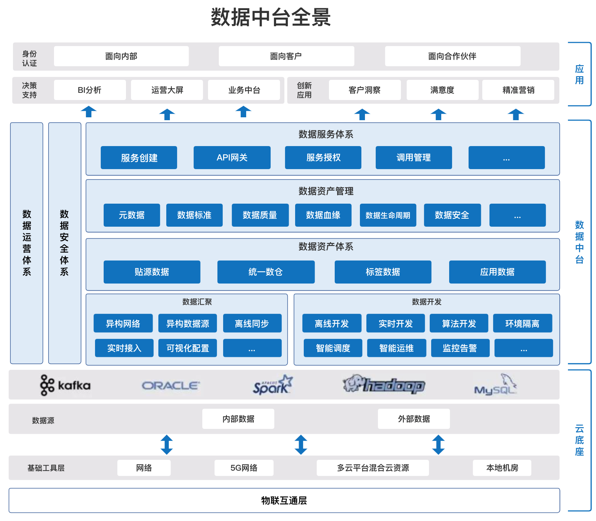

# BigdataKnowledge

## 愿景
致力于规范大数据数据质量标准、集成、开发、管理、监控以及部署知识库，帮助您快速构建起稳定、高效、可弹性伸缩的大数据平台。

## BigdataKnowledge是什么？
BigdataKnowledge是一个综合性的大数据知识库，旨在汇集大数据领域的标准、集成、开发、展示和运维等方面的知识，为用户提供全面深入的学习和参考资源。该知识库的目标是成为一个集大数据领域专业性和广度于一体的平台，为大数据从业者、学习者和研究者提供有价值的信息和工具。

主要特性有:

* 标准化知识：涵盖大数据领域的标准化概念、规范和最佳实践，帮助你了解在大数据生态系统中如何建立一致性和高效性。
* 集成技术：介绍大数据系统和平台之间的集成方法和技术，包括数据源集成、数据仓库搭建以及不同技术栈的整合等内容。
* 开发指南：提供大数据开发的技巧和方法，包括编程语言、框架和工具，帮助你构建高性能、可扩展的大数据应用。
* 数据展示与可视化：解释如何有效地将大数据结果呈现给用户，包括数据可视化、报表展示和仪表盘设计等。
* 运维管理：介绍大数据系统的运维和管理技术，包括监控、故障排除、性能优化等内容，确保大数据平台的稳定运行。

通过BigdataKnowledge，你可以不断学习、研究和分享大数据领域的最新进展和经验，从而在大数据的世界中发挥出更大的价值。无论你是初学者还是有经验的专业人士，这个知识库都将成为你在大数据领域不可或缺的学习和参考资源。

## 整体知识体系

## 相关组件

大概相关大数据技术如下。

| 序号 |       名称        |  版本  |                       描述                       |
| :--: | :---------------: | :----: | :----------------------------------------------: |
|  1   |       HDFS        | 3.3.3  |                 分布式大数据存储                 |
|  2   |       YARN        | 3.3.3  |             分布式资源调度与管理平台             |
|  3   |     ZooKeeper     | 3.5.10 |                  分布式协调系统                  |
|  4   |       FLINK       | 1.15.2 |                   实时计算引擎                   |
|  5   | DolphoinScheduler | 3.1.1  |      分布式易扩展的可视化工作流任务调度平台      |
|  6   |    StreamPark     | 1.2.3  | 流处理极速开发框架,流批一体&湖仓一体的云原生平台 |
|  7   |       Spark       | 3.1.3  |                  分布式计算系统                  |
|  8   |       Hive        | 3.1.0  |                   离线数据仓库                   |
|  9   |       Kafka       | 2.4.1  |          高吞吐量分布式发布订阅消息系统          |
|  10  |       Trino       |  367   |             分布式Sql交互式查询引擎              |
|  11  |       Doris       | 1.1.5  |            新一代极速全场景MPP数据库             |
|  12  |       Hbase       | 2.4.16 |               分布式列式存储数据库               |
|  13  |      Ranger       | 2.1.0  |                   权限控制框架                   |
|  14  |   ElasticSearch   | 7.16.2 |                  高性能搜索引擎                  |
|  15  |    Prometheus     | 2.17.2 |           高性能监控指标采集与告警系统           |
|  16  |      Grafana      | 9.1.6  |             监控分析与数据可视化套件             |
|  17  |   AlertManager    | 0.23.0 |                 告警通知管理系统                 |

